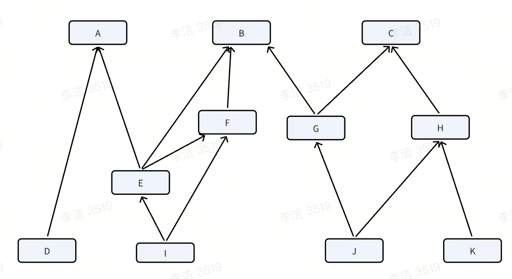

## 插件部分

### 插件的作用

- 承接一些非通用性需求；
  - 剥离工程里的特化的表单字段类型的渲染逻辑，实现该部分功能逻辑的自动插拔；
  - 承接部分企业的自定义的字段类型，自定义tab等非通用性诉求；
- 建立开放生态，为业务类型覆盖、商业模式拓展提供基础；

### 脚手架模块划分和功能梳理

### 插件的基本运行逻辑

插件的基本运行逻辑就类似于一个react component，然后给这个react component注入了一堆运行时需要的全局变量（这些全局变量做了一些访问控制，调用时的前置拦截逻辑等，提供有限、安全的访问环境），这些访问控制和全局变量注入通过proxy、with等来实现。

with实现全局变量注入，proxy来实现访问控制，做一些拦截逻辑；比如插件要读取location等可能对宿主造成安全风险的全局变量，则通过proxy拦截，返回经过处理的safeLocation。

### cli - vscode插件解决了什么问题？

原先的脚手架方式有一定的上手成本，需要理解、使用一些cli指令和一些基础配置，而且存在切换，不能在一个地方丝滑的完成所有操作。
迁移成vscode插件后，可以避免非必要配置的感知，整个开发流程可视化，同时可以方便的接入飞书的登陆鉴权体系，完成资源上传等流程的卡点管控。

### 各插件主要逻辑梳理

1. 代理插件：
基于公司内部基建eden proxy开发代理插件，实现了插件相关接口的代理，使得主工程请求相关接口可以代理转发到请求本地资源，具体代理接口：
    - 已安装插件列表：
    - 插件资源详情：

    1. 注册cli提供的钩子'after.devServer.start'（工程的devServer启动），执行以下逻辑：

    - 获取插件信息，根据配置决定从远端还是从本地读取配置信息；
    从本地拉取插件信息，和插件的配置信息，对内置的插件配置信息做一个merge操作，保证插件自身尽可能少的配置可以运行起来。
    - 启动一个proxy server，来实现接口转发；

    2. 注册cli提供的钩子'after.build.finish'（工程构建完成），与devServer启动时的执行逻辑相似。

插件自身内置了一些代理配置，然后开放自定义代理配置的能力，最终会将内置的代理配置和用户自定义的代理配置合并，传入proxy server执行。

2. 优化后的代理插件

proxy-tool-plugin的开发：

  1. 注册cli提供的钩子'after.devServer.start'（工程的devServer启动时），执行以下逻辑：
    - 接收传入的配置信息；

    - 启动一个ProxyServer，实现接口转发；
    设计pluginPresetManager来处理配置数据的初始化，同时存储一些插件的基础信息。
    设计ProxyServer模块处理内置代理配置和用户自定义配置，处理完配置数据后，处理代理证书相关逻辑，然后启动基于AnyProxy的ProxyServer。
    处理api mock的时候需要处理跨域问题，设置响应头：'Access-Control-Allow-Origin' 和 'Access-Control-Allow-Methods'。

插件开发者的接入使用：

安装Chrome扩展 SwitchOmega，并添加相关代理配置，这里会需要注意代理证书的下载安装，完成后即可正常开发插件了。

旧的代理插件的设计思路：

  - switch omega配置代理端口；
  - 代理插件启动基于any proxy启动代理服务，通过chrome插件配置将工程里的插件的请求转发到本地启动的代理服务；
  - 本地启动的代理服务对插件相关的节点做请求拦截，将其中pluginKey匹配的插件信息替换为本地启动的插件资源，从而完成插件资源代理；

新的插件的设计思路：

  - 主工程在开发者后台设置一个开启/关闭代理的开关；
  - 当代理开关打开后，工程里请求插件资源时会取本地插件资源和插件列表的资源做merge，从而实现插件资源代理的目的；

3. 热更新插件：

注册cli提供的钩子'after.start.inited'（本地运行初始化阶段），执行以下逻辑：
- 接收插件注册的root文件；
- 在回调参数里拿到工程运行的域名和端口号，传入root，使得root指向的模块拥有热更新的能力；
- 链式调用HotModuleReplacementPlugin，依次执行需要热更新的模块；

4. 打包文件压缩上传插件

  1. 注册cli提供钩子'after.build.finish'（工程打包完成），执行以下逻辑：
    - 读取产物的js资源，做一些重命名等处理逻辑，根据配置的环境信息，调用服务端提供的上传接口上传插件资源；
    - 读取产物的css资源，做一些重命名等处理逻辑，根据配置的环境信息，调用服务端提供的上传接口上传插件资源；
    - 读取产物的图片、字体等静态资源，做一些重命名等处理逻辑，根据配置的环境信息，调用服务端提供的上传接口上传插件资源；
  
  2. 静态资源压缩
  
  静态资源压缩主要通过引入webpack的loader：url-loader、image-loader来处理。

### 各插件与Cli的如何结合？

插件和cli的关系，就类似于webpack和webpack plugin的关系，插件的实现依赖于cli提供的各种钩子，在对应的生命周期里执行对应逻辑来实现插件的功能。而cli层面会在对应生命周期触发钩子，执行插件逻辑，从而完成插件对打包内容的干预。

### 还可以做些什么？

- 尽可能降低插件开发者的使用负担，将通用功能内置，无需额外配置即可启用。同时开放自定义的能力，允许开发者自定义配置或覆盖。
- 提供有限的开放能力，避免越来越多的开放能力产生很高的维护成本，保障提供的开放能力的正确性（存在维护成本）；
- 充分考虑数据安全，插件间数据隔离，插件与宿主的数据隔离、运行环境隔离；

## React Query

React Query本质上是一个异步状态管理器，核心是一个框架无关的QueryClient，持有Query Cache并保存各个Query的状态机（请求数据、请求状态、错误次数、更新时间等）；

基于QueryClient提供的缓存机制，对Observer封装实现视图层上的消费策略（key、请求方法、过期时间、gc时间）。

React Query结合DataLoader可以将短时间内调用的多个接口合并成为一次，存在批量请求接口的时候，十分有用；

- 多个组件请求同一个query时只发出一个请求；
- 请求全生命周期管理：
  - 不需要维护每个请求的loading/error等状态；
  - 像使用自定义hook一样发起请求；
- 会对请求做缓存和数据新鲜度管理；
- 可以很方便的实现预加载等逻辑；

可以明确帮我们区分空状态、加载成功态、加载失败态。React Query非常适合管理被大范围依赖且对数据实时性要求不高的数据，如配置信息，灰度信息，用户信息等；

### 设计实现React Query

1. 如果自己实现一个React Query怎么做？

  - 第一步：设计一个Query Client单例管理所有请求逻辑和配置信息；
  - 第二步：以queryKey为维度生成不同数据请求的query实例；
  - 第三步：每个query实例上创建对应的observer等，维护对应key、请求方法、过期时间、gc等，并处理数据更新后触发observer更新等逻辑；
  - 第四步：缓存管理，缓存分为内存级别的缓存和持久化缓存。根据数据的新鲜状态消费缓存的数据或清除失效的缓存数据；
  - 第五步：对短时间内发起的相同queryKey的请求做去重，引入dataLoader等对相同queryKey但不同参数的请求做聚合（需要服务端接口提供批量查询的能力）；

2. 请求聚合的具体逻辑：
  - 第一步：首先需要服务端支持批量请求的接口；
  - 第二步：你的数据需要有一个标识，通过这个标识，可以将批量一次性拉下来的数据数组和所有单独去的请求一一映射；
  - 第三步：设定一个schedule函数，可以一个周期内的请求预先记录到队列中，然后用批量请求接口将数据拉下来，用唯一的数据标识进行分发；

3. React Query可以更优雅的处理多个任务的并发依赖；



如果有上面的计算任务，通常我们会这样编写代码：
```js
await Promise.all(A(), B(), C());
await Promise.all(F(b), G(b,c), H(c), D(a));
await Promise.all(E(a,b,f), J(g,h), K(h));
await Promise.all(I(e, f));
return { d, i, j, k }
```
上述代码看似极大限度的利用了并发，但还是按层将请求阻塞了，没有把各任务依赖独立开。
如果F耗时较久，而G、H较短，其实J、K可以先于E请求。
我们基本可以得出，如果把任务的依赖关系、执行顺序放在一个平面上来管理，那它一定不是最优的，这是由于并发的不确定性导致的，命令式的静态控制执行顺序不可能实现最优的。

```js
// 直接面向结果的并发处理，没有多余的心智负担：
await Promise.all(D(), I(), J(), K());
return { d, i, j, k }

// 每个任务处理自己的依赖
async function D() {
  await A();
  // ...do D's job
  return someResult;
}

async function I() {
  await Promise.all(E(), F());
  // ...do I's job
  return someResult;
}

async function J() {
  await Promise.all(G(), H());
  // ...do J's job
  return someResult;
}

async function K() {
  // 注意H的结果可以借助react query缓存
  await H();
  // ...do K's job
  return someResult;
}

```


### 技术选型考虑

为什么选它？其他的同类型的弊端在哪里？

### 带来的收益如何

多少业务侧接入

### 灰度请求聚合

减少了灰度请求，支撑30+需求的灰度管理等。

## 和服务端、pm对接的举例说明

## 自动化部分

自动化用于配置研发流程的相关操作触发时指定一些自动化的逻辑，是一个面向需求研发业务的流程引擎。里面的表单和节点的逻辑是和业务强相关的，比如工作项状态修改，对应的表单项「选择工作项」，「选择工作项下的字段列表」等，不适合用外部完善的三方低代码平台来做。

比较高频使用的场景：
- 当需求节点流转、需求研发人员变更、缺陷单创建、缺陷单状态流转时给指定人员发送通知；
- 当需求节点下的子任务创建并分配负责人，给对应人员创建飞书任务，同时飞书任务完成时自动完成飞书项目下的对应任务；
使得研发人员可以及时的感知和管理需求、缺陷状态，无需频繁去check，可以安心投入自己的研发任务，感知到需求、缺陷状态变更后及时介入处理。
pmo可以很方便的管理整个研发流程，无需人为频繁介入、check进展，极大解放人力、提升效率。

### 难点梳理及对应的解决策略

- 这是一个什么功能（做什么事情）
- 大概的交互界面；
- 约定DSL描述自动化规则，整体是一个N叉树的数据结构来描述一个自动化规则；
- 难点一：规则画布的渲染，实现dfsExecutor后序遍历处理规则画布的渲染，每个节点位置的计算；
- 难点二：节点表单的渲染，formCompiler解析器；
- 难点三：实现linkageManager来处理节点和节点之间，节点表单与节点表单之间的联动逻辑；
- 难点四：处理联动事件执行有条件约束，表单a选择了需求/缺陷，表单b展示需求/缺陷下的字段列表，设计condition来描述这样的条件，并实现一个formulaExecutor来解析联动条件；
- 难点五：整个模块的底层设计一个取数中心，将节点和表单用到的底层数据并行前置拉取，维护在一个取数中心，dsl层面只需要配置dataKey和condition，运行时注入storeGetter，来实现动态取数的逻辑；

1. 难点一：如何描述这个自动化规则

和服务端一起约定一套DSL，描述规则用到的不同的节点类型（父类型标记是哪种类型的节点是触发器、条件、还是操作，子类型标记具体是什么节点：定时循环、动态时间任务、工作项状态修改、工作项节点流转等）、用formSchema描述节点对应的form表单配置，以父子关系的树结构来描述节点之间的关系，从而构造出一颗N叉树。

2. 难点二：规则画布的渲染

基于工程里的canvas引擎，开发规则组成基本元素的基础组件（不同节点、连线等），注册node_render_map，dfs解析规则中的节点配置，建立父子关系，完成不同类型节点渲染和节点间连线的绘制。采用后序遍历，根据子节点的位置和数量来动态确定父节点的水平位置，保证父节点始终处于子节点中央上方。

画布中所有节点和连线都通过left、top、width、height来确定位置，同时为了防止规则画布创建过多节点和分支，导致渲染卡顿做了两个措施：
  - 控制可以添加的最大分支数为10；
  - 控制屏幕外节点的渲染比例为0.2，保障流畅的渲染体验；

3. 难点三：节点表单的渲染

解析节点对应的formSchema，根据底层注册的rendererMap，渲染每个表单项的label和Form表单组件。不同类型的表单组件通过optionSchema来完成取数逻辑。

4. 难点四：节点间联动、节点表单间联动

设计linkageManager实现节点间联动、节点表单间联动，底层实现nodeKey或formKey->eventListener的映射，解析配置数据里的联动配置，完成联动事件注册，然后在节点添加、移除和节点表单变更时触发对应的listener逻辑。这里的eventListener使用的在schema层面是用 eventKey + condition来描述，在触发event时会在eventMap里查询eventKey对应的listener，同时会在listener执行的时候注入联动事件执行所需的上下文数据，然后解析对应的condition来执行联动逻辑。

解析condition这部分设计到一个公式解析器，传入的condition和上下文数据，吐出公式的执行结果。

因为linkageManager本身是脱离实体的一套底层设计，和具体的实体、业务是解偶的，可以很方便的移植到任何有依赖关系的功能诉求里。

联动条件的解析：

联动listener：通常联动事件可以是执行添加一个节点、删除一个节点的逻辑，或者修改、更新、清空某个节点表单的值，或者select表单的选项列表等逻辑，这些功能的实现依赖于上层注入依赖的api，formApi，storeGetter等方法。

5. 难点五：定义数据获取中心

将节点、节点表单需要的数据统一维护在数据获取中心，并在规则画布渲染前前置拉取，提供对应的storeGetter，使得节点、节点表单以及相关的联动事件可以很方便的获取到某个dataKey对应的dataSource。

### 后续的演进方向

- 可以往开放性去做，面向国际用户，国际用户可能没有购买飞书，他们以邮件通信为主，不同的公司可能不同的协同平台，可以约定一套规范的DSL，允许三方开发者自定义触发器、操作节点来承接不同用户的功能诉求（如发送邮件）；
- 提供规则运行情况的度量能力：让用户可以感知规则运行的情况，包括但不仅限于本周执行了哪些规则，规则成功率，度量节约人力情况，甚至可以针对规则的执行情况给出一些规则配置的优化建议；
- 提供规则测试的能力：目前的规则不支持实时验证配置的规则是否能正常执行，执行结果是否符合预期，用户需要构造一些场景去人工验证规则执行，这个过程成本较高，不够便利；
- 结合大模型的能力和既有的规则数据，智能的给用户推荐规则，或者根据用户的描述自动为用户创建规则，支持用户对其进行二次编辑；

## 工程化&性能优化

1. 为什么工程化拆包的方案不选择vmok 而选择webpack的module foundation？

vmok本身是一个比较完善的微前端解决方案，它在MF的基础上，做了很多能力的补充，例如模块的多版本发布管理、snapshot生成、开发时的类型支持、预加载等，考虑的比较完善，对于只有唯一线上部署的场景是比较合适的，使用起来会比较方面。

但飞书项目是面向B端的Saas应用，有私有化部署的场景，且有比较多的线上多环境部署诉求（内网、外网、海外等），这需要对整个工程化的链路做定制，需要支持灵活定制的能力，但vmok是一个比较黑盒的方案，主要体现在对MF的机制的修改、版本数据的封闭性、与现有基础设施的强耦合等。因此最终选择了基于webpack的modal foundation进行封装。

## 一些开放性问题

1. 介绍下你最熟悉的前端框架以及它的主要特点

我最熟悉的前端框架是react，它具有以下特点：
  - JSX语法：
  react允许我们使用jsx语法来很方便的创建react组件；
  - 单向数据绑定：
  react采用单向数据流的设计，数据由父组件流向子组件，这种方式使得数据流向更加清晰，易于管理和调试。且react的遵循不可变数据的设计，每次状态发生变更都返回一个新的state，这使得状态变更可以更方便的被追踪。
  - 虚拟DOM：
  react设计虚拟dom来处理状态发生变化之后的dom diff和dom update逻辑，react可以高效的更新页面，只对发生了变化的部分进行DOM更新，使得开发者无需做dom操作，只需要管理好组件状态即可。
  - 组件化开发：
  React中，一切皆为组件。通常将应用程序的整个逻辑分解为小的单个部分。我们将每个单独的部分称为组件。组件化开发使得ui、逻辑可以更好的组合、重用，也更容易理解和维护。

  - 声明式编程：
  声明式编程是一种编程范式，它关注的是你要做什么，而不是如何做。它表达逻辑而不是显式的定义步骤，这意味着我们需要根据逻辑的计算来声明要显示的组件。声明式编程方式使得react组件更容易使用，最终的代码更简单易于维护。

2. 在实际项目中，你是如何优化网页加载速度的？

首先要在工程中加相关性能埋点，结合web-vita统计TCP、CLS、FID、TTI，首屏加载耗时等页面性能数据。然后分析影响页面加载速度的因素是哪些？
  - 请求过多？
    - 能否做请求合并，接口数据的前置获取？
    - 懒加载，按需加载？
    - 图片等资源进入视野前开始加载？
  - 请求的资源体积过大？
    - 图片等资源压缩，根据屏幕大小加载不同尺寸的图片；
    - js拆包、压缩；
  - 资源缓存
    - 三方库独立打包或者cdn引入；
    - contenthash等缓存为变更的css和js资源；
  - 耗时的循环逻辑？
    - 处理成map，优化算法，降低代码执行的时间复杂度（降低代码的圈复杂度）；
    - 耗时的计算逻辑放到js worker中去；


3. 在项目中遇到了兼容性问题，如何解决？

4. 你在开发过程中遇到的最大挑战是什么？如何解决的？


5. 如何设计一个前端架构，满足高并发、高性能的需求。

  1. 架构描述：架构设计的目标是为了确保应用在各种设备和网络条件下都能快速响应。能支持大量用户访问，保持系统稳定。方便未来功能的扩展和维护。且能够保障用户数据和应用安全。

  2. 技术选型：前端框架选择React，状态管理选择Mobx，使用的心智负担低，易上手，维护成本可控。构建工具使用webpack，功能强大且丰富，生态也很丰富，遇到问题更容易找到稳定可靠的解决方案。同时接入一些性能监控的三方平台，做前置的性能监控和后续的优化。

  3. 性能优化策略：使用webpack的代码分割功能，将应用拆分为多个小块，按需加载，减少首屏加载时间。对首屏内容进行懒加载，减少初始加载的资源体积。利用service worker进行离线缓存，减少网络请求，提高响应速度。

  4. 高并发处理：使用nginx做负载均衡，将请求转发到多个服务器，避免单点故障。利用CDN（内容分发网络）加速静态资源的加载，减少服务器压力。服务端使用radis等缓存工具，缓存频繁访问的数据，减少数据库压力。服务端使用消息队列处理异步任务，避免阻塞主线程。

  5. 可扩展性：如何设计架构支持未来的扩展和维护，为了确保架构的可扩展性，可以采取模块化设计，将应用拆分成多个独立的模块，每个模块负责特定的功能，方便独立开发和维护。做好分层设计，考虑底层模块的健壮性，把已知的和后续的业务演进方向做充分调研，尽量把底层的能力做的足够通用。

  采用微前端架构，将大型应用拆分成多个小型应用，每个应用都可以独立部署和扩展。设计清晰、稳定的API，方便前端和后端的解耦和扩展。

  6. 安全性：使用https协议保障数据传输的安全。配置CSP策略，防止XSS攻击。对用户输入做严格的验证和过滤，防止SQL注入等攻击。设计合理的权限控制机制，确保用户只能访问其权限范围内的资源。

  7. 总结：一个合理的前端架构设计从下方面考虑：合理的技术选型、性能优化策略、高并发处理、可扩展性和安全性措施，确保应用在高并发和高性能的环境下稳定运行。这种设计不仅能够满足当前的需求，还能够方便未来的扩展和维护，提升用户体验和系统稳定性。

6. 开发一个组件库的具体流程和注意事项

  1. 应用规模和复杂度；
  - 小型应用：对于简单的应用，使用react的useState和vue的data

7. 微前端

飞书项目属于需要强控制的业务场景，业务上的快速迭代，是需要可控的快速生效的。服务化的思想，将模块作为一种服务来设计和实现。

**常见微前端方案：**
  1. Single-SPA
  Single-SPA是最早的微前端框架之一，支持将多个前端框架集成到一个应用中。
  核心特性：
    - 框架无关：支持多种前端框架，允许不同团队使用不同的技术栈；
    - 路由管理：通过URL路由将不同子应用加载到主应用中；
    - 生命周期管理：提供子应用的加载、挂载和卸载生命周期；
  适用场景：适用于需要集成多种技术栈的大型项目；
  缺点：配置复杂，需要手动管理子应用的依赖和通信；
  2. qiankun
  qiankun是基于Single-SPA的微前端框架，由阿里巴巴开源，提供了更简单易用的API和更强大的功能。
  核心特性：
    - 开箱即用：提供完善的微前端解决方案，包括路由、通信、样式隔离等；
    - 沙箱机制：支持js和css的沙箱隔离，避免子应用之间的冲突；
    - 预加载：支持子应用的预加载、提升性能；
  适用场景：适合快速集成多个子应用的场景；
  缺点：依赖于主应用的集中管理，灵活性较差；
  3. Module Federation
  Module Federation是webpack 5引入的特性，允许在多个应用之间共享模块，实现微前端架构。
  核心特性：
    - 模块共享：子应用可以共享依赖模块，减少重复加载；
    - 动态加载：支持在运行时动态加载子应用的模块；
    - 独立部署：子应用可以独立开发和部署，不同子应用之间可以灵活依赖，无需主应用的参与；
  适用场景：适用于高度模块化和动态加载的场景；
  4. Vmok
  基于Garfish、Module Federation抽象其中的动态化、产物拆分及依赖复用能力，打造Vmok这个解决方案。

**微前端要解决什么问题？**
随着迭代次数的增加和更多的开发人员加入，一个应用逐渐从一个普通应用变成一个巨石应用，使得维护成本不断增加，主要有以下问题：
  - 开发成本
    - 启动变慢；
    - 编译打包变慢；
    - 模块间相互影响；
    - 文件、代码结构臃肿；
  - 部署管理成本
    - 新手上手成本增加；
    - 代码风格统一成本高；
    - 上线迭代速度慢（发车会互相delay）；
    - 技术栈不能自主选择；

**微前端的设计目标：**
微前端主要用来解决巨石应用的维护成本越来越高的问题，核心理念就是解耦，设计目标如下：
  - 独立开发、独立部署；
  微前端仓库独立，前后端可独立开发，部署完成后主框架自动完成同步更新；
  - 独立运行时；
  每个微应用之间状态隔离，运行时状态不共享；
  - 技术栈无关
  主框架不限制接入应用的技术栈，微前端可自主选择技术栈；
**微前端架构设计：**
  - 主工程基座：
    - 加载子应用列表；
    - 注册子应用；
    - 管理子应用公共依赖；
  - 应用管理：
    - 异步加载子应用，编译导出内容：
    - 路由劫持，跳转子应用；
    - 子应用通信，数据共享；
  - 设计合理的沙箱机制，减少子应用之间的相互影响：
    - 样式影响；
    - 事件影响；
    - 全局变量影响；


8. 我的优缺点：

  - 优点：踏实、认真、靠谱、有很强的自我迭代能力、意识到问题会复盘并快速改正，擅长、喜欢找规律；
  - 缺点：需要在保证需求的高质量落地的同时，锻炼自己从更大的视角去看待自己做的业务和需求，它为何会这样演进，产品上还需要从哪些方面去发力设计，如果有反馈渠道可以分析大家还有哪些诉求尚未得到满足，技术上需要为产品的后续演进做出怎样的规划，需要做怎样的设计和改造来支持后续的演进，主动承接一些复杂度更高的事情，做更多能够给产品带来有效推动的事情。

9. 如何设计和封装一个组件，需要考虑哪些因素？

  - 单一职责原则，保证组件功能的单一明确；
  - 可复用性，能够很方便的在多个场景中复用；
  - 可扩展性，支持通过事件或回调函数，从外部控制组件的行为；如果组件功能复杂，可以设计为支持插件扩展；
  - 性能优化：组件的渲染和交互都要保证高效；
  - 可测试性：组件应该易于编写单元测试，尽量设计为纯组件；
  - 接口设计清晰：prop等参数的定义清晰、无歧义；
  - 样式与主题：样式和主题支持自定义、扩展；
  - 国际化：如果工程需要支持国际化，那么组件要能够很好的支持国际化；
  - 无障碍性：对残障等特殊用户友好，标签语义化，支持键盘操作等；

10. 前端的新技术的了解？

  - svelte；
  - rust；
  - web component；

11. 如何降低代码复杂度？

 - 遵循单一职责原则，一个函数、类、模块只负责一个功能；
 - 使用设计模式，策略模式、观察者模式、工厂模式等；
 - 减少嵌套层次，提前返回，将复杂的嵌套逻辑拆分成独立的函数；
 - 使用高阶函数和函数组合：高阶函数和函数组合可以减少重复代码，提高代码的抽象层次；
 - 避免全局状态和副作用，全局状态和副作用会增加代码的复杂度和不确定性；
 使用局部变量替代全局变量，使用纯函数，使用状态管理工具集中管理全局状态。

12. 前端技术的发展趋势

  1. 前端框架和库的演变：
    - 主流框架react、vue在不断迭代，更多的是在做优化性能
    提升开发者体验，通过一些特性如hooks等让代码更简洁和易维护；
    - 新兴框架的崛起：像Svelte、SolidJs等框架，可以减少运行时开销、提升性能；
    - 微前端架构：随着应用复杂度的增加，微前端架构逐渐成为一种趋势，允许独立开发和部署不同的模块，提升开发效率和灵活性；
    - 低代码/无代码平台
    企业级应用开发中，更多的演进出低代码、无代码平台，将重复性的工作抽象出来，提升应用的开发效率。

  2. web组件化和模块化
    - web components：web components标准逐渐成熟，允许开发者创建可重用的自定义元素，跨框架使用；
    edge团队打算将浏览器中基于React的web ui转成web组件，只在用原生web组件替代react组件来加速浏览器的渲染，减少对js的依赖，减少代码量，给用户更流畅的访问体验；
    - 模块化开发：es module的广泛支持使得前端代码的模块化更加标准化，结合打包工具如webpack、Vite等，提升了开发效率和代码的可维护性；
  3. 性能优化与用户体验；
    - 渐进式web应用（pwa）：pwa技术通过service workers、离线缓存等技术，提升了web应用性能，优化用户体验，使得web应用更接近原生应用的体验；
    - 懒加载和代码拆分：通过懒加载、代码拆分等技术，减少首屏加载时间，提升应用的响应速度；
    - Web Assembly：wasm允许开发者使用c/c++，rust等语言编写高性能的web应用，扩展了前端的性能边界；
    Web Assembly（wasm）是一种低级的二进制指令格式，不是一种编程语言，而是一种中间表示（IR），可以在浏览器中高效执行；

  4. 前端与后端的融合
    - Server Side Rendering（服务端渲染） 与 Static Site Generation（静态站点生成）：React的Nextjs，vue的Nuxt.js等框架支持SSR和SSG，提升了首屏渲染速度和SEO效果；
    - 全栈开发：前端开发者越来越多的参与到后端开发中，Nodejs的普及使得前端开发者可以轻松的构建全栈应用；
  5. 跨平台开发
    - React native、Flutter：这些跨平台框架允许开发者使用前端技术构建移动应用，减少开发成本和时间；
    - Electron：Electron使得前端开发者能够使用Web技术构建桌面应用，扩展了前端技术的应用场景；

  6. 前端工具链的演进
    - 构建工具的优化：Vite等新一代构建工具通过利用现代浏览器的原生ES模块支持，大提升了开发时的构建速度；
    - TypeScript的普及：ts已经成前端开发的主流选择，提供了类型检查和更好的代码提示，提升了代码的健壮性和可维护性；
  7. 前端与AI的结合
    - AI驱动的开发工具：AI驱动的代码生成工具和调试工具正在改变前端开发的方式，提升了开发效率；
    - AI在前端应用中的应用：AI技术如自然语言处理、计算机视觉等逐渐被集成到前端应用中，提供更智能的用户体验；
  8. 应用形态

  