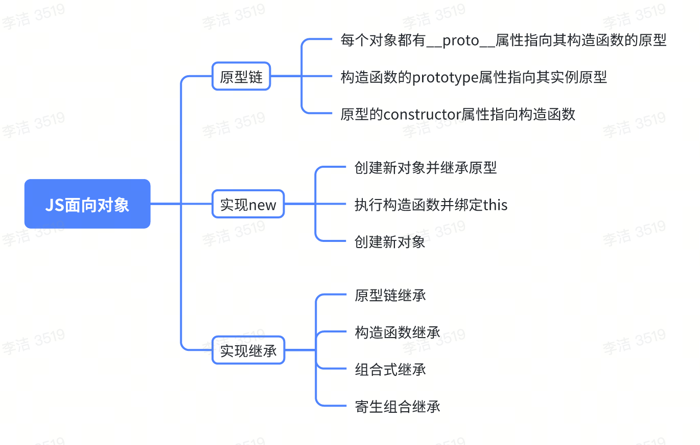

1. 自执行函数实现块级作用域

```js
(function() {
    for(var i = 0; i < 5; i++) {
        console.log(i); // 0 1 2 3 4
    }
})();

console.log(i) // Uncaught ReferenceError: i is not defined
```
2. var 和 let/const的区别

    - var声明的变量会挂在window上，而let和const不会；
    - var声明的变量存在变量提升(提升的只是变量的声明)，而let和const不会；
    - let和const声明形成块级作用域，只能在块级作用域里访问，不能跨块访问，也不能跨函数访问；
    - 同一作用于域下，let和const不能声明同名变量，而var可以；
    - 暂时性死区，let和const声明的变量不能在声明前使用；

3. ES5实现const

```js
function _const(key, value) {
    Object.defineProperty(window, key, {
        value,
        writable: false
    })
}
_const('obj', { a: 1})
obj.b = 1; // 可以正常赋值
obj = {}; // 不报错，但是赋值失败

```

4. 手写call

call使用一个指定的this值和单独给出的一个或多个参数来调用一个函数。
```js
Function.prototype.myCall = function(context = window, ...args) {
    const fn = Symbol();
    context[fn] = this;
    let result = context[fn](...args);
    delete context[fn];
    return result;
}
// 
function foo() {
    console.log(this.name)
}
const obj = {
    name: 'muzishuiji'
}
foo.myCall(obj)
```


5. 手写apply
apply方法调用一个具有给定this值的函数，以及作为一个数组（或类似数组对象）提供的参数。
```js
Function.prototype.myApply = function(context = window, args) {
    let fn = Symbol();
    context[fn] = this;
    let result = context[fn](...args);
    delete context[fn];
    return result;
}
function foo() {
    console.log(this.name)
}
const obj = {
    name: 'muzishuiji'
}
foo.myApply(obj, [])
```

6. 手写bind
bind方法创建一个新的函数，在bind()方法被调用时，这个新函数的this被指定为bind()的第一个参数，而其余参数作为新函数的参数，提供调用时使用。

```js
Function.prototype.myBind = function (context, ...args1) {
    // 如果返回的函数被以构造函数调用，就沿用旧逻辑，否则使用apply修改this
    let _this = this;
    return function F(...args2) {
        if(this instanceof F) {
            return new _this(...args1, ....args2);
        } else {
            return _this.apply(context, args1.concat(args2))
        }
    }
}
let obj = {
    name: "muzishuiji"
}
function foo() {
    console.log(this.name)
    console.log(arguments)
}
const aa = foo.myBind(obj, 'a', 'b', 'c')  // 输出 muzishuiji
aa(); // 输出 muzishuiji a b c
```

7. 手写防抖
```js
function myDebounce(fn, wait) {
    let timer = null;
    return function (...args) {
        if(timer) {
            clearTimeout(timer);
            timer = null;
        }
        setTimeout(() => {
            fn.apply(this, args);
        }, wait);
    }
}
```
8. 手写节流
```js
function myThrottle(fn, wait) {
    let timer = null;
    return function(...args) {
        let context = this;
        if(!timer) {
            timer = setTimeout(function () {
                clearTimeout(timer)
                timer = null;
                fn.apply(context, args);
            }, wait);
        }
    }
}
``` 

9. 数组扁平化

    1. flat()
    ```js
    const arr = [1, [1,2], [1,2,3]]
    arr.flat(Infinity)  // [1, 1, 2, 1, 2, 3]
    ```
    2. 序列化后正则
    ```js
    const arr = [1, [1,2], [1,2,3]]
    const arr = `[${JSON.stringify(arr).replace(/\[|\]/g, '')}]`
    JSON.parse(arr) // // [1, 1, 2, 1, 2, 3]
    ```
    3. 使用递归实现
    ```js
    const arr = [1, [1,2], [1,2,3]];
    function flat(_arr) {
        return _arr.reduce((pre, cur) => pre.concat(cur instanceof Array ? flat(cur) : cur), [])
    }
    flat(arr) // // [1, 1, 2, 1, 2, 3]
    ```

10. js面向对象

    原型链的核心有三点：
    1. 每个对象都有__proto__属性，该属性指向其原型对象，在调用实例的方法和属性时，如果在实例上找不到，就会往原型对象上找。
    2. 构造函数的prototype属性也指向实例的原型对象；
    3. 原型对象的constructor属性指向构造函数；



11. 模拟实现new

实现逻辑梳理：
- 定义一个对象，让该对象的原型指向传入函数的原型；
- 绑定传入的函数执行时的this为创建的对象；
- 返回一个对象，函数原本有返回则返回函数原来的，没有则返回创建的这个对象；

```js
function New(fn) {
    let obj = {};
    let args = Array.prototype.slice.call(arguments, 1);
    obj.__proto__ = fn.prototype;
    let result = fn.apply(obj, args);
    return result instanceof Object ? result : obj;
}

const pp1 = New(Person1, "pp1", 18, "famle")
const pp2 = New(Person1, "pp2", 28, "male")
console.log(pp1.__proto__ === pp2.__proto__) // true
console.log(pp1.__proto__ === Person.prototype) // true
```

12. js继承

[原型链与继承](./原型链与继承.md)

13. V8如何执行一段js代码

    1. 预解析：检查语法错误但不生成AST；
    2. 生成AST：经过词法/语法分析，生成抽象语法树；
    3. 生成字节码：基线（Ignition）编译器将AST转换为字节码；
    4. 生成机器码：优化编译器（Turbofan）将字节码转换成优化过的机器码，此外在逐行执行字节码的过程中，如果一段代码经常被执行，那么V8会将这段代码直接转换成机器码保存起来，下一次就可以直接使用，优化了加载速度。

14. 小程序和H5有什么区别？

    - 小程序
    渲染方式不同，小程序一般是通过native原生渲染的，但是小程序同时也支持web渲染，如果使用web渲染的方式，我们需要初始化一个webview组件，然后在webview中加载H5页面。
    native方式通常情况下性能要优于web方式。
    - 小程序特有的双线程设计。H5下我们所有资源通常都会打到一个bundle.js文件里（不考虑分包加载），而小程序编译后的结果会有两个bundle，index.js封装的是小程序项目的view层，以及index.worker.js封装的是项目的业务逻辑，在运行时，会有两条线程来分别处理两个bundle，一个是主渲染线程，它负责加载并渲染index.js里的内容，另外一个是Service Worker线程，它负责执行index.worker.js里封装的业务逻辑，这里面有很多对底层api的调用。

15. 0.1 + 0.2 !== 0.3

    - 产生这个情况的原因
    ECMAScript中Number类型使用IEEE754标准来表示整数和浮点数值。所谓IEEE754标准，全程IEEE二进制浮点数算数标准，这个标准定义了浮点数的格式等内容
    IEEE754中，规定了四种表示浮点数的方式：单精确度（32位）、双精确度（64位）、延伸单精确度、与延伸双精确度。像ECMAScript采用的就是双精确度，也就是说，会用64位来储存一个浮点数。
    浮点数在储存时会被转成二进制，但0.1转换成二进制是一个无限循环的数，但ECMAScript使用64位来存储浮点数，存储的过程会发生精度丢失。后面0.1和0.2的浮点数计算也发生了精度丢失（参与计算的是两个近似值，近似值会累积误差），最终导致了 0.1 + 0.2 !== 0.3
    - 如何解决？
    解决精度丢失问题，有以下方法：
        1. 使用toFixed或者toPrecision方法
        这并不能消除精度问题，但你可以用它们来控制小数点位数，让比较结果更加稳定。
        ```js
        let sum = (0.1 + 0.2).toFixed(2);
        console.log(sum)
        console.log(sum == 0.30)
        ```
        2. 数字运算中的适度容差
        给比较操作引入一个非常小的值（epsilon），当两个浮点数的差值在这个小值之内时，就认为它们是相等的。
        ```js
        function isEqual(a,b,epsilon = Number.EPSILON) {
            // 误差在极小值的范围内，认为相等
            return Math.abs(a - b) < epsilon;
        }
        console.log(isEqual(0.1+0.2, 0.3)); // true
        ```
        3. 将浮点数转换为整数进行运算
        通过先将浮点数放大转换为整数，再进行运算，这样可以避免浮点数的精度问题。
        ```js
        function add(a, b) {
            // 将浮点数放大位整数计算
            let multiplier = 1000000;
            return (Math.round(a * multiplier) + Math.round(b * multiplier)) / multiplier;
        }
        console.log(add(0.1, 0.2) === 0.3); // true
        ```
        4. 使用三方库
        有一些javascript库专门处理精确的浮点数运算，如decimal.js,big.js等。
        使用decimal.js:
        ```js
        const Decimal = require('decimal.js');
        let a = new Decimal(0.1);
        let b = new Decimal(0.2);
        let sum = a.plus(b);
        console.log(sum.toNumber() === 0.3) // true
        ```
        使用big.js:
        ```js
        const Big = require('big.js');
        let a = new Big(0.1);
        let b = new Big(0.2);
        let sum = a.plus(b);
        console.log(sum.toString() === '0.3')  // true
        ```
    - bitNum的处理

16. 一段js代码是如何执行的；
    在执行一段代码时，js会创建一个执行栈，然后js引擎会创建一个全局上下文，并push到执行栈中，这个过程js引擎会为这段代码中的所有变量分配内存并赋一个初始值（undefined），在创建完成后，js引擎会进入执行阶段，这个过程js引擎会逐行的执行，即为之前分配好的内存的变量逐个赋值。
    如果代码中存在function的声明和调用，那么js引擎会创建一个函数执行上下文，并push到执行栈中，其创建和执行过程跟全局执行上下文一样。但有特殊情况，即当函数中存在对其它函数的调用时，js引擎会在父函数的执行过程中，将子函数的全局上下文push到执行栈。
    还有一种特殊情况时，在子函数执行的过程中，父函数已经return了，这种情况下，js引擎会将父函数的上下文从执行栈中移除，与此同时，js引擎会为还在执行的子函数上下文创建一个闭包放在[[scopes]]中，这个闭包里保存了父函数内声明的变量及其赋值，子函数仍然能够在其上下文中访问并使用父函数中的变量/常量。当子函数执行完毕，js引擎才会将子函数的上下文及闭包一并从执行栈中移除。
    js引擎单线程的，那么它是如何处理高并发的呢？即当代码中存在异步调用时js是如何执行的。比如setTimeout或fetch请求都是non-blocking的，当异步调用代码触发时，js引擎会将需要执行的代码移出调用栈，直到等待到返回结果，js引擎会立即将与之对应的回调函数push进任务队列中等待被调用，当调用（执行）栈中已经没有需要被执行的代码时，js引擎会立刻将任务队列中的回调函数逐个push进调用栈并执行。这个过程我们称之为事件循环。

17. for...of 循环
for...of 循环相较于forEach性能会损：
- 额外的抽象层：for...of循环需要通过迭代器协议来访问元素，这会引入额外的抽象层，可能会导致一些性能开销；
- 内部实现：某些js引擎可能会对for...of的优化不如传统的for循环或forEach方法；

18. 一些支持跨域的标签

- iframe
- script
- img
- link
- audio
- video

19. 使用CORS实现跨域

CORS（Cross-Origin Resource Sharing，跨域资源共享）是一种基于HTTP头的机制，允许服务器声明哪些源站通过浏览器有权限访问哪些资源。CORS是现代Web开发中推荐的方式，因为它提供了更安全和灵活的跨域请求解决方案。

服务端代码示例（Node.js示例），在服务端，需要设置适当的CORS头，允许跨域请求。
```js
const express = require('express');
const app = express();

// 设置cors头
app.use((req, res, next) => {
    res.header('Access-Control-Allow-Origin', '*'); // 允许所有域名访问
    res.header('Access-Control-Allow-Methods', 'GET, POST, PUT, DELETE, OPTIONS'); // 允许的HTTP方法
    res.header('Access-Control-Allow-Headers', 'Content-Type, Authorization');  // 允许的请求头
    next();
});

// 处理实际请求
app.get('/api/data', (req, res) => {
    const data = {
        message: 'Hello from the server!',
        timestamp: new Date().toISOString()
    }
    res.json(data);
});

app.listen(3000, () => {
    console.log('Server is running on http://localhost:3000');
});
```

20. Event对象常见应用

  1. event.preventDefault()：取消事件的默认动作；
  2. event.stopPropagation()：阻止事件冒泡；
  3. event.stopImmediatePropagation()：
  阻止剩下的事件处理程序执行。如果一个元素绑定了三个事件，在其中一个事件上调用了这个方法，那其他的两个事件将不会被执行。

21. 原型、构造函数、实例、原型链


22. instanceof的原理

instanceof用于判断一个引用类型是否属于某个构造函数，只要在实例对象的原型链上的构造函数，instanceof都会返回true。

判断操作符右边对象的原型是否在操作符左边对象的原型链上。

```js
obj3 instanceof M // true
obj instanceof Object // true
```
23. 如何理解[].shift.call(arguments)

shift内部实现是使用this代表对象。那么[].shift.call()传入arguments对象的时候，通过call函数改变原来shift方法的this指向，使其指向arguments，并对arguments进行复制操作，而后返回一个新数组。至此便完成了arguments类数组转数组的目的。让类数组可以调用数组的方法。

24. 任务队列

  - 所有同步任务都在主线程执行，形成一个执行栈（execution context stack）；
  - 主线程之外，还存在一个“任务队列”，只要异步任务有了运行结果，就在“任务队列”中放置一个任务；
  - 一旦“执行栈”中所有同步任务执行完毕，系统就会读取”任务队列“，看看里面有哪些事件。将任务队列中的任务一一push进执行栈，开始执行。

  任务队列分为宏任务队列和微任务队列，每次同步任务执行完毕后，会先将微任务队列一一执行，然后从宏任务队列中取出一个宏任务执行，此为一个事件循环，接着重复上述步骤；

25. requestAnimationFrame的执行机制

requestAnimationFrame是浏览器提供的一个API，用于在浏览器下一次重绘之前执行指定的回调函数。它允许开发者以一种有效且与浏览器渲染周期同步的方式来更新动画，这使得动画逻辑能够在最佳的时间节点执行，从而提高了应用的性能和动画的流畅度。

26. js中的显式绑定和隐式绑定

  - 显式绑定：通过call、apply、bind等方法显式指定this的值；
  - 隐式绑定：this的值由函数的调用上下文决定，通常在对象方法调用时发生；

27. 箭头函数的this

箭头函数的this是固定的（定义的时候就确定了），从定义它的上下文中继承，且后续不会发生改变，也不支持通过显式绑定改变。

28. 可以通过JSON.parse(JSON.stringify(object))来实现深拷贝，有几个需要注意的地方：

  - 会忽略undefined；
  - 无法处理函数和特殊对象（Map对象，Set对象，Error对象、Date对象、RegExp对象、Symbol等）。
  - 不能处理循环引用：如果对象中存在循环引用，会抛出错误；
  - 性能问题：在处理大型对象时可能存在性能问题，尤其是在对象嵌套层次较深的情况下；
  - 原型链丢失：深拷贝后的对象将丢失原型链上的属性和方法；

29. Proxy 和 Object.defineProperty

Proxy 和 Object.defineProperty 都是js中用于实现对象属性拦截和代理的工具，但功能上存在一些区别：

 1. 拦截能力

  Proxy：

    - Proxy有更强大的拦截能力，可以拦截更多的操作，包括属性读取、属性赋值、属性删除、函数调用、构造函数调用、属性枚举、属性存在性检查、属性描述符获取、属性描述符设置、对象冻结、对象是否可扩展、对象是否冻结、对象原型设置等。
    - 动态代理：Proxy可以代理整个对象，而不仅仅是对象的某个属性，这意味着你可以在对象创建时动态的拦截所有所有属性的操作，而不是在对象创建后逐个定义属性的拦截器。

  Object.defineProperty

    - 有限的拦截能力：只能拦截属性的读取和赋值操作；
    - 静态定义： Object.defineProperty需要在对象创建后逐个定义属性的拦截器；

  2. 性能

  Proxy：
    - 惰性加载：Proxy的拦截器是惰性加载的，只有在实际操作发生时才会调用，因此在某些情况下，Proxy的性能可能优于Object.defineProperty。

  Object.defineProperty
  
    - 需要在对象创建时逐个定义拦截器，可能会影响性能。

  3. 错误处理

  Proxy

    - 细粒度的错误处理：Proxy提供了更细粒度的错误处理能力，你可以拦截器中捕获和处理错误；
    
  Object.defineProperty 

    - Object.defineProperty在定义属性时如果发生错误，可能会导致整个对象的定义失败；

  4. 支持的对象类型
    - Proxy可以代理数组和函数，而Object.defineProperty 只能代理对象的属性。
  5. 语法简洁性
    - Proxy的语法更简洁，拦截多个操作时，只需要定义一个handler对象，并在其中定义需要拦截的操作，而不需要为每个属性单独定义拦截器。
    - Object.defineProperty：需要为每个属性单独定义拦截器，语法相对繁琐；

**使用示例**

```js
// Proxy
const target = {
    a: 1,
    b: 2
};
const handler = {
    get(target, prop, receiver) {
        console.log(`Getting ${prop}`);
        return Reflect.get(target, prop, receiver);
    },
    set(target, prop, value, receiver) {
        console.log(`Setting ${prop} to ${value}`);
        return Reflect.set(target, prop, value, receiver);
    },
}
const proxy1 = new Proxy(target, handler);
proxy.a; // 输出: Getting a
proxy.b = 3; // 输出: Setting b to 3

// Object.defineProperty
const target = {
    a: 1,
    b: 2
}
// 需要遍历对象，为每个属性定义拦截器
Object.keys(target).forEach(key => {
    const val = target[key];
    Object.defineProperties(target, key, {
        get() {
            console.log(`Getting ${key}`);
            return val;
        },
        set(newValue) {
            console.log(`Setting ${key} to ${newValue}`);
            target[key] = newValue;
        }
    })
});
target.a; // 输出: Getting a
target.b = 3; // 输出: Setting b to 3
```

**Reflect**

Reflect提供了一组静态方法，这些方法与Proxy的拦截器方法一一对应，用于执行对象的基本操作。结合使用Proxy和Reflect，可以实现对对象操作的细粒度控制和自定义。

30. Promise A+规范的核心逻辑

  1. Promise本质是一个状态机，且状态只能分为以下几种：Pending（等待态），Fulfilled（执行态），Rejected（拒绝态），状态的变更是单向的，只能从Pending->Fulfilled或Pending->Rejected，状态变更不可逆。

  2. then方法接收两个可选参数，分别对应状态改变触发的回调。then方法返回一个promise。then方法可以被同一个promise调用多次。

31. 观察者模式和发布-订阅模式的区别

  - 在观察者模式中，观察值是知道被观察者的，被观察者记录了所有的观察者。然而，在发布订阅模式中，发布者和订阅者不知道对方的存在。它们只有通过消息代理进行通信。
  - 在发布订阅模式中，组件是松散耦合的，正好和观察者模式相反；
  - 观察者模式大多数时候是同步的，当事件触发，被观察者就会去调用观察者的方法。而发布订阅模式大多数时候是异步的（使用消息队列）。
  - 观察者模式需要在单个应用程序地址空间中实现，而发布-订阅更像是交叉应用模式。

32. Object.prototype.toString.call

原理：读取对象的`Symbol.toStringTag`一个内置`symbol`，它通常作为对象的属性键使用，对应的属性值应该为字符串类型，这个字符还用来表示该对象的自定义类型标签，通常只有内置的Object.prototype.toString方法回去读取这个标签并把它包含在自己的返回值里。

```js
const obj = {};
// 定义属性
Object.defineProperty(obj, Symbol.toStringTag, { value: "Module" });
// 查看自定义类型
console.log(Object.prototype.toString.call(obj)); // '[object Module]'
```

32. with 和 eval

**with**

  with语句用于扩展一个语句的作用域链。
  ```js
  with(expression) {
    statement;
  }
  ```
  JavaScript 查找某个未使用命名空间的变量时，会通过作用域链来查找，作用域链是跟执行代码的 context 或者包含这个变量的函数有关。`with`语句将某个对象添加到作用域链的顶部，如果在 statement 中有某个未使用命名空间的变量，跟作用域链中的某个属性同名，则这个变量将指向这个属性值。如果沒有同名的属性，则将拋出`ReferenceError`异常。

  **注意事项**

  - 性能问题：with语句会降低代码的性能，因为它会改变作用域链，导致js引擎无法进行有效的优化；
  - 可读性差：with语句会使代码难以阅读和理解，因为它隐藏了变量的来源；
  - 潜在的命名冲突：with语句可能会导致命名冲突，特别是在嵌套的作用域中；
  
**eval**

  eval函数用于执行一个字符串形式的js代码。

  **注意事项**

  - 安全风险：eval执行的代码可以访问当前作用域中的变量和函数，这可能导致安全问题，特别是在执行不受信任的代码时；
  - 性能问题：eval会降低代码的执行性能，因为它会动态解析和执行代码，而不是在编译时进行优化；
  - 可读性差：eval函数会使代码难以阅读和理解，因为它隐藏了代码的实际执行逻辑；
  - 调试困难：eval执行的代码难以调试，因为它是在运行时动态生成的；

33. Web Component

Web Component的优势：
  1. 封装性：Web Component允许开发者将组件的HTML、CSS和js封装在一起，自带隔离性，可避免与外部样式和脚本冲突。
  2. 可重用性：自定义元素可以在不同的项目中重复使用，而不需要依赖特定的框架和库；
  3. 跨框架兼容性：Web Component可以在不同的框架中使用，因为它是基于Web标准的；
  4. 性能：由于Web Component是基于web技术的，因此它们的性能比基于框架的组件更好；

Web Component的局限性：
  1. 浏览器兼容性：虽然现代浏览器web components的支持已经很好，但在一些旧版本的浏览器中可能需要polyfill；
  2. 复杂性：开发和维护Web Component比使用框架更复杂，尤其在处理复杂交互和状态管理时；
  3. 生态系统：Web Component的生态系统相对较小，没有像React或Vue那样丰富的第三方库和工具；

Web Component是一组强大的Web平台API，允许开发者创建可重用的自定义元素或组件，并将它们封装起来，以便在不同的项目中使用。

34. 大文件上传

  - 前端

    1. 读取本地的文件，读成一个文件对象；
    2. 使用slice对文件对象进行切割，并得到blob类型的文件对象；
    核心就是利用Blob.prototype.slice这个方法，它和数组的slice方法相似，但不是，文件的slice方法可以返回原文件的某个切片，将大文件对象切割成小的blob对象，由于后端无法识别blob对象，所以需要转为前后端都能识别的formData对象，再用post请求发送给后端。
    3. 将blob类型的文件对象转成formData表单类型的对象；
    4. 发送请求，将formData对象切片一个一个发送给后端；

  - 后端

    1. 接受前端传递的切片并解析切片得到数据；
    2. 保存切片到某个文件夹；
    3. 当接受到前端的合并请求后，开始合并切片或者接收到所有chunk后开始合并切片；
    4. 创建可写流，将所有的切片读成流类型并汇入到可写流中得到完整的文件资源；

35. 冯诺依曼原理

> 冯诺依曼原理是现代计算机设计的基础理论，由著名数学家和计算机科学家约翰冯诺依曼提出。这一原理主要包括两个核心概念：存储程序和程序控制。

  1. 存储程序：这一概念指出计算机的程序和数据都应以同等地位存储在计算机的内存中。这意味着程序指令和处理的数据都被视为二进制信息，并且可以按地址访问。在计算机运行之前，程序会被加载到内存中，等待执行。
  2. 程序控制：计算机根据存储在内存中的程序指令序列自动执行任务，无需人工干预。计算机从第一条指令开始，控制器负责输出指令、解码并执行，然后根据指令的要求顺序执行后续指令，知道程序结束或者遇到停止指令。指令不仅指定了数据的运算方式，也指定了下一条要执行的指令地址，从而实现了流程控制。

36. String 对象有哪些静态方法

```js
// 可通过以下命令获取
Object.getOwnPropertyNames(String);

```
  - length: 字符串长度
  - name: 字符串名称
  - fromCharCode(num1[, ...[, numN]]):
  返回使用指定的Unicode值创建的字符串。参数为一个或多个Unicode值，返回值为一个新的字符串。
  ```js
  console.log(String.fromCharCode(65, 66, 67)); // 输出: 'ABC'
  ```
  - fromCodePoint(num1[, ...[, numN]):
  返回使用指定的代码点序列创建的字符串。
  ```js
  console.log(String.fromCodePoint(65, 66, 67)); // 输出: 'ABC'
  console.log(String.fromCodePoint(0x1F600)); // 输出: "😀"
  ```
  - raw: 用于获取模版字符串的原始字符串形式，即不进行任何转义处理。它通常用于模版字符串中。
  ```js
  let rawStr = String.raw`Hello\nWorld`;
  console.log(rawStr); // 输出：hello\\world
  ```

37. js的基础数据类型

  - Null;
  - Undefined;
  - Boolean;
  - Number;
  - String;
  - Symbol;
  - BigInt：表示任意精度的整数，可以表示大于Number类型支持的整数范围（-(2^53 - 1) 到 2^53 - 1），ES11/ES2020引入。

  
38. BOM对象

BOM（browser object model），浏览器对象模型，提供了独立于内容和浏览器窗口进行交互的对象。

  - window；
  - location；
  - navigator；
  - screen；
  - history；

39. 闭包是内层函数有权访问它外部作用域中的任何变量。

闭包使得函数中变量的生命周期得到延长，函数柯里化正是借助闭包实现的。

40. 作用域：即变量和函数生效的区域或集合。

词法作用域，又叫静态作用域，变量被创建时就确定好了，而非执行阶段确定的。也就是说我们写代码时它的作用域就确定了，js遵循的就是词法作用域。

41. 函数的this

函数的this关键字在js中的表现略有不同，在绝大多数情况下，函数的调用方式决定了this的值（运行时绑定）。

this关键字是函数运行时自动生成一个内部对象，只能在函数内部使用，总是指向调用它的对象。

严格模式下，不能将全局对象用于默认绑定，this会绑定到undefined，只有函数运行在非严格模式下，默认绑定才能绑定到全局对象。

关于this绑定的优先级：new绑定的优先级 > 显式绑定优先级 > 隐式绑定优先级 > 默认绑定优先级。

42. 事件流会经历三个阶段

  - 事件捕获阶段（capture phase）；
  - 处于目标阶段（target phase）；
  - 事件冒泡阶段（bubbling phase）；

43. 事件委托

事件委托，会把一个或者一组元素的事件委托到它的父层或者更外层元素上，真正绑定事件的是外层元素，而不是目标元素。

当事件响应到目标元素上时，会通过事件冒泡机制从触发它的外层元素的绑定事件上，然后在外层元素上去执行函数。

适合事件委托的事件有：click、mousedown、mouseup、keydown、keyup、keypress (即拥有冒泡机制的事件)。

事件委托的优点：
  - 减少事件绑定的数量，减少整个页面所需的内存，提升整体性能；
  - 动态绑定，减少重复工作；

44. super指向当前对象的原型对象。

45. 尾递归

在递归调用过程中系统会为每一层的返回点，局部量等开辟栈来存储，递归次数过多容易造成栈溢出。

这时候，我们可以使用尾递归，即一个函数中所有递归形式的调用都出现在函数的末尾，对于尾递归来说，由于只存在一个调用记录，所以永远不会发生“栈溢出”错误。

```js
// 普通的递归调用
function factorial(n) {
  if(n === 1) {
    return 1;
  }
  return n * factorial(n - 1);
}
factorial(5); // 120
// 尾递归调用优化
function factorial(n, total) {
  if(n === 1) {
    return total;
  }
  // 每次返回的是一个新的函数，不带上一个函数的参数，也就不需要存储上一个函数了
  return factorial(n - 1, n * total);
}
factorial(5); // 120
```

46. 埋点平台的采样方案

总体思路梳理：
  1. 实现一个util支持输入一个uid字符串，输出一个哈希值；这个方法需要确保两点：
    - 输出一个1-1000的哈希值；
    - 保证每次相同的输入都是确定的哈希值；
  2. 将生成的哈希值对1000取余，如果值在 [1, ratio * 1000）范围内，则命中灰度，否则，未命中灰度；

```js
// 整体设计用传入的userId的unicode码生成对应的数值
// 在用这个数值对1000取余，求这个数据的映射范围
// 根据映射范围判断是否命中用户采样灰度
function hashUserId(userId) {
  let hash = 5381;
  for (let i = 0; i < userId.length; i++) {
    hash = hash * 33 + userId.charCodeAt(i);
  }
  return Math.abs(hash) % 1000 + 1;
}
console.log(hashUserId('85d46fd47bdfa7476a2bc1f51f45726')); // 输出某个值，例如 345
console.log(hashUserId('85d46fd47bdfa7476a2bc1f51f45726')); // 应该输出相同的值，例如 345
console.log(hashUserId('abcdef12345')); // 输出另一个值，例如 876
function isHitRatio(userId, ratio) {
  let baseVal = 1000;
  // 保证每次相同的userid生成相同的hash值
  let hashVal = hashUserId(userId);
  return hashVal % baseVal < ratio * baseVal;
}
isHitRatio('ssss', 0.1);
```

47. tsc --noEmit

tsc --noEmit是ts编译器的一个命令行选项，用于编译检查你的ts代码而不生成任何输出文件。它会执行所有的类型检查和编译阶段的验证，但是不会将ts文件编译成js文件或输出声明文件。

使用场景：

  1. 类型检查：当你只想验证代码是否符合TypeScript类型系统的要求，而不希望生成新的js文件时，可以使用--noEmit。这在持续集成（CI）环境中特别有用，以确保代码库中么有类型错误。
  2. 构建过程优化：如果你有一个复杂的构建流程，并且只在某些阶段进行类型检查，其他阶段才需要实际编译输出，那么可以在不需要输出文件的时候用--noEmit来节省时间和资源。
  3. 编译器/IDE集成：一些编辑器或IDE可能在后台运行带有--noEmit的tsc实例，以便提供实时的类型检查和错误报告，而不会干扰用户的开发环境。
  4. 预提交钩子：在Git的pre-commit hooks中使用--noEmit可以确保在每次提交之前都进行了完整的类型检查，从而避免将包含类型错误的代码提交到仓库。

48. import.meta

import.meta元属性将特定上下文的元数据暴露给js模块。它包含了这个模块的信息，例如这个模块的URL。

  - url：此模块的完整URL，包括查询参数和片段标识符（在？和#之后）。在浏览器中，它是可获得此脚本的URL（对外部脚本）或者是包含此脚本的URL（对内联脚本）。在Node.js中，它是文件路径（包括 file:// 协议部分）。
  - resolve：将一个模块的标识符解析为相对于当前模块的URL；

import.meta不是属性访问器而是特殊的表达式语法（因为import是保留字而不是标识符）。

import.meta元属性在js模块中可用；在模块之外（包括在模块中直接调用eval），使用import.meta是语法错误。

示例：

  - 传递查询参数：
  在import声明中使用查询参数允许为特定模块传递参数，可作为应用程序从window.location读取参数的补充方式：

  ```HTML
  <script type="module">
    import './index.mjs?someURLInfo=5'
  </script>
  ```
  index.mjs模块可以通过import.meta获取someURLInfo参数：

  ```js
  new URL(import.meta.url).searchParams.get("someURLInfo");  // 5
  ```
  - 相对当前文件解析文件路径
  在Node.js的commonjs模块中，有专门的__dirname变量，值为包含当前文件的文件夹的绝对路径，可以用来解析相对路径。但是，ES模块除了import.meta之外没有上下文变量。因此，要解析相对路径的文件，可以使用import.meta.url。注意这个属性使用的是URL而非文件系统的路径。

  ```js
  // 之前（commonjs）
  const fs = require('fs/promises');
  const path = require('path');
  const filePath = path.join(__dirname, 'someFile.txt');
  fs.readFile(filePath, 'utf8').then(console.log);

  // 之后（ES模块）
  import fs from 'node:fs/promises';
  const fileURL = new URL('./someFile.tex', import.meta.url);
  fs.readFile(fileURL, 'utf8').then(console.log)
  ```

49. 埋点主要采集什么？
  1. 程序错误
  2. 性能问题
  3. 用户行为：页面访问、跳转、停留时长

业界比较优秀的埋点平台：神策、ARMS、Sentry。

50. 埋点上报的方案

  1. 创建image标签的上报；
  2. 设置定时或一定数据量上报；
  比如一秒上报一次，或者数据到达10条以上上报；
  3. 页面离开时上报，可以利用navigator.sendBeacon委托浏览器在页面关闭时上报；

51. 跨域和跨站

跨域：协议、域名、端口有一个不一样就是跨域；
跨站：域名不一样是跨站；
通常是顶级域名+二级域名一样则视为同站，否则视为跨站。有一些公共后缀的特殊情况也会涉及跨站。

52. Image Beacon

Image Beacon(图片信标)是一种前端技术，用于在不需要用户交互的情况下，将数据发送到服务器。它通过创建一个Image对象，并将数据作为URL参数拼接到图片的src属性中，从而触发一个CET请求。由于请求时异步的，且不会阻塞页面渲染，因此它非常适合用于数据上报、埋点统计等场景。

53. navigator.sendBeacon
navigator.sendBeacon是web api中的一个方法，用于在页面卸载货关闭时，异步且可靠地向服务器发送少量数据。它主要用于日志记录、用户行为分析、错误报告等场景，确保数据在页面关闭或跳转时能够成功发送，而不阻塞页面的卸载过程。

54. 为什么js会阻塞页面解析？

图片和css资源的加载不会阻塞页面解析，但js的加载会阻塞页面解析，解决这个问题有两个办法：
  - 异步加载js，设置async、defer等属性；
  - 将js放在body之后加载；
因为js具有修改DOM和CSSOM的能力。浏览器为了确保页面的一致性和准确性，会等待js执行完毕后继续页面解析。

为避免js阻塞页面解析，可以将js放在body后加载，异步加载js（defer或async），但是async加载的js因为是下载完立即解析执行，所以可能也会阻塞页面解析，而defer加载的js会等到页面解析完毕后才执行。

55. javascript的作用域时词法作用域，即函数的作用域是在函数定义时就已经确定，而不是在函数调用的时候确定的。

```js
var a=3;
function c(){
  // 函数c定义的时候其外层作用域就是全局作用域，所以访问的是全局变量a
  alert(a);
}
(function(){
  var a=4;
  c();
})();
// alert 3
```

56. 如果一个路由支持a->b->c,同时支持c->b->a，则可以考虑使用两个栈。
  - 主栈：存储当前路由历史；
  - 副栈：存储返回时弹出的路由；

57. 代码中使用`await Promise.resolve()`的作用：

在代码中执行 `await Promise.resolve()`的作用是将当前代码的执行权交给事件循环，以便让其他任务（如微任务、宏任务）有机会执行。

作用
  - 暂停当前异步函数的执行：
    - await会暂停当前async函数的执行，直到Promise.resolve完成；
    - 由于Promise.resolve是一个立即完成的Promise，因此await会立即恢复执行；
  - 将后续代码放入微任务队列；
    - await Promise.resolve() 会将后续代码包装成一个微任务，放入微任务队列中；
    - 这样可以让事件循环先处理其他任务（如宏任务或其他微任务）；

58. DOM解析方法
```js
const domStr = `
<div class='container'>
  <div>Dom Parser</div>
  <ul>
    <li>Lorem.</li>
    <li>Adipisci.</li>
    <li>Mon.</li>
    <li>EA.</li>
  </ul>
</div>
`;
function removeTag(fragment) {
  const res = new DOMParser().parseFromString(fragment, 'text/html');
  console.log(res.body.textContent);
}
removeTag(domStr);
```

58. Web页面的多窗口通信

  1. localStorage + Storage事件
  在一个窗口中修改localStorage或sessionStorage，其他窗口通过监听storage事件捕获数据变更。
  ```js
  localStorage.setItem('message', JSON.stringify({ data: 'Hello' }));
  window.addEventListener('storage', e => {
    if(e.key === 'message') {
      const data = JSON.parse(e.newValue);
      console.log('Received:', data);
    }
  })
  ```
  2. Broadcast Channel API
  创建一个命名频道，所有窗口都通过该频道发送和接收消息。
  ```js
  const channel = new BroadcastChannel('my_channel');
  channel.postMessage({ data: 'Hello' });
  channel.onmessage = e => {
    console.log('received: ', e.data);
  }  
  ```
  3. SharedWorker
  实现方式：使用ShareWorker创建共享的后台线程，各窗口通过该线程中转消息。
  ```js
  const worker = new SharedWorker('worker.js');
  worker.port.postMessage({ data: 'Hello' });
  worker.port.onmessage = (e) => {
    console.log('Received:', e.data);
  } 
  ```
  4. window.postMessage和MessageChannel
  实现方式：通过window.postMessage直接向其他窗口发送消息（需要持有目标窗口的引用）；
  ```js
  const targetWindow = window.open('https://example.com');
  targetWindow.postMessage('hello', 'https://example.com');

  window.addEventListener('message', e => {
    if(e.origin === 'https://example.com') {
      console.log("Received:", e.data);
    }
  })
  ```
  5. Server-Send Events或WebSocket
  实现方式：通过服务器中转消息来完成多窗口之间的通信；
  6. IndexDB
  实现方式：使用IndexDB存储共享数据，通过轮询或监听变更事件实现通信；

