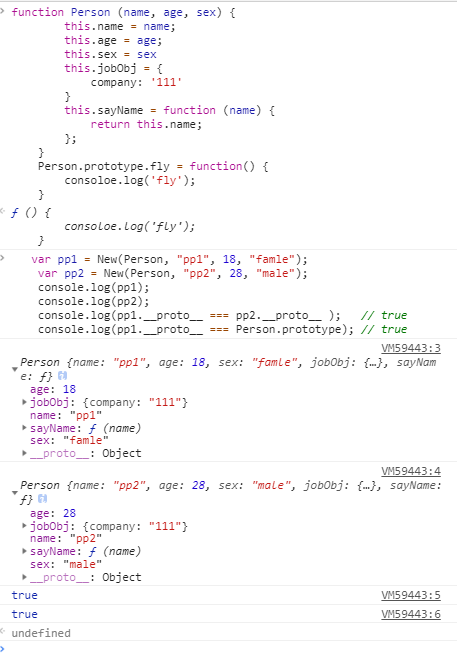

我们都知道new 操作符可以创建一个构造函数的实例,那使用new 操作符调用函数和直接调用函数的区别在哪里呢?new操作符究竟做了哪些事情呢?一起来探究下~
看下面这段代码:

    function Person (name, age, sex) {
        this.name = name;
        this.age = age;
        this.sex = sex
        this.jobObj = {
            company: '111'
        }
        this.sayName = function (name) {
            return this.name;
        };
    }
    Person.prototype.fly = function() {
        consoloe.log('fly');
    }
    var person = new Person("tom", 21, "famle");
    var person1 = Person("tom", 21, "famle");
    
运行截图如下:

使用new 操作符调用Person, 返回值是一个对象,这个对象继承Person构造函数里定义的所有属性和方法.

而简单调用Person方法的person1是undefined,这回死因为该方法没有直接的返回值,只是单纯的执行了一次调用操作.    

我们再来测试一下,多次使用new操作符调用构造函数返回的对象是不是同一个.

    var p1 = new Person("p1", 18, "famle");
    var p2 = new Person("p2", 28, "male"); 
    p1.name = 'muzishuiji';
    p2.name;   // 'p2'

可见new 操作符每次创建实例的时候是创建一个新的对象,并让它拥有构造函数里定义的属性和方法,并返回该对象,那么怎么让它拥有构造函数里定义的属性和方法呢?我们肯定不是傻傻的意义给新的对象绑定属性和方法对吧?那用什么来帮我们实现这步操作呢?

啊哈,原来是继承,通过继承的方式,让新创建的对象拥有构造函数的属性和方法,不就行了?关于继承有不同种方式,可以达到目的最优雅的继承方式就是寄生组合继承啦,带着上面的分析,我们来试着实现自己的New.

    // 接收一个参数: 要创建实例的构造函数
    var New = function(fun) {
        let obj = {}
        // 把处理构造函数之外的参数存起来
        const args = Array.prototype.slice.call(arguments, 1);
        obj.__proto__ = fun.prototype;   // 继承构造函数原型上的属性和方法
        // 创建自己的私有属性(其实就是将构造函数上的属性和方法复制一份给自己),
        // 避免构造函数里有引用类型的变量时,不同的实例间相互污染
        let result = fun.apply(obj, args); 
        return result instanceof Object ? result : obj;
    }
    var pp1 = New(Person1, "pp1", 18, "famle");
    var pp2 = New(Person1, "pp2", 28, "male"); 
    console.log(pp1);
    console.log(pp2);
    console.log(pp1.__proto__ === pp2.__proto__ );   // true
    console.log(pp1.__proto__ === Person.prototype); // true

运行结果的截图:

好啦,确实是这样的结果,支持为止我们就完美的实现了自己的New函数,为自己鼓掌~~~
