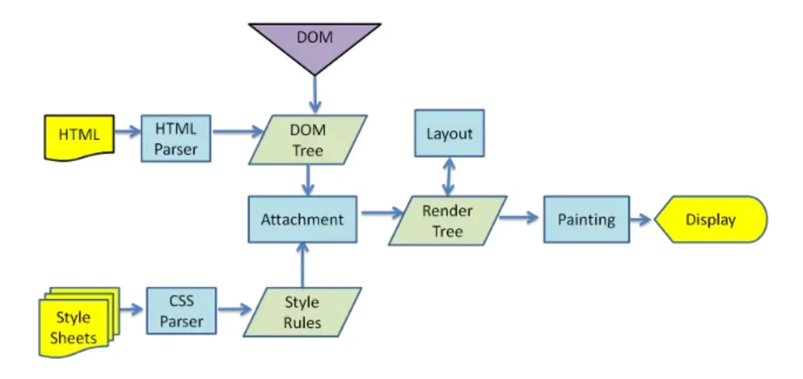

1. 浏览器的渲染过程是怎样的

大体流程如下：
- HTML和CSS经过各自解析，生成DOM树和CSSOM树
- 合并成为渲染树
- 根据渲染树进行布局
- 最后调用GPU进行绘制，显示在屏幕上

2. 如何根据浏览器渲染机制加快首屏速度?

  1. 优化文件大小：HTML和CSS的加载和解析都会阻塞渲染树的生成，从而影响首屏展示速度，因此我们可以通过优化文件大小、减少CSS文件层级的方法来加快首屏速度
  2. 避免资源下载阻塞文档解析：浏览器解析到<script>标签时，会阻塞文档解析，直到脚本执行完成，因此我们通常把<script>标签放在底部，或者加上defer、async来进行异步下载
  3. 采用ssr
  4. 预渲染pre-rendering