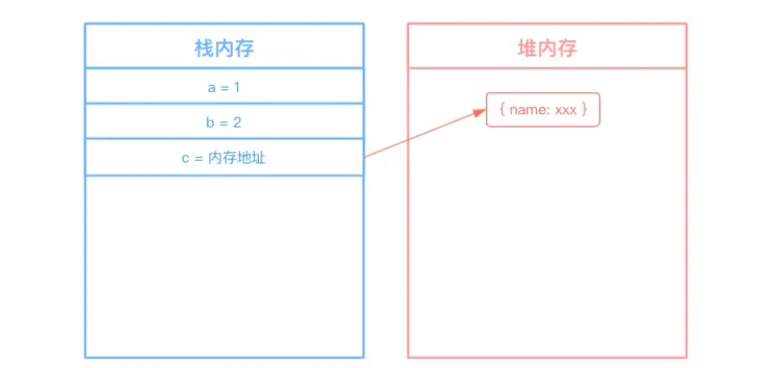
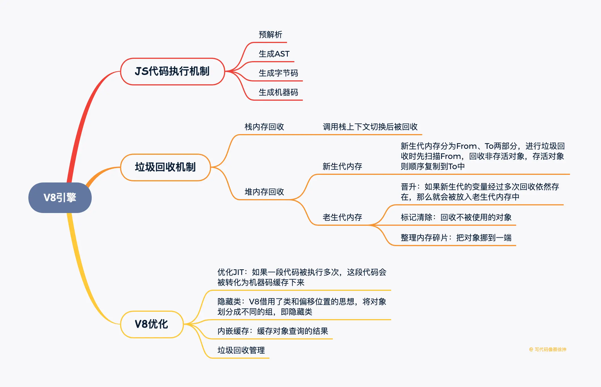

## V8引擎机制
1. V8引擎如何执行一段JS代码
    1. 预解析：检查语法错误但不生成AST；
    2. 生成AST：经过词法/语法解析，生成抽象语法树；
    3. 生成字节码：基线编译器（Ignition）将AST转换成字节码；
    4. 生成机器码：优化编译器（Turbofan）将字节码转换成优化过的机器码，此外在逐行执行字节码的过程中，如果一段代码经常被执行，那么V8会将这段代码直接转换成机器码存储起来，下一次执行就不必经过字节码，优化了执行速度；

2. 引用计数和标记清除

    - 引用计数：给一个变量赋值引用类型，则该对象的引用次数+1，如果这个变量成了其他值，那么该对象的引用次数-1，垃圾回收器会回收引用次数为0的对象。但是当对象循环引用时，会导致引用次数永远无法归零，造成内存无法释放。
    - 标记清除：垃圾收集器先给内存中所有对象加上标记，然后从根节点开始遍历，去掉被引用的对象和运行环境中对象的标记，剩下的被标记的对象就是无法访问的等待回收的对象。

3. V8如何进行垃圾回收

JS引擎中对变量的存储主要有两种位置，栈内存和堆内存，栈内存存储基本类型数据以及引用类型数据的内存地址，堆内存存储引用类型的数据。



**栈内存的回收：**
栈内存调用栈上下文切换就被回收，比较简单

**堆内存的回收：**
V8的堆内存分为新生代内存和老生代内存，新生代内存时临时分配的内存，存在时间短，老生代内存存在时间长。


    - 新生代内存回收机制：
        - 新生代内存容量小，64位系统下仅有32M。新生代内存分为From，To两部分，进行垃圾回收时，先扫描From，将非存活对象回收，将存活对象顺序复制到To中，之后调换From/To，等待下一次回收。
    - 老生代内存回收机制：
        - 晋升：如果新生代的变量经过多次回收依然存在，那么就会被放入老生代内存中；
        - 标记清除：老生代内存会先遍历所有对象并打上标记，然后对正在使用或被强引用的对象取消标记，回收被标记的对象；
        - 整理内存碎片：把对象挪到内存的一端；

[聊聊V8引擎的垃圾回收](https://juejin.cn/post/6844903591510016007#heading-10)

4. JS相较于C++等语言为什么慢，V8做了哪些优化
    1. js的问题：
        - 动态类型：导致每次存取属性/寻求方法的时候，都需要先检查类型；此外动态类型也很难在编译阶段进行优化；
        - 属性存取：c++/java等语言中方法、属性是存储在数组中的，仅需数组位移就可以获取，而js存储在对象中，每次获取都要进行哈希查询。
    2. V8的优化：
        - 优化JIT（即时编译）：相较于c++/java这类编译型语言，js一边解释一遍执行，效率低。V8对这个过程进行了优化：如果一段代码被执行多次，那么V8会把这段代码转化为机器码缓存下来，下次运行时直接使用机器码。
        - 隐藏类：对于C++这类语言来说，仅需几个指令就能通过偏移量获取变量信息，而js需要进行字符串匹配，效率低，V8借用了类和偏移位置的思想，将对象划分成不同的组，即隐藏类；
        - 内嵌缓存：即缓存对象查询的结果。常规查询过程是：获取隐藏类地址->根据属性名查找偏移值->计算该属性地址，内嵌缓存就是这一过程结果的缓存。
        - 垃圾回收管理：上文已介绍



## 浏览器调试

1. 设置断点（break point）
在chrome devtools中，你可以在源代码中设置断点，以暂停嗲吗执行。设置断点的方式有几种：
    - 点击行号左侧：在源代码视图的左侧空白区域点击，会在当前行设置一个断点。断点通常用一个小红圈表示；
    - 右键点击行号：右键点击行号，选择“toggle breakpoint”来设置或取消断点；
    - 使用debugger语句；在代码中插入debugger语句，当代码执行到这一行会自动暂停；
2. 断点控制按钮
一旦设置了断点并开始调试，你会看到几个主要的断点控制按钮：
    - Resume Script Execution（F8）:继续执行（F8）
        - 这个按钮通常表示为一个蓝色箭头，点击后会继续执行代码直到下一个断点或代码执行完毕。
    - Step Over Next Function Call（F10）：单步执行、步过（F10）
        - 步过按钮表示为一个蓝色箭头，点击后会执行当前的代码，但不会进入函数调用。如果当前行是一个函数调用，则会跳过该函数体内的代码。

    - Step Into Next Function Call（F11）： 步入（F11）
        - 步入按钮表示为一个向下的箭头，点击后会进入当前函数的调用。如果当前行是一个函数调用，则进入该函数体内进行逐行调试（步过调试）。
    - Step Out of Current Function Call(shift+F11): b步出（shift+F11）
        - 步出按钮是一个向上的箭头，点击后会退出当前的函数并继续执行外部的代码。

3. 断点条件设置
出了基本的断点设置外，Chrome DevTools还允许你为断点设置条件。
    - 条件断点：可以在断点处设置条件表达式，只有当条件满足时，断点才会激活，如：设置x>10作为断点条件。
    - Log Point：可以在断点处记录变量的值，当代码执行到断点时，会在控制台输出指定的信息。

4. 断点的管理

    - 断点列表：在Sources面板中，你可以查看当前设置的所有断点，并对其进行管理；
    - 禁用/启用断点：可以临时禁用某个断点，而不需要删除它。右键点击断点图标，选择“Disable Breakpoint”禁用断点或者“Enable Breakpoint”启用断点；
    - 删除断点：同样可通过右键菜单选择“Remove Breakpoint”移除断点来删除一个断点；

## 浏览器的5种observer
1. IntersectionObserver
IntersectionObserver可以jian ting一个元素和可视区域相交部分的比例，然后在可视比例达到某个阈值的时候触发回调；

使用场景：当我们做一些数据采集的时候，可以利用这个api知道某个元素是否是可见的，什么时候可见。做图片/列表懒加载的时候，可以设置可视比例达到某个值后触发加载。

2. MutationObserver
MutationObserver可以监听对元素的属性的修改、对它的子节点的增删改。

使用场景：文章水印被人通过devtools去掉了，就可以通过MutationObserver监听这个变化，然后重新加上。

3. ResizeObserver
ResizeObserver可以监听元素大小的改变，当width、height被修改时触发回调。

4. PerformanceObserver
PerformanceObserver用于监听performance数据的行为，一旦记录了就会触发回调，这样我们就可以在回调里把这些数据上报。
创建PerformanceObserver对象，监听mark（时间点）、measure（时间段）、resource（资源加载耗时）这三种记录时间的行为。
mark记录一个时间点，measure记录一个时间段。利用这个api，可以很方便的做性能分析。

5. ReportingObserver
浏览器提供PerformanceObserver的api用来监听过时的api、浏览器干预等报告的打印，在回调里上报，这些事错误监听无法监听到但对了解网页运行情况很有用的数据。
    - 当浏览器运行到过时（deprecation）的api的时候，会在控制台打印一个过时的报告；
    - 浏览器会在一些情况下把cpu占用太多的iframe删掉；
    - 浏览器会在网络比较慢的时候把图片替换为占位图片，点击才会加载；

6. URL的长度限制

IE的最大URL长度为2083个字符，而Chrome和Firefox等现代浏览器支持最多大约32,767个字符的URL。safari和opera介于两者之间，字符限制约8000个字符串。

7. 浏览器的硬盘缓存和内存缓存

浏览器会根据资源的大小、资源的使用频次、浏览器的策略，以及服务端的控制等来就决定是将资源存储在硬盘中还是内存中。

**硬盘缓存**

硬盘缓存是将资源存储在硬盘上，通常用于存储较大的资源或那些不太频繁访问的资源。硬盘缓存的优点是存储容量大，但访问速度相对较慢。

何时使用硬盘缓存：
  1. 资源较大：较大的资源（如图片、资源、大文件等）通常会被存储在硬盘缓存中，因为内存缓存容量有限。
  2. 不频繁访问的资源：那些经常不被访问的资源也会被存储在硬盘缓存中，以及省内存空间。
  3. 持久化存储：硬盘缓存是持久化的，即使浏览器关闭或计算机重启，缓存的数据仍然存在。

**内存缓存**

内存缓存时将资源存储在内存中，通常存储较小的资源或那些频繁访问的资源。内存缓存的优点是访问速度快，但存储容量有限。

何时使用内存缓存：
  1. 资源较小：较小的资源（如css、js、小图片等）通常会被存储在内存缓存中，从而可以快速加载。
  2. 频繁访问的资源：那些经常被访问的资源会被存储在内存中，以提高访问速度。
  3. 临时存储：内存缓存是非持久化的，当浏览器关闭或标签页关闭时，缓存的数据会被清除。


8. 内存泄漏与预防策略

**内存泄漏的概念**

浏览器内存泄漏是指在网页或应用程序中，由于某些原因导致不再使用的内存没有被正确释放，从而导致内存占用不断增加，最终可能导致性能下降甚至崩溃。内存泄漏通常是以下几种情况引起的：
  1. 闭包：闭包可能引用外部作用域的变量，导致这些变量无法被正常回收；
  2. 全局变量：全局变量不会被垃圾回收器回收，除非页面被关闭；
  3. DOM引用：如果一个js对象持有对DOM元素的引用，而该DOM元素已经被移除，但js对象仍然存在，那么这个DOM元素就无法被垃圾回收；
  4. 定时器和事件监听器：如果定时器或事件监听器没有被正确清除，它们可能会继续持有对其他对象的引用，导致这些对象无法被回收；
  5. 循环引用：两个或多个对象互相引用，形成一个循环，导致垃圾回收器无法正确回收这些对象；

**如何检测到内存泄漏**

  1. Chrome DevTools：Chrome开发者工具提供强大的内存分析功能，可以帮助你检测内存泄漏；
    - Memory面板：可以记录和分析内存使用情况；
    - Heap Snapshot：可以拍摄堆快照，分析对象的引用关系；
    - Allocation Timeline：可以实时监控内存分配情况；
  2. Performance面板：可以记录和分析页面的性能，包括内存使用情况；
  3. Lighthouse：Chrome开发者工具中的Lighthouse工具可以对页面进行性能分析，包括内存泄漏的检测；

**如何解决浏览器的内存泄漏？**

  1. 避免不必要的全局变量
  全局变量不会被垃圾回收器回收，因此应尽量避免使用全局变量。如果必须使用全局变量，确保在使完毕后将其设置为null。
  2. 正确处理闭包
  闭包会引用外部变量，导致变量无法被垃圾回收。确保在闭包中只引用必要的变量，并在不需要时解除引用。
  3. 正确处理DOM引用
  如果一个js对象持有对DOM元素的引用，而该DOM元素已经被移除，确保解除对DOM元素的引用。
  4. 正确清除定时器和事件监听器
  确保在不需要时清除定时器和事件监听器，避免它们继续持有对其他对象的引用。
  5. 避免循环引用
  确保对象之间没有形成循环引用，或者在不需要时手动解除引用。

9. 修改Referrer
  - 标签方式修改
  ```html
  <!--no-referrer: 不发送Referrer头-->
  <meta name="referrer" content="no-referrer" >
  <!--no-referrer-when-downgrade: 仅在从HTTPS页面跳转到HTTP页面时不发送Referrer-->
  <meta name="referrer" content="no-referrer-when-downgrade" >
  <!--origin: 只发送源信息，不包含路径和查询参数-->
  <meta name="referrer" content="origin" >
  <!--origin-when-cross-origin: 对于同源请求发送完整的URL，对于跨域请求只发送源信息-->
  <meta name="referrer" content="origin-when-cross-origin" >
  <!--unsafe-url: 总是发送完整的URL，即使是在跨域请求中-->
  <meta name="referrer" content="unsafe-url" >
  ```
  - 请求方式修改
  可以通过设置请求头的方式来手动设置Referrer头
  ```js
  fetch(url, {
    referrerPolicy: 'no-referrer'
    Referrer: 'xxx'
  });
  ```
  - 通过nginx配置反向代理来设置。


