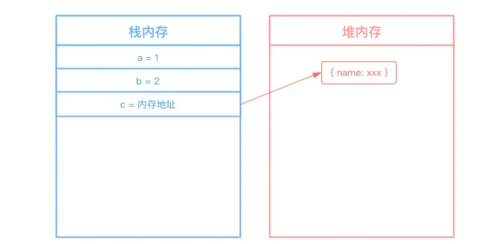
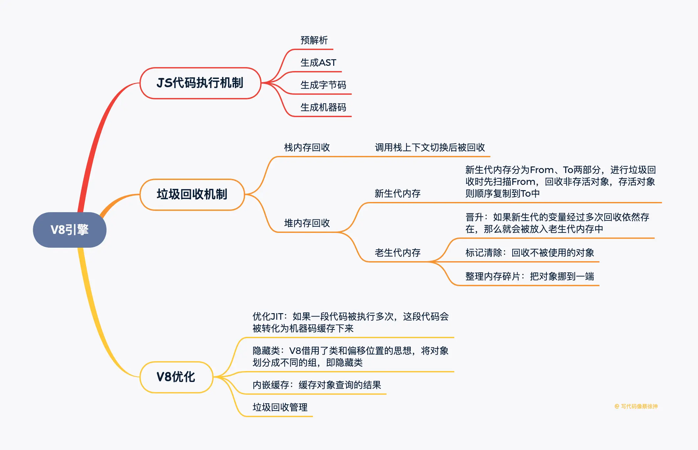

## V8引擎机制
1. V8引擎如何执行一段JS代码
    1. 预解析：检查语法错误但不生成AST；
    2. 生成AST：经过词法/语法解析，生成抽象语法树；
    3. 生成字节码：基线编译器（Ignition）将AST转换成字节码；
    4. 生成机器码：优化编译器（Turbofan）将字节码转换成优化过的机器码，此外在逐行执行字节码的过程中，如果一段代码经常被执行，那么V8会将这段代码直接转换成机器码存储起来，下一次执行就不必经过字节码，优化了执行速度；

2. 引用计数和标记清除

    - 引用计数：给一个变量赋值引用类型，则该对象的引用次数+1，如果这个变量成了其他值，那么该对象的引用次数-1，垃圾回收器会回收引用次数为0的对象。但是当对象循环引用时，会导致引用次数永远无法归零，造成内存无法释放。
    - 标记清除：垃圾收集器先给内存中所有对象加上标记，然后从根节点开始遍历，去掉被引用的对象和运行环境中对象的标记，剩下的被标记的对象就是无法访问的等待回收的对象。

3. V8如何进行垃圾回收

JS引擎中对变量的存储主要有两种位置，栈内存和堆内存，栈内存存储基本类型数据以及引用类型数据的内存地址，堆内存存储引用类型的数据。

**栈内存的回收：**
栈内存调用栈上下文切换就被回收，比较简单

**堆内存的回收：**
V8的堆内存分为新生代内存和老生代内存，新生代内存时临时分配的内存，存在时间短，老生代内存存在时间长。

    - 新生代内存回收机制：
        - 新生代内存容量小，64位系统下仅有32M。新生代内存分为From，To两部分，进行垃圾回收时，先扫描From，将非存活对象回收，将存活对象顺序复制到To中，之后调换From/To，等待下一次回收。
    - 老生代内存回收机制：
        - 晋升：如果新生代的变量经过多次回收依然存在，那么就会被放入老生代内存中；
        - 标记清除：老生代内存会先遍历所有对象并打上标记，然后对正在使用或被强引用的对象取消标记，回收被标记的对象；
        - 整理内存碎片：把对象挪到内存的一端；

[聊聊V8引擎的垃圾回收](https://juejin.cn/post/6844903591510016007#heading-10)

4. JS相较于C++等语言为什么慢，V8做了哪些优化
    1. js的问题：
        - 动态类型：导致每次存取属性/寻求方法的时候，都需要先检查类型；此外动态类型也很难在编译阶段进行优化；
        - 属性存取：c++/java等语言中方法、属性是存储在数组中的，仅需数组位移就可以获取，而js存储在对象中，每次获取都要进行哈希查询。
    2. V8的优化：
        - 优化JIT（即时编译）：相较于c++/java这类编译型语言，js一边解释一遍执行，效率低。V8对这个过程进行了优化：如果一段代码被执行多次，那么V8会把这段代码转化为机器码缓存下来，下次运行时直接使用机器码。
        - 隐藏类：对于C++这类语言来说，仅需几个指令就能通过偏移量获取变量信息，而js需要进行字符串匹配，效率低，V8借用了类和偏移位置的思想，将对象划分成不同的组，即隐藏类；
        - 内嵌缓存：即缓存对象查询的结果。常规查询过程是：获取隐藏类地址->根据属性名查找偏移值->计算该属性地址，内嵌缓存就是这一过程结果的缓存。
        - 垃圾回收管理：上文已介绍
