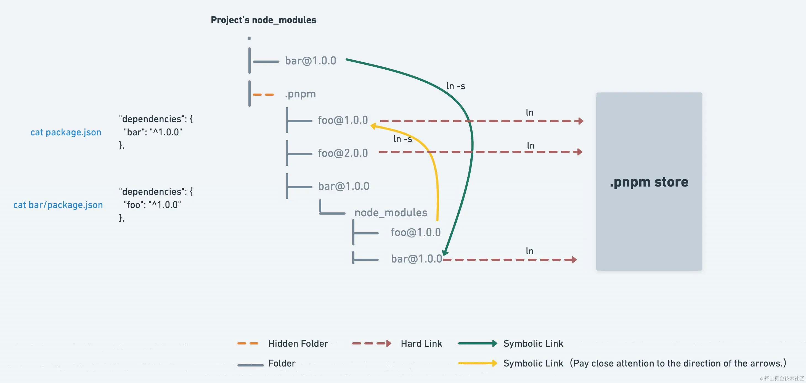
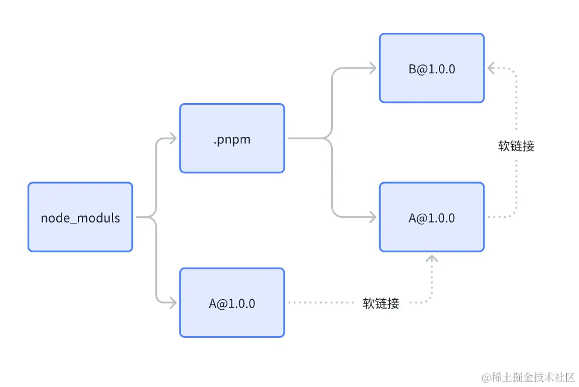

## 简介

pnpm通过软硬链接依赖的方式实现了快速安装，去幽灵依赖，当前各种类库，组件库的最佳实践方案也基本都是pnpm+monorepo。

pnpm旨在解决npm和yarn在某些方面存在的效率和存储问题，同时通过引入一种独特的链接方式有效解决了大部分幽灵依赖的问题。

## 硬链接和软链接（符号链接）
在了解 pnpm 具体机制之前，我们先了解一下硬链接和软链接（符号链接）的概念：

- 硬链接（Hard Link）

    - 概念：硬链接是文件系统中的一个链接，它指向磁盘上的数据。当创建一个硬链接时，实际上是在创建一个和原始文件相同的入口点，但是不占用额外的磁盘空间。这个新的链接和原始文件共享相同的数据块，任何一个文件的修改都会反映在另一个上。
    - 特点：硬链接不能跨文件系统创建，也不能用于链接目录，但如果原始文件被删除，硬链接依然可以访问数据。
    - 使用场景：当你想要在不同位置访问同一个文件内容，而又不想占用额外磁盘空间时，可以使用硬链接。比如，在多个项目中共享相同的库文件，但不需要复制这个文件多份。

- 软链接（符号链接，Symbolic Link）

    - 概念：软链接是一个特殊类型的文件，它包含了另一个文件的路径。类似于 Windows 系统中的快捷方式。与硬链接不同，软链接可以指向目录，也可以跨文件系统。
    - 特点：软链接指向文件或目录的路径，如果原始文件被删除，软链接就会失效，因为它的指向已经不存在了。
    - 使用场景：软链接适用于需要引用特定位置的文件或目录时，特别是当这些文件或目录可能会移动或变化时。它允许链接到另一个文件系统中的文件或目录。

### 硬链接

pnpm通过使用全局.pnpm-store来存储下载的包，使用硬链接来重用存储在全局存储中的包文件，这样在不同项目中相同的包无需重复下载，节约磁盘空间。

### 软链接（符号连接）

pnpm将各类包的不同版本平铺在node_modules/.pnpm下，对于那些需要构建的包，它使用符号链接到存储在项目中的实际位置，这种方式使得包的安装非常快速，并且节约磁盘空间。

举个例子，项目中依赖了 A，这时候可以通过创建软链接，在 node_modules 根目录下创建 A 软链指向了 node_modules/.pnpm/A/node_modules/A。此时如果 A 依赖 B，pnpm 同样会把 B 放置在 .pnpm 中，A 同样可以通过 软链接依赖到 B，避免了嵌套过深的情况。

这样的设计解决了很多问题：

1. 节省磁盘空间：由于使用硬链接，相同的包不需要被重复存储，大大减少了磁盘空间的需求；
2. 提高安装速度：安装包时，pnpm通过创建链接而非复制文件，也会缓存已经安装的全局的包，通过硬链接索引，pnpm还支持并行下载依赖；
3. 确保依赖隔离：通过软链接有效减少了幽灵依赖产生的可能，同时保证了依赖的隔离；

### 第三方库的历史问题

由于历史原因或开发者的疏忽，有些项目可能没有正确地声明所有直接使用的依赖。对于三方依赖，幽灵依赖已经被当做了默认的一种功能来使用，提 issue 修复的话，周期很长，对此 pnpm 也没有任何办法，只能做出妥协。

pnpm的处理方式：
- 对直接依赖严格管理：对于项目的直接依赖，pnpm 保持严格的依赖隔离，确保项目只能访问到它在package.json 中声明的依赖。
- 对间接依赖妥协处理：考虑到一些第三方库可能依赖于未直接声明的包（幽灵依赖），pnpm 默认启用了 hoist 配置。这个配置会将一些间接依赖提升（hoist）到一个特殊的目录 node_modules/.pnpm/node_modules中。这样做的目的是在保持依赖隔离的同时，允许某些特殊情况下的间接依赖被访问。
