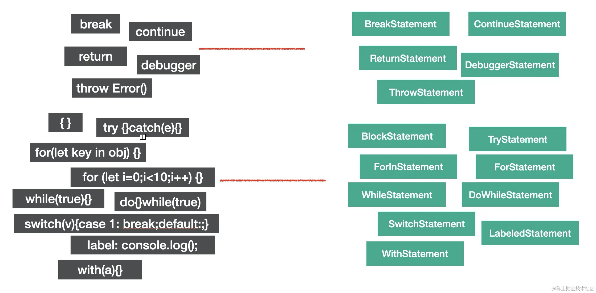
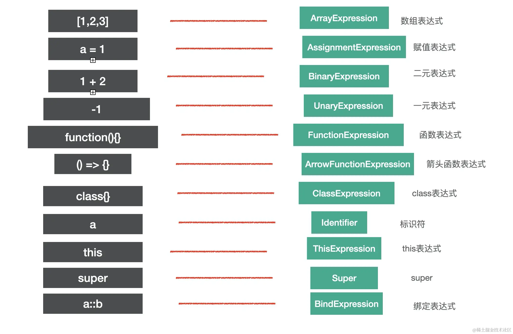
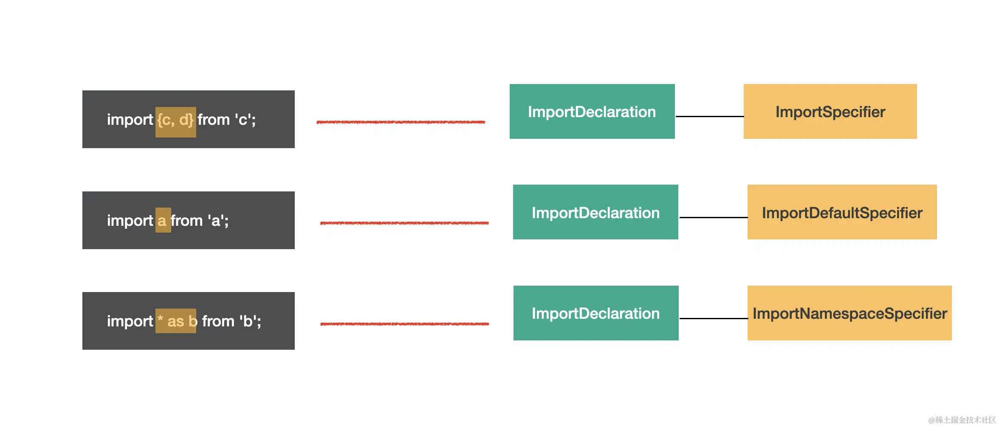
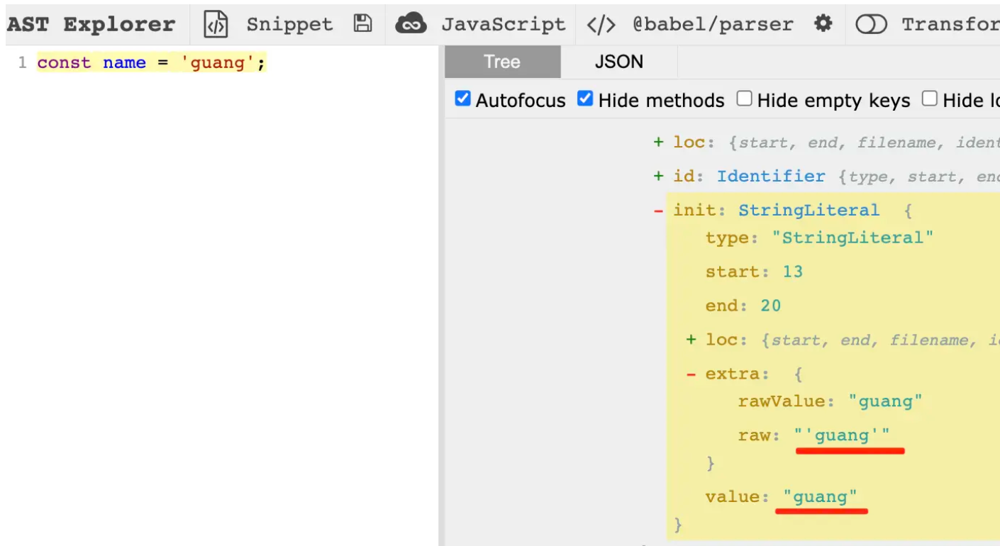

# Babel

babel是一个转译器，暴露了很多api，用这些api可以完成代码到AST的解析、转换、以及目标代码的生成。

开发者可以用它来完成一些特定用途的转换，比如函数插桩（函数中自动插入一些代码，例如埋点代码）、自动国际化等。

流行的小程序转移工具taro，就是基于babel的api来实现的。

[babel设计原理图](./images/babel.png)

## 编译器和转译器
编译的定义是从一种编程语言转成另一种编程语言。主要指的是从高级语言到低级语言。

- 高级语言： 有很多描述逻辑的语言特性，比如分支、循环、函数、面向对象等，接近人的思维，可以让开发者快速的通过它来表达各种逻辑。比如c++，javascript。
- 低级语言：与硬件的执行细节有关，会操作寄存器、内存，具体做内存与寄存器之间的复制，需要开发者理解熟悉计算机的工作原理，熟悉具体的执行细节。比如汇编语言、机器语言。

一般编译器（compiler）是指从高级语言到低级语言的转换工作，而从高级语言到高级语言的转换工具，被叫做转换编译器，简称转译器（Transpiler）。

babel就是一个Javascript Transpiler。

## Babel的编译流程

1. babel 的处理过程总共分为三个阶段， 解析，转换，生成。
  - 解析（parse）：通过parser将源码转成抽象语法树（AST），这个过程会对源代码进行词法解析和语法解析；
  .png>)
  - 转换（transform）：遍历AST，通过各种transform插件对AST进行增删改；
  遍历的过程会调用注册的相应的visitor函数，visitor函数可以对AST节点进行增删改，返回新的AST（可以指定是否继续遍历新生成的AST）。这样遍历完一遍AST之后就完成了对代码的修改。

  - 生成（generate）：把转换后的AST打印成目标代码，并生成sourcemap；
  sourcemap记录了源码到目标代码的转换关系，通过它我们可以找到目标代码中每一个节点对应的源码位置，用于调试的时候把编译后的代码映射回源码，或者线上报错的时候把报错位置映射到源码。

2. babel 本身不具有任何转换功能，它把转换的功能都分解到一个个 plugin 里面，当我们不配置任何插件时，经过 babel 的代码输入和输出是相同的。
3. babel 的插件分为两种

  - 语法插件

  当我们添加语法插件之后,在解析这一步就使得 babel 能够解析更多的语法.(babel 内部的解析类叫做 babylon).`babel-plugin-syntax-trailing-function-commas`这个插件就是为了解决函数最后一个参数可以加逗号的语法插件.

  - 转译插件

  转译插件一般用于将我们的语法作进一步的转换并输出,这是 babel 最本质的需求. 比如完成箭头函数的转换的插件`babel-plugin-transform-es2015-arrow-functions`.

  同一类语法可能同时存在语法插件版本和转译插件版本,如果我们使用了转译插件,就不用再使用语法插件了.

4. Preset 一套语法规范套餐合集.
preset就是插件的集合，但是它可以动态确定包含的插件，比如preset-env就是根据targets来确定插件。

5. Babel 的执行顺序

- Plugin 会运行在 Preset 之前
- Plugin 会从前到后顺序执行
- Preset 的顺序则刚好相反

6. 一个 Preset 的配置实例
```json
    "presets": [
      // 带有自定义配置项的,需要转换成数组
      [
        // 第一个是名字
        "env",
        // 第二个元素是对象.列出配置项
        {
          // 该参数项可以配置以特定的模块化格式来输出代码,如果配置成false则不进行模块化处理
          "module": false
        }
      ],
      "stage-2"
    ]
```
7. 如果不写任何配置项,env 等价于 latest,也等价于 es2015+es2016+es2017 三个相加.
8. babel-cli 让我们可以使用 babel 命令来编译文件.
9. babel-node 是 babel-cli 的一部分,不需要单独安装.babel-node = babel-polyfill+ babel-register.
10. babel-require 会对 require 命令引入的文件进行转码.
11. babel-polyfill

babel 默认只转换 js 语法，而不转换新的 API,比如 iterator, generator,set,map,proxy,reflect,symbol,promise 等全局对象，babel-polyfill 内部集成了 core-js 和 regenerator.

缺点:

- 使用`babel-polyfill`会导致打出来的包非常大,因为 babel-polyfill 是一个整体,把所有的方法都加到原型链上比如我们只是用了 Array.from，但它把 Object.defineProperty 也给加上了，这个问题可以通过单独使用 core-js 的某个类库来解决.

- `babel-polyfill` 会污染全局变量,给很多类的原型上都做了修改,如果我们开发的是一个类库供给其它开发者使用,这种情况会变得非常不可控.

12. babel-plugin-transform-runtime 这里是为了不再重复的转译相同的代码,把重复的定义变成了重复的引用.

```js
    // babel添加一个方法,把async转换为generator
    function _asyncToGenerator(fn) { return function(){.....}}  // 很长一段
    // 具体使用处
    var _ref = _asyncToGenerator(function* (arg1,arg2) {
      yield (0, something)(arg1, arg2)
    })
    // 以上的写法会导致很多地方重复的生成_asyncToGenerator的定义,如果是用来 babel-plugin-transform-runtime 插件,转译后的代码是这样的
    // 从直接定义改为引用,这样就不会重复定义了
    var _asyncToGenerator2 = require('babel-runtime/helpers/asyncToGenerator')
    var _asyncToGenerator3 = _interopRequireDefault(_asyncToGenerator2)
    // 使用处
    var _ref = _asyncToGenerator3(function* (arg1,arg2) {
      yield (0, something)(arg1, arg2)
    })
```
13. babel-loader 一个用于和构建工具相结合,对 js 进行转译处理的 loader.
14. babel-upgrade 用于 babel 配置升级的转换(主要是使用的是旧版本的 label,又暂时不想改配置项,就可以使用这个插件,仍旧沿用旧的配置项,这个插件可以帮助我们把旧的配置项对应的映射成新的配置项.)

15. sourcemap对应字段的含义如下：
  - version：source map的版本，目前为3。

  - file：转换后的文件名。

  - sourceRoot：转换前的文件所在的目录。如果与转换前的文件在同一目录，该项为空。

  - sources：转换前的文件。该项是一个数组，因为可能是多个源文件合并成一个目标文件。

  - names：转换前的所有变量名和属性名，把所有变量名提取出来，下面的 mapping 直接使用下标引用，可以减少体积。

  - mappings：转换前代码和转换后代码的映射关系的集合，用分号代表一行，每行的 mapping 用逗号分隔。
  ```mappings:"AAAAA,BBBBB;;;;CCCCC,DDDDD"```
  mapping有五位：
  ```markdown
  1. 第一位目标代码中的列数；
  2. 第二位是源码所在的文件名；
  3. 第三位是源码对应的行数；
  4. 第四位是源码对应的列数；
  5. 第五位是源码对应的names，不一定有
  ```
  每一位是通过VLQ编码的，一个字符就能表示行列数。

16. sourcemap的源码和目标代码的行列数怎么来的？
babel在parse阶段就在ast节点中保存了loc属性，存源码中的行列号，在后面transform的过程中，并不会修改它，所以转换完成以后节点中仍然保留有源码中的行列号信息，在generate打印成目标代码的时候会计算出新的行列号，这样两者关联就可以生成sourcemap。
具体生成sourcemap的过程使用mozilla维护的[source-map](https://link.juejin.cn/?target=https%3A%2F%2Fwww.npmjs.com%2Fpackage%2Fsource-map)包，其他工具做sourcemap的解析和生成也是基于这个包。

17. 如何在控制台打印颜色？

@babel/code-frames 可以在控制台高亮错误信息。
控制台打印的是ascii码，并不是所有的编码都对应可见字符，ascii码有一部分字符是对应控制字符的，比如27是esc，对应键盘的esc键，按下它可以完成一些控制功能，我们可以通过修改打印内容的ascii来控制打印内容的颜色、字体样式等。

18. 插件做的事情就是通过api拿到types、template等，通过state.opts拿到参数，然后通过path来修改AST。可以通过state放一些遍历过程中共享的数据，通过file放一些整个插件能访问到的一些数据，还可以通过this来传递本对象共享的数据。

19. plugin和preset的插件处理顺序
  - 先应用plugin，再应用preset；
  - plugin从前到后，preset从后到前；

20. babel plugin的单元测试
  - 测试转换后的节点的具体的值是否匹配，验证转换的正确性；
  - 每次测试生成代码的快照，和之前的做对比；
  - 执行下转换后的代码，比较结果是否符合预期；

21. babel runtime

babel-runtime是一个由babel提供的运行时库，它包括了一些在编译过程中需要用到的辅助函数和类，比如es6/es7语法的polyfill、generator函数的特殊处理，promise的实现等；

babel runtime里面放运行时加载的模块，会被打包工具打包到产物中，包含三部分：regenerator、corejs、helper。

  - corejs：新api的polyfill，corejs2只支持静态方法， corejs 3才支持实例方法（如Array.prototype.fill）的polyfill；
  - regenerator：facebook实现的async的runtime库，babel使用regenerator-runtime来支持实现async await的支持；
  - helper是babel做语法转换用到的函数，比如_typeof、_extends等

（babel做语法转换是自己实现的helper，但是做polyfill都不是自己实现的，而是来自第三方的corejs、regenerator）

## 常见的AST节点

AST是对源码的抽象，字面量、标识符、表达式、语句、模块语法、class语法都有各自的AST。

### Literal

Literal就是字面量的意思，不同类型的数据对应不同的字面量。

|字符|字面量描述符|
|---|---|
|'muzishuiji'|StringLiteral|
|123|NumericLiteral|
|`guang`|TemplateLiteral|
|/^[a-z]+/|RegExpLiteral|
|True|BooleanLiteral|
|1.232434n|BigintLiteral|
|null|NullLiteral|

### Identifier

Identifier是标识符的意思，变量名、属性名、参数名等各种声明和引用的名字，都是Identifier。

```js
const name = 'muzishuiji';
function say(name) {
  console.log(name);
}
const obj = {
  name: 'muzishuiji'
}
```
上述代码的Identifier：name、say、name、console、log、name、obj、name

### Statement

statement是语句，它是可以独立执行的单位，比如break、continue、debugger、return或者if语句、while语句、for语句，还有声明语句，表达式语句等。我们写的每一条可以独立执行的代码都是语句。语句末尾一般会加一个分号分隔护着用换行分隔。

```js
break;
continue;
debugger;
throw Error();
{}
try {} catch(e) {} finally {}
for(let i = 0; i < 10; i++) {}
while(true) {}
do{}while(true)
switch(v) { case:1: break;default: ;}
label: console.log();
with(a) {}
```
它们对应的ast节点如下图：


语句是代码执行的最小单位，可以说，代码是由语句（Statement）构成的。

### Declaration

声明语句是一种特殊的语句，它执行的逻辑是作用域内声明一个变量、函数、class、import、export等。

```js
const a = 1;
function b() {}
class C{}

import d from 'e';
export default e = 1;
export {e}
export * from 'e'

```

上述声明对应的AST节点如下：


### Expression

expression是表达式，特点是执行完以后有返回值，这是和语句（statement）的区别。

```js
[1,2,3]
a = 1
1 + 2;
-1;
function () {};
() => {};
class {}
a;
this;
super;
a::b;
```
它们对应的AST如图：


identifier和super怎么也是表达式呢？因为identifier，super有返回值，符合表达式的特点，所以也是expression。

能够单独执行的表达式也是语句，有的表达式不能单独执行，需要和其他类型的节点组合在一起构成语句。

赋值语句a=1的AST：


### class
class代码：
```js
class Guang extends Person {
  name = 'muzishuiji'
  constructor() {}
  eat() {}
}
```
对应的AST：


class是es next的语法，babel中有专门的AST来表示它的内容。

### Modules

es module是语法级别的模块规范，也有专门的AST节点

### import

```js
// name import
import {c, d} from 'c'; // ImportSpecifier
// default import
import a from 'a'; // ImportDefaultSpecifier
// namespaced import
import * as b from 'b'; // ImportNamespaceSpecifier
```
这3语法都有对应的ImportDeclaration，但specifiers属性不同，分别对应ImportSpecifier、ImportDefaultSpecifier，ImportNamespaceSpecifier。


### export

```js
// name export
export {a, b}
// default export
export default c
// namespaced export
export * from 'd'
```
这3种语法都有对应的ExportDeclaration，分别对应ExportNamedDeclaration、ExportDefaultDeclaration、ExportAllDeclaration的AST。


### Program & Directive

program是代表整个程序的节点，它有body属性代表程序体，存放statement数组，就是具体执行的语句的集合。还有directives属性，存放Directive节点，比如'use strict'这种指令通常会用Directive节点表示。


program是包裹具体执行语句的节点，而Directive则代码中的指令部分。

### File & Comment

babel的AST最外层节点是File，它是program、comments、tokens等属性，分别存在Program程序体、注释、token等，是最外层节点。

注释分为注释和行内注释，对应CommentBlock和CommentLine节点。


### AST可视化查看工具
可以在https://astexplorer.net/去查看源码parse成ast之后的结果。

如果想查看全部的 AST 可以在[babel parser 仓库里的 AST 文档](https://link.juejin.cn/?target=https%3A%2F%2Fgithub.com%2Fbabel%2Fbabel%2Fblob%2Fmain%2Fpackages%2Fbabel-parser%2Fast%2Fspec.md)里查，或者直接去看 @babel/types 的 
[typescript 类型定义](https://link.juejin.cn/?target=https%3A%2F%2Fgithub.com%2Fbabel%2Fbabel%2Fblob%2Fmain%2Fpackages%2Fbabel-types%2Fsrc%2Fast-types%2Fgenerated%2Findex.ts)。

### AST的公共属性

每种AST都有自己的属性，但它们也有一些公共的属性：
- type： AST节点的类型；
- start、end、loc：start和end代表该节点在源码中的开始和结束下标。而loc属性是一个对象，有line和column属性分别记录开始和结束的行列号。
- leadingComments、innerComments、trailingComments：表示开始的注释、中间的注释、结尾的注释，每个AST节点中都可能存在注释，想拿到某个AST的注释可通过这三个属性。
- extra：rawValue, raw等属性记录一些额外的信息，用于处理一些特殊情况。比如StringLiteral的value只是值的修改，而修改extra.raw则可以单双引号一起修改。




### babel的api有哪些
根据babel的编译流程：parse、transform、generate，会有以下api。

  - @babel/parser: parse阶段有@babel/parser，功能是把源码转成AST；
  - @babel/traverse: 可以遍历AST，并调用visitor函数修改AST；
  - @babel/types: 修改AST自然涉及到AST的判断、创建、修改等，这就需要@babel/types了，当需要批量创建AST的时候可以使用@babel/template来简化AST创建逻辑；
  - @babel/generator: generate阶段会把AST打印为目标代码字符串，同时生成sourcemap，需要@babel/generator包
  - @babel/traverse: 通过visitor函数对遍历到的ast进行处理，分为enter（进入节点时调用）和exit（离开节点时调用）两个阶段，具体操作ast使用的ptah的api，可以通过state在遍历过程中传递一些数据；
  - 中途遇到错误想打印代码未知的时候，使用@babel/code-frame包；
  - @babel/core: babel整体功能通过@babel/core提供，@babel/core的功能就是完成babel整体的编译流程，从源码到目标代码，生成sourcemap。实现plugin和preset的调用。
  - 可以安装@types/babel_xxx的包来增加ts的提示，比如@types/babel_parser、@types/babel_traverse等。

### Babel的visitor模式

visitor模式是23种设计模式中的一种。visitor模式的思想是：当被操作的对象结构比较稳定，而操作对象的逻辑经常变化的时候，通过分离逻辑和对象结构，使得它们能独立扩展。

### .babelrc

在.babelrc 中配置 userBuildIns 为 usage 后,babel 会在使用用到 es6 以上的新特性的时候,自动为我们添加 babel-polyfill 的引用.

'usage'这个属性值还在实验阶段

可以通过给 userBuildIns 设置为 true 来根据浏览器兼容列表自动引入所需的 polyfill

    {
        "presets": [
            ["env", {
                "modules": false,
                "targets": {
                    "browsers": ["ie >= 9"]
                },
                "userBuildIns": true,
                "debug": true
            }]
        ]
    }
    // 还需要在webpack的入口文件中引入 "babel-polyfill"

### 遍历AST的最佳实践

1. 尽量避免遍历抽象语法树（AST）

遍历AST的代价很昂贵，并且很容易做出非必要的遍历，优化的思路是合并多个visitor，能够在单次遍历做完所有事情的话那就合并它们。

```js
// before
path.traverse({
    Identifier(path) {
        // ...
    }
});
path.traverse({
    BinaryExpression(path) {
        // ...
    }
});

// after
path.traverse({
    Identifier(path) {
        // ...
    },
     BinaryExpression(path) {
        // ...
    }
});
```
2. 可以手动查找就不要遍历

```js
// before
const visitorOne = {
    Identifier(path) {
        // ...
    }
}
const MyVisitor = {
    FunctionDeclaration(path) {
        path.get('params').traverse(visitorOne);
    }
}
// after
const MyVisitor = {
    FunctionDeclaration(path) {
        path.node.params.forEach(function () {

        })
    }
}
```

3. 优化嵌套的访问者对象

```js
// 嵌套访问者会使得每次调用都会创建新的访问者对象
const MyVisitor = {
  FunctionDeclaration(path) {
    path.traverse({
      Identifier(path) {
        // ...
      }
    });
  },
}
// 可以考虑把访问者提升，每次复用已创建的访问者对象
const visitorOne = {
  Identifier(path) {
    // ...
    console.log(this.exampleState)
  }
}
const MyVisitor = {
  FunctionDeclaration(path) {
    path.traverse({
      visitorOne,
      // 传递给嵌套的访问者的参数
      {
        exampleState
      }
    });
  },
}
```

