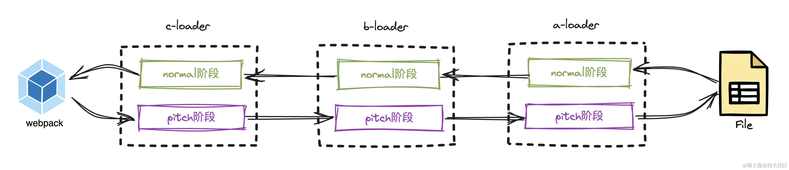
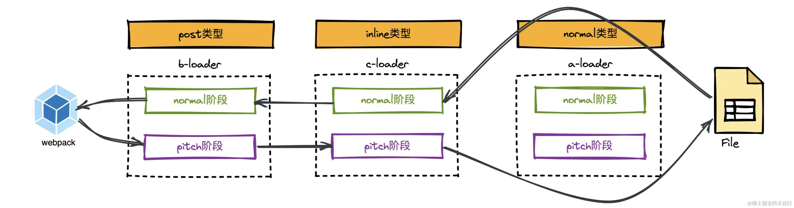
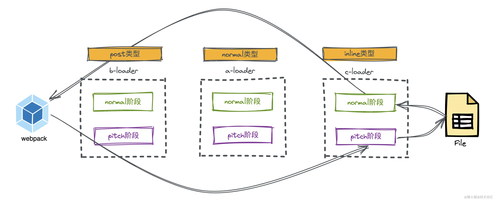

## loader

### loader的本质是什么？

loader的本质是导出为函数的javascript模块。它接受资源文件或者上一个loader产生的结果作为入参，也可以用多个loader函数组成loader chain，最终输出转换后的结果。

loader chain设计的好处是，可以保证每个loader的职责单一。同时，方便后期的组合和扩展。

loader chain：
```js
module: {
    rules: [
        {
            test: /\.less$/,
            // loader chain的执行顺序，从右往左
            use: [
                'style-loader', // 将css内容变成style标签插入到html中去
                'css-loader',  // 解析css文件的路径等
                'less-loader', // 将less->css
            ]
        }
    ]
}
```

自定义一个简单的loader：

```
function ALoader(content, map, meta) {
  console.log("我是 ALoader");
  return content;
}
module.exports = ALoader;

```

### 在webpack中如何自定义loader

webpack中使用自定义loader有三种方式：

1. 配置loader的绝对路径

```js
{
    test: /\.js$/,
    use: [
        {
            loader: path.resolve(__dirname, './loaders/simpleLoader.js'),
            options: {
                // ...
            }
        }
    ]
}
``` 

2. 配置resolveLoader.alias配置别名

```js
resolveLoader: {
    alias: {
        "simpleLoader": path.resolve(__dirname, './loaders/simpleLoader.js'),
    },
}
module: {
    rules: [
        {
            test: /\.js$/,
            use: [
                {
                    loader: 'simpleLoader',
                    options: {
                        // ...
                    }
                }
            ]
        }
    ]
}
```

3. 配置resolveLoader.modules
配置loader的查找范围。

```js
resolveLoader: {
    modules: ['loaders', 'node_modules'],
},
module: {
    rules: [
        {
            test: /\.js$/,
            use: [
                {
                    loader: 'simpleLoader',
                    options: {
                        // ...
                    }
                }
            ]
        }
    ]
}
```

### loader的四种类型

loader按类型分可以分为四种：前置（pre）、普通（normal）、行内（inline）、后置（post）。

```js
  module: {
    rules: [
      {
        test: /\.css$/,
        use: ["css-loader"],
        enforce: "pre", //这里也可以是post，默认不写就是normal
      },
    ],
  },

```

inline loader的使用示例：

```js
// 表示用inline-loader1和inline-loader2这两个loader来解析引入的文件
import xxx from 'inline-loader1!inline-loader2!/src/xxx/css';
```

loader的执行顺序，在不同的阶段是不一样的，分为Pitching阶段和Normal阶段：

1. Pitching阶段：Loader上的pitch方法，按照后置（post）、行内（inline）、普通（normal），前置（pre）的顺序调用；
2. Normal阶段：Loader上的常规方法，按照前置（pre），普通（normal）、行内（inline），后置（post）的顺序调用。模块源码的转换，发生在这个阶段；
3. 同等类型下的Loader的执行顺序才是由右向左，或者由下到上执行。

如果预期先进行eslint校验，则需要前置（pre）Loader，前置loader中发现了错误就提前退出构建。

注意这里的loader的执行顺序是校验一个，编译一个，而不是校验完所有的js再编译。这很合理，因为loader是链式执行一路往下走完的，所以不可能支持把所有js执行完，再流转到下一个loader。

```js
module: {
    rules: [
        {
            test: /\.js$/,
            use: ['eslint-loader'],
            enforce: 'pre'
        },
        {
            test: /\.js$/,
            use: ['babel-loader']
        }
    ]
}
```

在loader的运行过程中，如果发现该Loader上有pitch属性，会先执行pitch阶段，再执行normal阶段。



假设我们配置了一系列的loader：

```js
  {
    test: /\.js$/,
    use: [
      {
        loader: "a-loader",
        enforce: "pre",
      },
      {
        loader: "b-loader",
        enforce: "post",
      },
      {
        loader: "c-loader",
        enforce: "pre",
      },
      {
        loader: "d-loader",
        enforce: "post",
      },
      {
        loader: "e-loader",
        enforce: "normal",
      },
      {
        loader: "f-loader",
        enforce: "normal",
      },
    ],
  },

```

webpack会对这些loader先进行分类：

```js
// post类型loader
const postLoaders = ['b-loader', 'd-loader'];
// inline类型loader
const inlineLoaders = [];
// normal类型loader
const normalLoaders = ['e-loader', 'f-loader'];
// pre类型loader
const preLoaders = ['a-loader', 'c-loader']
```

按post -> inline -> normal -> pre的顺序合并所有loader：

```js
let loaders = [
    ...postLoaders,
    ...inlineLoaders,
    ...normalLoaders,
    ...preLoaders,
];
// 结果为: ['b-loader', 'd-loader', 'e-loader', 'f-loader', 'a-loader', 'c-loader']
```

最终loader的执行顺序为依次执行pitch阶段，然后反向执行normal阶段：

```js
b-loader 的 pitch 阶段 -> 
d-loader 的 pitch 阶段 -> 
e-loader 的 pitch 阶段 -> 
f-loader 的 pitch 阶段 -> 
a-loader 的 pitch 阶段 -> 
c-loader 的 pitch 阶段 -> 
c-loader 的 normal 阶段 -> 
a-loader 的 normal 阶段 ->
f-loader 的 normal 阶段 -> 
e-loader 的 normal 阶段 ->
d-loader 的 normal 阶段 -> 
b-loader 的 normal 阶段 ->
```

pitch方法可以控制某些情况下提前返回，在Pitch阶段，如果执行到该Loader的pitch属性函数有返回值，就直接结束Pitch阶段，并直接跳到该Loader pitch阶段的前一个Loader的normal阶段继续执行（若无前置Loader，则直接返回）。


可以通过使用!前缀，禁用所有已配置的normal loader.
```js
// 这样配置之后，webpack会禁用已经配置的normal-loader
import test from '!c-loader!./test.js';
const a = 1;
```


使用!!前缀，将禁用其他类型的loader，只要内联loader。

```js
import test from '!!c-loader!./test.js';
const a = 1;
```



使用-!禁用pre loader和normal loader:

```js
import test from "-!c-loader!./test.js";

const a = 1;
```

本质上就是根据上述的正则，对loaders数组做过滤。

```js
let loaders = [];
if(request.startsWith('!!')) {
    loaders = [...inlineLoaders];
} else if(request.startsWith("-!")) {
    loaders = [...postLoaders, ...inlineLoaders];
} else if(request.startsWith("!")) {
    loaders = [...postLoaders, ...inlineLoaders, ...preLoaders];
} else {
      loaders = [...postLoaders, ...inlineLoaders, ...normalLoaders, ...preLoaders];

}
```

### normal loader 

```js
//a-loader.js
function ALoader(content, map, meta) {
  console.log("执行 a-loader 的normal阶段");
  return content + "//给你加点注释(来自于Aloader)";
}
module.exports = ALoader;
```

### pitch loader 

```js
//a-loader.js
function ALoader(content, map, meta) {
  console.log("执行 a-loader 的normal阶段");
  return content + "//给你加点注释(来自于Aloader)";
}

ALoader.pitch = function () {
  console.log("ALoader的pitch阶段");
};

module.exports = ALoader;
```

### loader的内联方式
```js
import test from "c-loader!./test.js"; //使用内联Loader

const a = 1;

```


