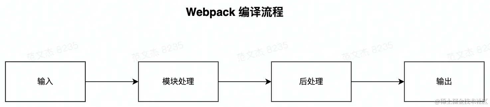

## webpack

### webpack 究竟是什么?

1. webpack 是一个模块打包工具

2. webpack.config.js 是 webpack 默认的打包配置文件,可以通过--config 参数来指定其他的打包配置文件

3. webpack-cli 使得我们可以直接在命令行里执行 webpack 命令
4. chunk

chunk是webpack内部一个非常重要的底层设计，用于组织、管理、优化最终产物，在构建阶段进入生成（Seal）阶段后：

  1. webpack首先根据entry配置创建若干chunk对象；
  2. 遍历构建（make）阶段找到的所有module对象，同一Entry下的模块分配到Entry对应的chunk中；
  3. 遇到异步模块则创建新的chunk对象，并将异步模块放入该chunk；
  4. 分配完毕后，根据SplitChunksPlugin的启发式算法进一步对这些chunk进行裁剪、拆分、合并、代码调优，最终调整成运行时性能更优的形态；
  5. 最后，将这些chunk一个个输出成最终的产物（Asset）文件，编译工作到此结束；

chunk的一些关键属性：

    - chunks, 存放每个文件对应的 id 值,和相关联的文件的 id 值
    - chunksName, 每个文件对应的名字,和相关的文件的名字.

5. mode：打包模式,默认是 production, development 模式打包出来的文件是非压缩的, production 模式打包出来的文件是默认压缩的.
6. Webpack的打包流程可以简化为：


    - 输入：从文件系统读入代码文件；
    - 模块递归处理：调用loader转译module内容，并将结果转换为AST，从中分析出模块间依赖关系，进一步递归调用模块处理过程，直到所有依赖文件都处理完毕；
    - 后处理：所有模块递归处理完毕后开始执行后处理，包括模块合并、注入运行时、产物优化等，最终输出chunk集合；
    - 输出：将chunk写出到外部文件系统；

7. webpack配置项大体分为两类：
    - 流程类：作用于打包流程某个或若干个环节，直接影响编译打包效果的配置项；
    - 工具类：打包主流程之外，提供更多的工程化工具的配置项；
8. 与打包流程强相关的配置项：

    - 输入输出：
        - entry：用于定义项目入口文件，Webpack 会从这些入口文件开始按图索骥找出所有项目文件；
        - context：项目执行上下文路径；
        - output：配置产物输出路径、名称等；
    - 模块处理：
        - resolve：用于配置模块路径解析规则，可用于帮助 Webpack 更精确、高效地找到指定模块
        - module：用于配置模块加载规则，例如针对什么类型的资源需要使用哪些 Loader 进行处理
        - externals：用于声明外部资源，Webpack 会直接忽略这部分资源，跳过这些资源的解析、打包操作
    - 后处理：
        - optimization：用于控制如何优化产物包体积，内置 Dead Code Elimination、 Scope Hoisting、代码混淆、代码压缩等功能
        - target：用于配置编译产物的目标运行环境，支持 web、node、electron 等值，不同值最终产物会有所差异
        - mode：编译模式短语，支持 development、production 等值，可以理解为一种声明环境的短语

9. 工具类配置项：

- 开发效率类：
    - watch：用于配置持续监听文件变化，持续构建
    - devtool：用于配置产物 Sourcemap 生成规则
    - devServer：用于配置与 HMR 强相关的开发服务器功能
- 性能优化类：
    - cache：Webpack 5 之后，该项用于控制如何缓存编译过程信息与编译结果
    - performance：用于配置当产物大小超过阈值时，如何通知开发者
- 日志类：
    - stats：用于精确地控制编译过程的日志内容，在做比较细致的性能调试时非常有用
    - infrastructureLogging：用于控制日志输出方式，例如可以通过该配置将日志输出到磁盘文件
10. webpack中处理css文件：
- css-loader： 将css等价翻译为`module.exports=${css}`的js代码，使得webpack能够同处理js代码一样解析css内容与资源依赖；
- style-loader：该loader在产物中注入一系列runtime代码，这些代码会将css内容注入到页面的`style`标签，使得样式生效；
- mini-css-extract-plugin：该插件会将css代码抽离到单独的css文件，并将文件通过link标签方式插入到页面中；

11. PostCSS相当于css的babel，实现了一套将css源码解析为AST结构，并传入PostCSS插件做处理的流程框架，具体功能由对应插件实现，常用插件有：
    - autoprefixer：基于 Can I Use 网站上的数据，自动添加浏览器前缀
    - postcss-preset-env：一款将最新 CSS 语言特性转译为兼容性更佳的低版本代码的插件
    - postcss-less：兼容 Less 语法的 PostCSS 插件，类似的还有：postcss-sass、poststylus
    - stylelint：一个现代 CSS 代码风格检查器，能够帮助识别样式代码中的异常或风格问题

12. webpack底层的工作流程：
  1. 初始化阶段
    - 初始化参数：从配置文件、配置对象、shell参数中读取，与默认配置结合得到最终的options;
    - 创建编译器对象：用上一步得到的参数创建Compiler对象；
    - 初始化编译环境：包括注入内置插件，注册各种模块工厂、初始化RuleSet集合、加载配置的插件等；
    - 开始编译：执行compiler对象的run方法，创建compilation对象；
    - 确定入口：根据entry配置找到所有入口文件，调用compilation.addEntry将入口文件转换为dependence对象。
  2. 构建阶段：
    - 编译模块（make）：从entry文件开始，调用loader将模块转译为标准js内容，调用js解释器将内容转换为AST对象，从中找出该模块依赖的模块，再递归处理这些依赖模块，直到所有依赖的文件都经过了本步骤的处理；
    - 完成模块编译：上一步递归处理所有能触达的模块后，得到了每个模块被翻译后的内容以及他们之间的依赖关系图；
  3. 封装阶段：
    - 合并（seal）：根据入口和模块间的依赖关系，封装成一个个包含多个模块的chunk；
    - 优化（optimization）：对上述chunk施加一系列优化操作，包括：tree-shaking、terser、scope-hoisting、code split等；
    - 写入文件系统（emitAssets）确定好输出内容后，根据配置确定输出的路径和文件名，把文件内容写入到文件系统中。

一些行之有效的构建性能优化手段：并行编译、缓存、缩小资源搜索范围等。设置`profile=true`，运行编译命令，并添加--json参数，如：`npx webpack --json=stats.json`,可在生成的stats.json下查看每个模块打包的性能数据，可以从这些数据中分析出模块之间的依赖关系、体积占比、编译构建耗时等。结合社区里的分析工具，可以从可视化图表里更直观的找到性能卡点。

13. webpack的并行构建

并行构建的npm包：
- HappyPack：多进程方式运行资源加载(Loader)逻辑，适用于webpack4之前的项目；
- Thread-loader：Webpack 官方出品，建议webpack4之后使用，同样以多进程方式运行资源加载逻辑；
- Parallel-Webpack：多进程方式运行多个 Webpack 构建实例；
- TerserWebpackPlugin：支持多进程方式执行代码压缩、uglify 功能。

配置示例：

```js
const TerserPlugin = require('terser-webpack-plugin');

module.exports = {
    optimization: {
        minimize: true,
        minimizer: [
            new TerserPlugin({
                parallel: 2, // number / boolean
            })
        ]
    }
}
```

这些并行构建方案的核心设计很类似，针对某种计算任务创建子进程，之后将运行所需参数通过IPC传递到子进程并启动计算操作，计算完毕后子进程再将结果通过IPC传递回主进程，寄宿在主进程的组件实例，再将结果提交给webpack；

happyPack和thread-loader主要将耗时的文件加载操作拆散到多个子进程中并发执行，子进程执行完毕后再将结果回传到webpack进程，从而提升构建性能。

14. webpack内部的几个核心对象

  - Compiler：全局构建管理器，Webpack启动后会先创建compiler对象，负责管理配置信息、Loader、Plugin等。从启动构建到结束，Compiler会触发一系列的钩子函数。
  - Compilation: 单次构建过程的管理器，负责遍历模块，执行编译操作。当watch=true时，每次文件变更触发重新编译，都会创建一个新的compilation对象；
  - 此外，还有 Module、Resolver、Parser、Generator 等关键类型，也都相应暴露了许多 Hook。

15. 插件架构至少要解决三个方面的问题：

  - 接口：需要提供一套逻辑接入方法，让开发者能够将代码插入特定环节，变更相关逻辑；
  - 输入：如何将上下文信息高效传导给插件；
  - 输出：插件内部通过何种方式影响整套运行体系；
  给插件提供固有方法来修改相关逻辑，提供有限的修改能力，且可以对插件的修改做监控，保障插件对模块的修改是合理范围内的。

针对这些问题，webpack基于tapable实现了：
  1. 编译过程的特定节点以钩子形式，通知插件此刻正在发生什么事情；
  2. 通过tapable提供的回调机制，以参数方式传递上下文信息；
  3. 在上下文参数对象中附带了很多存在Side Effect的交互接口，插件可以通过这些接口修改相关逻辑；

16. Webpack的构建流程

  - 初始化阶段：负责设置构建环境，初始化若干工厂类，注入内置插件等；
  - 构建阶段：读入并分析Entry模块，找到依赖模块，之后递归处理这些依赖、依赖的依赖，直到所有模块都处理完毕，构建出依赖图谱，这个过程解决资源“输入”问题；
  - 生成阶段：根据Entry配置将模块封装进不同chunk对象，经过一系列优化后，再将模块代码编译成产物形态，按chunk合并生成产物文件，这个过程解决资源“输出”问题。

17. Dependency Graph

webpack在构建过程中会持续收集模块之间的引用、被引用关系，并记录到Dependency Graph中，后续的Chunk封装、Code Split，Tree-Shaking等，但凡需要分析模块关系的功能都强依赖于Dependency Graph。

Dependency Graph是webpack底层最关键的模块地图数据，因此在webpack5之后，Dependency Graph结构被解偶抽离为以ModuleGraph为中心的若干独立类型，架构设计更合理，模块搜索、分析效率也得到不同程度的优化，进而使得Webpack5构建速度也有明显提升。

18. Chunk、ChunkGroup、ChunkGraph

  - Chunk：Module用于读入模块内容，记录模块间依赖关系；而Chunk则根据模块依赖关系合并多个Module，输出成资产文件；
  - ChunkGroup：一个ChunkGroup包含一个或多个Chunk对象；ChunkGroup与Chunk之间父子依赖关系；
  - ChunkGraph：Webpack会将chunk之间、ChunkGroup之间的依赖关系存储到compilation.chunkGraph对象中，

  「构建」阶段根据模块的引用关系构建ModuleGraph,「封装」阶段则负责根据ModuleGraph构建一系列Chunk对象，并将Chunk之间的依赖关系（异步引用、Runtime）组织为ChunkGraph--Chunk依赖关系图对象。与ModuleGraph类似，ChunkGraph结构的引入也能解偶Chunk之间的依赖关系和管理逻辑，整体架构更合理、更容易扩展。

  Webpack5内置三种分包规则；Entry Chunk、Async Chunk、与Runtime Chunk，这些都是最原始的分包逻辑，其它插件（splitChunksPlugin）都是在此基础，借助buildChunkGraph后触发的各种钩子进一步拆分、合并、优化chunk结构，实现扩展分包效果。

19. 更详细的Webpack构建流程

[Webpack构建流程](./images//webpack.png)

Webpack构建可以简单划分成init、make、seal三个阶段：
  - init阶段负责模块初始化webpack内部若干插件与状态，逻辑比较简单；
  - make阶段解决资源读入问题，这个阶段会从entry--入口模块开始、递归读入、解析所有模块内容，并根据模块之间的依赖关系构建ModuleGraph-模块依赖关系图；
  - seal阶段：
    - 一方面，根据ModuleGraph构建ChunkGraph；
    - 另一方面，开始遍历ChunkGraph，转译每一个模块代码；
    - 最后，将所有模块与模块运行时依赖合并为最终输出的bundle资产文件；

### Module Federation

1. 通常译作“模块联邦”，是webpack5新引入的一种远程模块动态加载、运行技术。MF允许我们将原本单个巨大应用按照我们理想的方式拆分成体积更小，职责更内聚的小应用形式，理想情况下各个应用能够实现独立部署、独立开发（不同应用甚至允许使用不同技术栈）、团队自洽，从而降低系统与团队协作的复杂度。

2. Module Federation的特性：
    - 应用可按需导出若干模块，这些模块最终被单独打成模块包，功能上有点像NPM模块；
    - 应用可在运行时基于http协议动态加载其他应用暴露的模块，且用法与动态加载普通NPM模块一样简单；
    - 与其他微前端方案不同，MF的应用之间关系平等，没有主应用/子应用之分，每个应用都能导出/导入任意模块。

3. Module Federation的核心概念：

  1. HOST（宿主）：需要加载远程模块的应用；
  2. Remote（远程）：需要访问的远程模块；
  3. Exposed Modules（暴露的模块）：远程应用中被暴露出来供其他应用使用的模块；
  4. Shared Modules（共享模块）：多个应用之间的共享的模块，可以避免重复加载；

4. 远程模块的加载逻辑：

  1. 配置 Module Federation

  远程模块的配置示例：
  ```js
  const { ModuleFederationPlugin }  = require('webpack').container;
  module.exports = {
    plugins: [
        new ModuleFederationPlugin({
            name: 'remoteApp',
            filename: 'remoteEntry.js',
            exposes: {
                './Button': './src/Button'
            },
            shared: ['react', 'react-dom']
        })
    ]
  }
  ```
  宿主应用配置示例：
  ```js
    // webpack.config.js (Host)
    const { ModuleFederationPlugin } = require("webpack").container;

    module.exports = {
        plugins: [
            new ModuleFederationPlugin({
                name: "hostApp",
                remotes: {
                    remoteApp: "remoteApp@http://localhost:3001/remoteEntry.js",
                },
                // 可以细粒度的控制共享范围，以及应用支持共享版本
                shared: ["react", "react-dom"],
            }),
        ],
    };
  ```
  MF中的模块导入/导出都依赖于ModuleFederationPlugin插件，其中导出方需要使用插件的exposes项声明导出那些模块，使用filename指定生成的入口文件；导入方需要使用remotes声明远程模块地址，之后在代码中使用异步导入语法`import("module"）`引入模块。

  通过MF的方式，一是可以将业务代码分解为更细粒度的应用形态；二是应用可以各自管理路由逻辑，降低应用间耦合性。最终能降低系统组件间耦合度，更多有利于团队协作。非常适用于微前端或代码重构迁移场景。

  2. 生成远程入口文件
  在远程应用中，webpack会生成一个远程入口文件，这个文件包含了远程应用暴露的模块信息。
  3. 宿主应用远程加载入口文件
  宿主应用在运行时会加载远程应用的入口文件。这个文件会被动态加载到宿主应用的运行环境中。
  4. 初始化远程应用
  远程入口文件加载完成后，会初始化远程应用（解析执行），并暴露远程模块。宿主应用可以通过`import()` 动态加载这些模块。
  5. 动态加载远程模块
  ```js
  import("remoteApp/Button").then((Button) => {
    // 使用远程模块
    const button = new Button();
    document.body.appendChild(button.render());
  });
  ```
  6. 模块解析和加载
  当宿主应用尝试加载远程模块时，webpack会根据远程入口文件中的信息，动态加载远程模块的代码，具体步骤如下：
    1. 解析模块路径：webpack解析模块路径'remoteApp/Button'，并根据远程入口文件的映射关系，找到对应的模块；
    2. 加载模块代码：webpack动态加载远程模块的代码，并将加载后的代码注入到宿主应用的运行环境中；
    3. 执行模块代码：远程模块的代码被执行，宿主应用可以使用这些模块；

  7. 共享模块
  如果远程模块和宿主应用之间有共享模块（如react、react-dom），webpack会优先使用宿主应用中已经加载的共享模块，避免重复加载。


指定对应模块的入口文件，如果是npm包可以通过package.json的main来指定模块入口文件。如果是MF则使用remotes里定义的指定模块的地址来确定模块的入口文件。

**MF的优点与缺点**

优点：

1. 代码复用
Module Federation允许你在多个应用之间共享模块，从而减少重复代码，提高代码复用性。这对于大型应用和微前端框架非常有用。
2. 共享依赖
Module Federation允许你共享依赖库，从而减少重复加载相同的依赖，节省带宽和加载时间。
3. 独立部署
每个应用可以独立开发和部署，而不影响其他应用。这使得团队可以更灵活的工作、减少部署的复杂性和风险。
4. 动态加载
Module Federation支持动态加载模块，这意味着你可以在运行时按需加载模块，减少初始化加载时间，提高应用性能；

缺点：

1. 复杂性

Module Federation的配置和使用相对复杂，需要理解webpack的高级配置和模块加载机制，有一定的学习成本。

2. 性能问题

Module Federation支持动态加载，但在某些情况下，动态加载可能导致性能问题，特别是在网络延迟较高的情况下。

3. 版本冲突

如果多个应用共享相同的依赖库，但版本不同，可能导致版本冲突问题，需要确保兼容性。

4. 调试困难

由于模块是动态加载的，调试可能会变的困难。特别是在开发环境中，需要确保所有模块都是正确加载和运行。
如果需要调试则需要额外的代理机制，拉取远程模块的sourcemap进行调试。

5. 改动时评估影响范围

需要有一个明确的地方集中维护依赖当前模块的其他模块，保证有修改的时候其他的所有模块能够及时感知，并做好充分的测试。

### PWA应用

PWA：Progressive Web Apps（渐进式Web应用），可以简单理解为一系列将网页如同独立APP般安装到本地的技术集合，借此，我们即可以保留普通网页轻量级、可链接（SEO友好）、低门槛（只要有浏览器就能访问）等优秀特点，又同时具备独立APP离线运行、可安装等优势。

### entry 与 output

1. 如果页面用到的静态 js 资源需要放到 cdn 上,则可以在 `output` 的 `publicPath` 里面配置静态资源所在地址,这样打包后的 index.html 里引入的打包的 js 的 src 都会包含这里配置的地址.`publicPath`指定资源的引入地址.

### sourceMap

1. source-map

打包会生成出口 js 对应的单独的 map 文件.

2. inline-source-map

打包会生成出口 js 对应的 map 文件,且对应的 map 文件的代码会放在打包的出口 js 中.

3. inline-cheap-source-map

打包报错信息只映射到行,不映射到具体哪一列的字符,且只会关注业务代码里的报错,不关注引入的第三方模块的报错

4. inline-cheap-module-source-map

设置不仅关注业务代码中的报错,还要关注模块中的报错.

5. eval

打包速度最快的一种方式,一样可以准确定位错误所在行.不会打包出口 js 对应的 map 文件,它是通过 eval 机制来生成 js 与 source-map 的映射关系的,但是针对复杂逻辑的代码,eval 提示出来的内容可能并不全面.

推荐的写法:

    // 开发环境
    // 打包出来可以看到原始源代码,仅限行
    cheap-module-eval-source-map
    // 正式环境
    // 打包出来可以看到原始源代码,仅限行
    cheap-module-source-map

### webpack-dev-server

1. 使用 node.js 可以实现类似于 webpack-dev-server 的功能.

    主要功能：
    - 结合webpack工作流，提供基于https协议的静态资源服务；
    - 提供资源热更新能力，在保持页面状态的前提下自动更新页面代码，提升开发效率；

    简单实现的代码示例:
    ```js
    const express = require('express');
    const webpack = require('webpack');
    const webpackDevMiddleware = require('webpack-dev-middleware');
    const config = require('./webpack.config.js');
    const compiler = webpack(config);   // 执行webpack打包

    const app = express();

    app.use(webpackDevMiddleware(compiler, {
        publicPath: config.output.publicPath
    }))

    app.listen(3001, () => {
        console.log('server is running');
    })
    ```
这样实现的代码,会自动打包,但是需要我们手动刷新来更新界面内容,且页面上未发生改变的模块的状态也不能被保存下来.每次刷新页面,所有内容回归为初始状态.

2.  webpack-dev-server 打包生成的文件不再 dist 目录下,而是在内存里.

3.  配置文件修改之后的热更新

``` new webpack.HotModuleReplacementPlugin()```

热更新可以保存我们页面未被修改部分的状态,只改变发生改变的内容.

手动触发热更新的代码示例:
```js
    import counter from './counter';
    import number from './number';
    counter();
    number();
    if(module.hot) {
        module.hot.accept('./number', () => {
            document.body.removeChild(document.getElementById('number'));
            number();
        })
    }
```
4. @babel/plugin-transform-runtime

一个能够复用 babel 的注入的工具函数来减少代码体积的插件,
@babel/plugin-transform-runtime 插件的;另一个作用就是为你的代码创建一个沙箱环境,可以避免全局变量的污染.

5. 一些参数

changeOrigin: true; // 解决 origin 的请求限制

secure: false; // 解除 https 协议下的安全限制

```js
      // 设置请求头的相关配置
      header: {
         host: '',
         cookie: ''
      }
```
6.  webpackDevServer 解决单页面应用路由的问题.
```js
        historyApiFallback: true;   // 可以帮助我们实现路由映射
        // 把history上对任何路径的请求都转化到对根路径的index.html的请求
        // 在index.html再配置对应的路由地址展示对应的内容
        // 还可以这样写:
        historyApiFallback: {
            rewrites: [
                {
                    // 访问abc.html转发到index.html
                    from: '/abc.html/',
                    to: '/index.html'
                }
            ]
        }
```
7. 热更新原理

  - 文件变化监听：webpack使用watch模式来监听文件系统的变化；
  - 编译与打包：当文件发生变化时，webpack会重新编译并打包发生变化的模块，webpack会生成一个包含更新模块信息的json文件（简称`update.json`文件），以及一个包含更新模块代码的js文件（称为`hot-update.js`文件）；
  - 发送更新信息：webpack dev server通过WebSocket将更新信息发送给浏览器；
  - 接收更新信息：浏览器接收到更新文件信息后，会通过HMR Runtime应用这些信息，HMR Runtime是webpack在打包时注入到每个模块中的代码，它负责处理模块的热更新逻辑；
  - 客户端脚本根据更新信息更新对应的模块，重新解析、运行发生变化的模块，而不会刷新整个页面；


### tree-shaking

webpack4.0 已经提供了 tree-shaking 的功能，仅支持 ES6 Module 引入的语法.
tree-shaking 的主要作用就是只打包用到的代码逻辑。

1. package.json 里可以通过设置 sideEffects 的值来指定不需要进行 tree-shaking 的模块.

一般如果页面中是用来 css 文件，使用 tree-shaking 的时候可能也会在打包的时候被丢掉，我们会在 package.json 里这样配置:

    sideEffects: ['*.css'];  // 意思对.css为后缀的文件不要使用tree-shaking

2. tree-shaking是一种只对ESM有效的Dead Code 

Elimination技术，它能够自动删除无效（没有被使用、且没有副作用）的模块导出变量，优化产物体积。不过，受限于js语言灵活性带来的高度动态特性，tree-shaking并不能完美删除所有无效的模块导出，需要我们在业务代码中遵循若干实践规则，帮助tree-shaking更好的运行。

在异步模块中使用tree-shaking需要加一些特殊语法备注：`/* webpackExports: xxx */`

使用tree-shaking时，如果主体代码中将导出模块赋值给某个变量，但该变量未被使用，也会导致tree-shaking失败，因为webpack的tree-shaking逻辑只停留在静态分析层面，只是浅显的判断：

  - 模块导出变量是否被其它模块引用；
  - 引用模块的主体代码中有没有出现这个变量；

3. tree-shaking使用的一些最佳实践；

  - 始终使用ESM：尽量坚持使用ESM编写模块代码；
  - 避免将导出模块赋值给未使用的变量；
  - 使用#pure标注纯函数调用；
  默认情况下webpack不会对函数调用做tree-shaking操作，但开发者可以在语句前加/*#PURE*/备注，webpack则会对此函数调用做tree-shaking。
  - 避免使用babel将导入导出语句转译为commonjs；
  - 优化导出值的粒度，统一默认导出也会导致tree-shaking失败；
  - 在异步模块中使用tree-shaking，需要显式声明导出了哪些模块；
  ```js
  // webpack借助备注语句，分析模块依赖，实现tree-shaking
  import(/* webpackExports: ['foo','default']*/).then((module) => {
    console.log(module.foo);
  })
  ```


### development 和 production 模式的区分打包

- development 环境下生成的 sourcemap 的更完整，production 环境下的 sourcemap 更简洁.

- 压缩与非压缩, development 的 map 文件可以不用压缩，production 的 map 文件要压缩

### webpack 和 code splitting

1. 第三方 npm 单独打包,因为这些资源,不会重复发生变更,所以我们就不需要每次发版都重新打包这些文件,用户访问又去重新加载,我们可以单独打包体积较大的第三方模块,这样用户再次访问应用,这部分资源就不需要重新加载了.

2. webpack 的代码分割有两种方式:

- 通过 webpack 的配置项来实现代码的分割,这里根据代码的体积和之间的联系进行代码分割:

        optimization: {
            splitChunks: {
                chunks: "all"
            }
        }

- 通过在用到的地方动态import,也就是异步加载的方式进行代码分割，webpack 会将我们异步加载的文件打包成单独的 js 文件，从而减少 main.js 的体积，在用到的时候再去加载对应的 js 文件.代码示例:

        function getComponent() {
            return import('lodash').then(({default: _}) => {
                var element = document.createElement('div');
                element.innerHTML = _.join(['li', 'jie'], '.');
                return element;
            })
        }

3.  splitChunksPlugin 参数详解

        optimization: {
            splitChunks: {
                chunks: 'async',
                minSize: 30000,
                maxSize: 0,
                minChunks: 1,
                maxAsyncRequests: 5,
                maxInitialRequests: 3,
                automaticNameDelimiter: '~',
                automaticNameMaxLength: 30,
                name: true,
                cacheGroups: {
                    vendors: false,
                    default: false
                }
            }
        }

- chunks:

'async'表示只对异步代码进行分割,

'all'对同步代码和异步代码都进行代码分割,同步代码的分割需要依据 cacheGroups 的参数配置

- minSize 与 maxSize

minSize 进行代码分割的文件的最小体积

maxSize 进行代码分割的文件的最大体积

- minChunks

minChunks,模块的被引入次数大于某个数值时进行代码分割.

- maxAsyncRequests

maxAsyncRequests 对异步模块进行代码分割的最大模块数

- maxInitialRequests

设置入口文件引入模块进行代码分割的个数

- automaticNameDelimiter

组合文件名之间的连接符设置

- automaticNameMaxLength

- name

打包生成的文件的名字

- cacheGroups

配置同步代码的代码分割规则,把符合某一组规则的模块打包到一起,所以叫缓存组.

    vendors: {
        test: '',      // 要打包到这个组的模块需要满足的要求
        priority: 0,   // 模块打包选择哪个组的优先级
        filename: ''   // 打包后的文件名
    }
    // 默认的打包组,所有打包组都不匹配则会被打包到默认的打包组中.
    default: {
        priority: -20,
        reuseExistingChunk: true,  // 如果某个模块已经被打包过,则不再重新对该模块进行打包
        filename: 'common.js'
    }

### lazy loading 和 chunk

1. 懒加载的文件webpack 会在打包的时候会在引入的地方写一个 ajax 请求对应文件的逻辑,只有在需要用到懒加载文件的时候,才会发送 ajax 去请求对应的文件.这样页面一开始需要加载的文件会减少,从而加速了首屏渲染.

2. chunk 就是一个打包生成的 一段 js 代码的基本单元。

### 打包分析, preloading, prefetching

1. 我们可以借用可视化的打包分析工具来分析哪些模块重复打包,或者体积过大,能否进行拆分,按需引入,以减少打包后的体积,对于体积比较大的模块有没有更好的替代方案,等等.

2) 开发的时候应该注重代码的使用率(可以通过谷歌调试工具中的 Coverage 来查看代码的使用率),这样尽可能减少页面首次加载的代码体积.

3) preloading

可以利用 webpack(magic comments)魔法注释的功能在网络空闲的时候为我们加载需要的异步模块,这样既可以减少首屏加载的代码的体积,又省去了用到该异步代码逻辑的时候等待对应资源加载的过程.

webpack Prefetch: 会在核心代码加载完毕,网络空闲的状态加载异步资源,但是 webpack Prefetch 在某些浏览器中会存在兼容性问题.
webpackLoad: 会在核心业务代码的加载过程中加载。

4. prefetching


5. 优化项目的思考因素

除了从缓存上去优化代码,我们还可以从提高代码利用率的方向优化代码,把暂时不会用到的代码,异步载入,通过 webpack 的配置,在网络空闲的状态去加载以后会用到的资源,它少去了 lazy loading 的等待时间.

6. webpack支持不同的打包配置形式
    - 单个配置对象：比较常用的一种方式，逻辑简单，适合大多数业务项目；
    - 配置对象数组：每个数组项都是一个完整的配置对象，每个对象都会触发一次单独构建，通常用于需要为同一份代码构建多种产物的场景，如Library；
    - 函数：webpack启动时会执行该函数获取配置，我们可以在函数中环境参数（如NODE_ENV）动态调整配置对象。

7. Scope Hoisting（作用域提升）

Scope Hoisting是一种优化技术，旨在减少打包后的代码体积并提高运行时性能。它的主要作用是将多个模块合并到一个函数中，从而减少函数声明的数量和作用域嵌套的层级。

工作原理
- 模块合并：webpack会将多个模块合并到一个函数中，而不是为每个模块生成一个独立的函数。这样可以减少函数声明的数量，从而减少打包后的包体积。
- 减少作用域嵌套：将模块合并到一个函数中，可以减少作用域嵌套的层级，降低变量查询耗时，从而提高代码的执行效率。

优点：

- 减少打包体积：通过减少函数声明的数量，打包后的文件体积会更小。
- 提高执行效率：减少作用域嵌套层级，代码执行时需要查找变量的次数减少，从而提高执行效率。
- 更好的tree shaking：合并到一个函数中，模块之间的依赖关系更加清晰，更容易识别未使用的代码并移除。

Scope Hoisting在production默认启用并激活。

注意事项：
- 不支持所有模块：Scope Hoisting不支持所有类型的模块，特别是使用了动态导入（`import()`）或使用了`eval`等非标准模块加载方式的模块；
- 可能增加构建时间：Scope Hoisting可以提高运行时性能，但它会增加构建时间，因为它需要分析模块之间的依赖关系并进行合并。

### css 代码分割

1. mini-css-extract-plugin

不同的 css 代码的分割打包可以在 cacheGroup 里面做配置,就可以把不同的 css 文件打包进不同的模块下.

### webpack 与浏览器缓存(Caching)

1.  为了解决用户浏览器上缓存文件的问题,我们可以在打包输出的文件的 name 加上`[contenthash]`这样的后缀,`contenthash`是根据文件内容产生的 hash 值.这样发生改变的文件在用户访问的时候就会因为文件名发生了变化而去服务器请求最新的资源文件,而内容没有发生变化的则文件名不变,浏览器则会返回缓存的对应的 js 文件给用户.

2.  runtimeChunk

        // 使用示例
        optimization: {
            // 兼容老版本webpack用户的contenthash的问题的配置
            runtimeChunk: {
                name: 'runtime'
            }
        }

runtimeChunk 里面存放的是各个 js 文件之间的关联关系,这样每次打包 js 之间的关联关系发生了变化,但是 js 文件没有变化,产生的 contenthash 也不会变化.老版本的 webpack4 会将各个 js 之间的关联关系也就是 manifest 打包进各个 js 文件中,这样即使 js 没有发生变化,但是它们之间的关联关系发生了变化,也会重新生成 contentHash.新版本的 webpack 已经不用配置了,新版本的 webpack 把 js 之间的关联关系放在 runtime 文件中,这样文件自身没有改变,关联关系改变,也只是会改变 runtime 的 contenthash,文件自身的 contenthash 则不会发生变化.

### Shimming

1. Shimming 就是 webpack 中的垫片,能够解决 webpack 打包过程中的兼容性问题.

2. 关于在 js 文件中使用了\$的兼容的 webpack 配置:

        plugins: [
            new webpack.ProvidePlugin({
                $: 'jquery',
                _: 'lodash'
                // 还可以用
                // _join: ['lodash', 'join']
            })
        ]

通过这样的配置，webpack 会为使用了`$`的文件自动引入`jquery`，是用来`_`的文件为我们自动引入`lodash`,这个插件可以理解为是一个垫片。

3. 垫片的一个使用场景:imports-loader

imports-loader 可以对文件的 this 的指向做一个变更,让它指向 window.配置示例如下:
```js
    rules: [
        {
            test: /\.js$/,
            use: [
                {
                    loader: 'babel-loader'
                },
                {
                    // 把js文件的this由指向模块自身改成指向window
                    loader: 'imports-loader?this=>window'
                }
            ]
        }
    ]
```
### PWA 的打包配置

PWA 是 progressive web app 的英文缩写,翻译过来就是渐进式增强 WEB 应用,是谷歌在 2016 年移除的概念,目的就是在移动端利用提供的标准化框架,在网页应用中实现和原生应用相近的用户体验的渐进式网页应用.

pwa 可以创建一份本地离线缓存,当成功访问网站后,其后如果网站服务器挂掉,也会从本地缓存读取页面资源,用户还是可以访问到页面.

webpack 中使用`workbox-webpack-plugin`来打包后,会为我们自动生成一个 service-worker.js,这个 js 为我们缓存相应的页面,从而保证当页面的服务器崩溃,仍然可以从缓存中读取页面返回给用户.为了真正的实现 pwa,我们还要写相应的业务代码.

配置步骤如下:

    // 1. webpack的配置文件增加以下代码:
    const WorkboxWebpackPlugin = require('workbox-webpack-plugin');
    plugins: [
        new WorkboxWebpackPlugin.GenerateSW({
            clientsClaim: true,
            skipWaiting: true
        })
    ]
    // 2. 项目的入口js文件中增加以下内容:
    // 注册service-worker
    if('serviceWorker' in navigator) {
        window.addEventListener('load', () => {
            navigator.serviceWorker.register('/service-worker.js')
                .then(registration => {
                    console.log('service-worker registed');
                }).catch(error => {
                    console.log('service-worker register error');
                })
        })
    }

这样浏览器就可以将你的页面缓存下来,当服务器挂掉的时候返回缓存中的静态页面给用户.

### TypeScript 的打包配置

    // 安装ts-loader模块,安装typescript模块等,新增webpack配置如下
     module: {
        rules: [
            {
                test: /\.tsx?$/,
                use: 'ts-loader',
                exclude: /node_modules/
            }
        ]
    }

### eslint 在 webpack 中的配置

只需要在项目中安装 eslint 模块，eslint-loader 模块，eslintrc.js,创建然后在 webpack 中做以下配置:

    // 创建 .eslintrc.js
    module.exports = {
        "extends": "airbnb",
        "parser": "babel-eslint",
        "rules": {
            "react/prefer-stateless-function": 0,
            "react/jsx-filename-extension": 0
        },
        globals: {
            document: false
        }
    }


    // webpack中的配置
    {
        test: /\.js$/,
        exclude: /node_modules/,  // 配置不做处理的文件
        use: ["babel-loader", "eslint-loader"]
    }

还可以使用 git 的钩子命令,在提交代码的时候对代码做 eslint 校验.

### webpack 性能优化

1. 跟上技术的迭代(尽可能的使用最新的 webpack,npm,yarn)

2. 尽可能的减少 loader 的使用频率(缩小 loader 的适用范围).

配置 js 的打包规则(rules)的时候通过 include 和 exclude 来排除不必要的文件的打包,提升打包速度.

3. 尽可能少的使用 plugin,且确保 plugin 的可靠性.

如开发环境下可以不用对 js 和 css 进行压缩,减少了 plugin 的使用,尽可能使用官方推荐的插件.

4. 合理的使用 resolve 配置

过多的配置 extensions 和 mainFields 会降低 webpack 的打包速度,所以我们需要在必要的情况下省略文件名的后缀、为嵌套过多的路径设置别名.

5. 使用 DllPlugin 来有效提高打包速度

单独对第三方模块进行统一的打包,打包成[name].dll.js,这样打包自己的逻辑代码的时候就不需要再打包这部分代码了,在自己的逻辑代码中直接引入打包好的[name].dll.js 文件, 从而有效提升打包速度.主要操作步骤如下:

- 1. 创建一个 webpack.dll.js,用于整合打包第三方模块的 webpack 配置文件,内容如下:

     const path = require('path');
     const webpack= require('webpack');
     module.exports = {
     mode: 'production',
     entry: {
     vendors: ['react', 'react-dom', 'lodash']
     },
     output: {
     filename: '[name].dll.js',
     path: path.resolve(**dirname, '../dll'),
     library: '[name]' // 把 js 以一个 library 暴露出来,可在 webpack 中引入
     },
     plugins: [
     // 对打包生成的 dll 中的模块之间映射关系的进行分析
     new webpack.DllPlugin({
     name: '[name]',
     path: path.resolve(**dirname, '../dll/[name].manifest.json'),
     })
     ]
     }

- 2. 然后在对应的项目的 webpack 配置文件中增加一下代码:

     // 引入 webpack 插件
     const AddAssetHtmlWebpackPlugin = require('add-asset-html-webpack-plugin');
     plugins: [
        // ...
        new webpack.DllReferencePlugin({
        manifest: path.resolve(__dirname, '../dll/vendors.manifest.json'),
        })
     ]

6. 控制包文件的大小从而提升 webpack 的打包速度

避免没有使用到的模块的打包,这样会增加打包后的 js 的体积,拖慢打包速度.

7. thread-loader, parallel-webpack, happypack 多进程打包

借助 node 里面的多进程来帮助我们提升打包速度.

8. 合理使用 sourceMap

sourceMap 越完整,打包出来的代码的体积就会越大,打包速度就会越慢

9. 结合 stats 分析打包结果

利用目前已有的可视化工具,结合 stats.json 帮助我们分析是哪些模块占据了打包后的代码的体积,哪些模块托慢了打包速度,从而进行有针对性的优化.

10. 开发环境内存编译.

11. 开发环境无用插件剔除

比如一些代码压缩插件在开发环境是不需要的.

### 多页面打包配置
```js
    const webpack= require('webpack');
    const path = require('path');
    const HtmlWebpackPlugin = require('html-webpack-plugin');
    const { CleanWebpackPlugin } = require('clean-webpack-plugin');
    const AddAssetHtmlWebpackPlugin = require('add-asset-html-webpack-plugin');
    const fs = require('fs');
    const makePlugins = (config) => {
        const plugins = [new CleanWebpackPlugin()]
        Object.keys(config.entry).forEach((item) => {
            plugins.push(
                new HtmlWebpackPlugin({
                    template: 'src/index.html',
                    filename: `${item}.html`,
                    chunks: ['runtime', 'vendors', item]
                })
            )
        });
        // 通过dllPlugin来打包公共模块,下次打包则不需要对公共模块做重复打包,
        // 直接引入模块对应的dll文件即可
        const files = fs.readdirSync(path.resolve(__dirname, '../dll'));
        files.forEach((file) => {
            if(/.*\.dll.js/.test(file)) {
                plugins.push(new AddAssetHtmlWebpackPlugin({
                    filepath: path.resolve(__dirname, '../dll', file)
                }))
            }
            if(/.*\.mainfest.js/.test(file)) {
                plugins.push(new webpack.DllReferencePlugin({
                    manifest: path.resolve(__dirname, '../dll', file),
                }))
            }
        })
        return plugins;
    }
    const config = {
        mode: 'development',
        entry: {
            index: './src/js/index.js',
            list: './src/js/list.js',
            detail: './src/js/detail.js'
        },
        resolve: {
            extensions: ['.js', '.jsx'],
            alias: {
                child: path.resolve(__dirname, '../src/child')
            }
        },
        module: {
            rules: [
                {
                    test: /\.(js|jsx)$/,
                    exclude: /node_modules/,
                    use: ['babel-loader', {
                        loader: 'eslint-loader'
                    }],
                },
                {
                    test: /\.css$/,
                    use: [
                        'css-loader'
                    ]
                },
                {
                    test: /\.(jpg|png|gif)$/,
                    use: {
                        loader: 'url-loader',
                        options: {
                            // placeholer
                            name: '[name]_[hash].[ext]',
                            limit: 2048
                        }
                    }
                },
                {
                    test: /\.(eot|ttf|svg)$/,
                    use: {
                        loader: 'file-loader'
                    }
                }
            ]
        },
        plugins: [
            // 当主代码逻辑里引入了第三方模块,webpack会先去对应的json文件里去找对应模块的映射关系
            // 如果找到就不需要再次打包该模块,直接引用即可,如果没有发现对应模块的映射,
            // 则会再去node_modules下查找并打包
        ],
        performance: false,
        output: {
            filename: '[name].js',
            chunkFilename: '[name].chunk.js',  // 定义间接引入的模块文件的打包命名规则
            path: path.resolve(__dirname, '../dist')
        },
        devtool: 'cheap-module-eval-source-map' // 加了inline后则不会打包单独的mapjs文件,而是把mapjs打包到[name].js中
    }
    config.plugins = makePlugins(config);
    module.exports = config;
```
### loader 
1. loader 的作用: 帮助我们去处理模块,当我们需要对代码的逻辑做一层包装的时候就可以编写一个对应的 loader.比如: 我们需要实现界面展示的国际化, 需要对函数添加异常捕获等.
loader 的执行顺序是后引入的先执行,有点像栈结构,后进先出.

2. 编写一个 loader 的大致流程:
    - 1.创建 loader 对应的文件夹,以及 js,编写对应的处理逻辑,代码示例:
        ```js
        const LoaderUtils = require('loader-utils');
        // loaders的导出函数最好不要使用箭头函数,因为使用箭头函数你会找不到想要的this.
        module.exports = function(source) {
            const options = LoaderUtils.getOptions(this);
            const result = source.replace('dongdong', options.name);
            return this.callback(null, result);
        }
        ```
    - 2.在 webpack 中做以下配置
    resolveLoader是webpack中用于配置加载器解析规则的配置项。通过 resolveLoader，开发者可以自定义加载器的查找路径、文件扩展名，从而有效缩短查找范围，提升查找效率，不指定则走默认的查找逻辑。
    ```js
        // 这里我们把编写的loaders放在loaders目录中
        // loaders的查找顺序,先从node_modules里查找,然后从loaders中查找
        resolveLoader: {
            // 指定在哪些目录中查找加载器
            modules: ['node_modules', './loaders']
        },
        // 这样我们就对js文件引入了两个loader
         rules: [
            {
                test: /\.js$/,
                use: [
                    {
                        loader: 'replaceLoader',
                        options: {
                            name: 'muzishuiji1'
                        }
                    },
                    {
                        loader: 'replaceLoaderAsync',
                        options: {
                            name: 'hello114'
                        }
                    }
                ]
            }
        ]
    ```
3. 常用loader介绍：

    1. file-loader 用于打包图片类文件.它为我们做了以下工作:

    - 移动图片到打包目录下,并可以做一些重命名,压缩之类的操作

    - 在引入该图片的文件中,填充上图片相当于该文件的地址
    2. url-loader（图片压缩）
        - 会帮我们把图片打包成 base64 字符串,然后在打包的 js 中导出这个 base64 字符串,在引用到它的 js 中引入.
        - 图片比较小的话,把图片打包成 base64 格式 是可取的,但是如果图片很大,打包成的 base64 格式的字符串就会很大,这也会导致打包后的 js 体积很大,如果图片比较大的情况,我们则把它打包成图片而不是 base64 字符串.我们可以通过配置 limit,来帮我们把图片大小小于 limit 的图片打包成 base64 格式的,大于 limit 的图片打包成图片文件.
    3. react-svg-loader：导入SVG图片并自动转化为React组件形态。
    4. raw-loader：不做任何转译，只是简单将文件内容复制到产物中，适用于SVG场景。
    5. image-webpack-loader：用于做图像压缩。
    6. responsive-loader：生成响应式图片的loader，为不同设备提供不同的分辨率、不同尺寸的图片。
    7. ts-loader：处理typescript转换为javascript；
    8. babel-loader：将ES6+代码转换为指定版本；

4. loader开发方法论

  - loader主要负责将资源转译为webpack能够理解、处理的标准js形式，所以通常需要loader内通过return/this.callback方式返回转译结果；
  - loader context提供了许多实用接口，我们可以借助这些接口读取上下文信息，或改变webpack运行状态或运行结果（相当于产生side effect，如通过emitFile接口）；
  - 如果开发loader时需要对外提供配置选项，可使用schema-utils校验配置参数是否合法；
  - 假若loader需要生层额外的资源文件，使用loader-utils拼接产物路径；
  - 执行时，webpack会按照use定义的顺序从前到后执行pitch loader，从后到前执行normal loader，可以将一些预处理逻辑放在pitch中。

5. pitch函数调度逻辑

pitch翻译成中文是抛、球场、力度、事物最高点等，它背后折射的是一整套Loader被执行的生命周期概念。

loader的链条执行过程分为三个阶段：pitch、解析资源、执行，设计上与DOM的事件模型非常相似，pitch对应到捕获阶段，执行对应到冒泡阶段；而两个阶段之间webpack会执行资源内容的读取、解析操作，对应的DOM事件模型的目标阶段。

pitch阶段按配置顺序从左到右执行loader.pitch函数（如果有的话），开发者可以在pitch返回任意值中断后续的链路的执行。

### plugin

plugin本质上是一种事件流机制，到了固定的时间节点就广播特定的事件，用户可以在事件里执行特定的逻辑，类似于生命周期。

1. plugin 的作用: plugin 生效的场景,在打包的某个时刻想要做一些处理逻辑的时候,比如: 在新的打包代码生成的时候先清空 dist 目录的插件(clean-webpack-plugin),多用于文件的创建和移除操作.

2. 编写一个 plugin 的大致流程:

我们一起来写一个在打包后的代码中创建一个 copyright.txt 的文本的 plugin.

    - 1.在项目下创建 plugins 文件夹,创建 copyright-webpack-plugin.js 文件,示例代码如下:

        ```js
            class CopyrightWebpackPlugin {
                constructor(options) {
                }
                apply(compiler) {
                    // compiler 是webpack的实例
                    // compiler hook,我们可以拿到webpack的生命周期,
                    // 所以可以让我们在特定的时刻做一些处理逻辑
                    // compile是一个同步的钩子函数
                    compiler.hooks.compile.tap('CopyrightWebpackPlugin', (compilation) => {
                        console.log('compiler')
                    })
                    // emit是一个异步的钩子函数
                    compiler.hooks.emit.tapAsync('CopyrightWebpackPlugin', (compilation, cb) => {
                        compilation.assets['copyright.txt'] = {
                            source:function() {
                                return 'copyright by muzishuiji'
                            },
                            size: function() {
                                return 21;
                            }
                        }
                        cb();
                    })
                }
            }
            module.exports = CopyrightWebpackPlugin;
        ```
    - 2.在 webpack 中进行以下配置

    ```js
        // 引入对应的插件
        const CopyrightWebpackPlugin = require('./plugins/copyright-webpack-plugin.js');
        // 实例化plugin
        plugins: [
            new CopyrightWebpackPlugin()
        ]
    ```
3. 常用plugin介绍
    1. `html-webpack-plugin` 会在打包结束后,根据模版或者默认模版生成一个 html 文件,并把打包生成的 js 都自动引入到这个 html 文件中.
    2. `clean-webpack-plugin`: 每次打包删除旧的构建文件；
    3. `webpack-spritesmith`: 实现雪碧图效果；
    4. `mini-css-extract-plugin`: 将css提取到单独的文件中；


4. Webpack plugin hooks

借助webpack数量庞大的hook，我们几乎能改写webpack所有特性，这使得plugin功能强大，但也伴随着巨大的开发复杂度。

webpack hook有两个重点，一是hook的触发时机；二是触发时传递的上下文参数。

  - compiler.hooks.compilation:
    - 时机：Webpack刚启动完，创建出compilation对象后触发；
    - 参数：当前编译的compilation对象；
  - compiler.hooks.make:
    - 时机：正式开始构建时触发；
    - 参数：当前编译的compilation对象；
  - compilation.hooks.optimizeChunks:
    - 时机：seal函数中，chunk集合构建完毕后触发；
    - 参数：chunks集合与chunkGroup集合；
  - compiler.hooks.done:
    - 时机：编译完成后触发；
    - 参数：stats对象，包含编译过程中的各类统计信息；
    
hook类型汇总：

|名称|简介|统计|
|---|---|---|
|SyncHook|同步钩子|Webpack 共出现 71 次，如 Compiler.hooks.compilation|
|SyncBailHook|同步熔断钩子|Webpack 共出现 66 次，如 Compiler.hooks.shouldEmit|
|SyncWaterfallHook|同步瀑布流钩子|Webpack 共出现 37 次，如 Compilation.hooks.assetPath|
|SyncLooHook|同步循环钩子|webpack中未使用|
|AsyncParallelHook|异步并行钩子|Webpack 仅出现 1 次：Compiler.hooks.make|
|AsyncParallelBailHook|异步并行熔断钩子|webpack中未使用|
|AsyncSeriesHook|异步串行钩子|Webpack 共出现 16 次，如 Compiler.hooks.done
|
|AsyncSeriesHook|异步串行熔断钩子|Webpack 中未使用|
|AsyncSeriesLoopHook|异步串行循环钩子|Webpack 中未使用|
|AsyncSeriesWaterfallHook|异步串行瀑布流钩子|Webpack 共出现 5 次，如 NormalModuleFactory.hooks.beforeResolve|。

hook动态编译

不同hook的所谓的同步、异步、bail、waterfall、loop等回调规则都是tapable根据hook类型、参数、回调队列等参数，调用new Function语句动态拼接出一段控制执行流程的javascript代码实现控制的。tapable的大多数特性都是基于Hook+hookCodeFactory实现的。借助这种能力我们就不需要为每一种情况单独创建hook，只需要在使用时动态创建，获取对应实例即可，能有效降低开发与维护成本。

### Tapable

Tapable 是一个用于实现插件系统的库，它允许你在特定的生命周期钩子（hooks）上注册插件逻辑。Tapable是webpack的核心库之一，webpack通过它来实现强大的插件系统。

### bundler 源码编写

当我们要对一个项目做打包的时候,我们首先需要对项目的入口文件用到的模块做分析,然后在对其他的入口文件引入的模块做分析.
手写 bundler 的过程也就是理解 webpack 打包的核心原理的过程.关于这一过程描述如下:

- 获取入口文件的抽象语法树,分析入口文件的依赖,存放在 dependencies 数组中
- 使用 babel 编译 ES6 的代码,生成可在浏览器端运行的 code,返回入口文件的信息,filename, code, dependencies
- 遍历 dependencies,获取依赖文件的 filename, code, dependencies 等信息,存放在 graph 对象中,形成入口文件的依赖图谱
- 将入口文件的 code(处理后的代码),和入口文件的依赖的 code,输出到打包后的 js 中

1.  解析对应文件的依赖

        const moduleAnalyser = (filename) => {
            const content = fs.readFileSync(filename, 'utf-8');
            // 生成抽象语法树ast
            const ast = parser.parse(content, {
                sourceType: 'module'
            })
            const dependencies = {}
            // 对入口文件的依赖分析
            traverse(ast, {
                // 引入语模块的语句
                ImportDeclaration({node}) {
                    const dirname = path.dirname(filename)
                    const newFile = dirname + node.source.value.replace("./", "/");
                    dependencies[node.source.value] = newFile;
                }
            })
            // ast, code, options
            // code即为编译生成的,可在浏览器上运行的代码
            const { code } = babel.transformFromAst(ast, null, {
                presets: ["@babel/preset-env"]
            })
            return {
                filename,
                code,
                dependencies
            }
        }

2.  dependencies Graph(依赖图谱)

        const makeDependenciesGraph = (entry) => {
            const entryModule = moduleAnalyser('./src/index.js');
            // 借用队列实现递归调用
            const graphArray = [ entryModule ]
            for(let i = 0; i < graphArray.length; i++) {
                const item = graphArray[i];
                const { dependencies } = item;
                if(dependencies) {
                    for(let j in dependencies) {
                        graphArray.push(
                            moduleAnalyser(dependencies[j])
                        )
                    }
                }
            }
            const graph = {}
            graphArray.forEach(item => {
                graph[item.filename] = {
                    dependencies: item.dependencies,
                    code: item.code
                }
            });
            return graph;
        }

3.  完整源代码

        const fs = require('fs');
        const parser = require('@babel/parser');
        const traverse = require('@babel/traverse').default;
        const babel = require('@babel/core');
        const path = require('path');
        const moduleAnalyser = (filename) => {
            const content = fs.readFileSync(filename, 'utf-8');
            // 生成抽象语法树ast
            const ast = parser.parse(content, {
                sourceType: 'module'
            })
            const dependencies = {}
            // 对入口文件的依赖分析
            traverse(ast, {
                // 引入语模块的语句
                ImportDeclaration({node}) {
                    const dirname = path.dirname(filename)
                    const newFile = dirname + node.source.value.replace("./", "/");
                    dependencies[node.source.value] = newFile;
                }
            })

            // ast, code, options
            // code即为编译生成的,可在浏览器上运行的代码
            const { code } = babel.transformFromAst(ast, null, {
                presets: ["@babel/preset-env"]
            })
            return {
            filename,
            code,
            dependencies
            }
        }

        // 创建依赖图谱
        // 返回一个文件和图谱对应的map结构
        const makeDependenciesGraph = (entry) => {
            const entryModule = moduleAnalyser('./src/index.js');
            // 借用队列实现递归调用
            const graphArray = [ entryModule ]
            for(let i = 0; i < graphArray.length; i++) {
                const item = graphArray[i];
                const { dependencies } = item;
                if(dependencies) {
                    for(let j in dependencies) {
                        graphArray.push(
                            moduleAnalyser(dependencies[j])
                        )
                    }
                }
            }
            const graph = {}
            graphArray.forEach(item => {
                graph[item.filename] = {
                    dependencies: item.dependencies,
                    code: item.code
                }
            });
            return graph;
        }

        //
        const gernerateCode = (entry) => {
            const graph =JSON.stringify(makeDependenciesGraph(entry));
            return `
                (function(graph) {
                    function require(module) {
                        function localRequire(relativePath) {
                            return require(graph[module].dependencies[relativePath])
                        }
                        var exports = {};
                        (function(require, exports, code) {
                            eval(code);
                        })(localRequire, exports, graph[module].code);
                        return exports;
                    };
                    require('${entry}')
                })(${graph})
            `
        }
        const generate = gernerateCode('./src/index.js');
        console.log(generate)

### 通过 CreateReactApp 深入学习 webpack 配置

### webpack的持久化缓存

持久化缓存是webpack5的新特性，能够将首次构建的过程与结果持久化保存到本地文件系统，在下次执行构建时跳过解析、连接、编译等一系列非常消耗性能的操作，直接复用上次的Module/ModuleGraph/Chunk对象数据，迅速构建出最终产物。

简单配置示例：

```js
module.exports = {
    // ...
    cache: {
        type: 'filesystem'
    }
    // ...
}
```
cache还提供了若干用于配置缓存效果、缓存周期的配置项。

**cache loader**

webpack4及之前版本的原生还没有相关实现，只能借助一些第三方插件实现类似效果。

```js
module.exports = {
    module: {
        rules: [
            {
                // cache-loader放在loader数组首位
                test: /\.js$/,
                use: ['cache-loader', 'babel-loader', 'eslint-loader]
            }
        ]
    }
}
```

**hard-source-webpack-plugin**

hard-source-webpack-plugin也是一种实现缓存功能的第三方组件，与cache-loader不同的是，它并不仅仅缓存了loader的运行结果，还保存了webpack构建过程中许多中间数据，包括：模块、模块关系、模块resolve结果、chunks、Assets等，效果几乎与webpack5自带的cache对齐。

使用示例：

```js
const HardSourceWebpackPlugin = require('hard-source-webpack-plugin');
module.exports = {
    // ...
    plugins: [
        new HardSourceWebpackPlugin(),
    ]
}
```

**loader、plugin自带的缓存能力**

- babel-loader
```js
  module.exports = {
    // ...
    module: {
        rules: [{
            test: /\.m?js$/,
            loader: 'babel-loader',
            options: {
                cacheDirectory: true
            }
        }]
    }
  }
```
默认情况下，缓存内容会被保存到 node_modules/.cache/babel-loader目录，你也可以通过cacheDirectory = 'dir' 属性设置缓存路径.

- eslint-loader；
- eslint-webpack-plugin（替代eslint-loader）；
- stylelint-webpack-plugin

plugin开启缓存：
```js
// webpack.config.js
module.exports = {
    plugins: [
        new ESLintPlugin({ cache: true }),
        new StylelintPlugin({ files: '**/*.css', cache: true })
    ]
}
```

### 记一些琐碎的优化点

1. HardSourceWebpackPlugin, 可以为模块提供中间缓存.
2. noParse, 如果你使用到了不需要解析的第三方依赖,可以通过配置 noParse 属性来实现优化.
3. moment(2.24.0 版本)会将所有本地化内容和核心功能一起打包,我们就可以使用 IgnorePlugin 在打包时忽略本地化内容.(如果在使用的时候需要指定语言,就需要手动去引入语言包)
4. 我们可以通过 script 手动引入对应的模块包,然后通过 webpack 的 externals 来让 webpack 不对其进行打包.

5. 可以通过配置将 react 和 react-dom 拆分并单独打包.


    //webpack.config.dll.js
    const webpack = require('webpack');
    const path = require('path');

    module.exports = {
        entry: {
            react: ['react', 'react-dom']
        },
        mode: 'production',
        output: {
            filename: '[name].dll.[hash:6].js',
            path: path.resolve(__dirname, 'dist', 'dll'),
            library: '[name]_dll' //暴露给外部使用
            //libraryTarget 指定如何暴露内容，缺省时就是 var
        },
        plugins: [
            new webpack.DllPlugin({
                //name和library一致
                name: '[name]_dll',
                path: path.resolve(__dirname, 'dist', 'dll', 'manifest.json') //manifest.json的生成路径
            })
        ]
    }
    // 打包语句: "build:dll": "webpack --config webpack.config.dll.js"

6. scope hosting 作用域提升,减小浏览器解析和javascript执行的开销。

7. babel 配置,只打包一次 babel 的辅助函数,其他模块引用这些辅助函数,而不是将它注入到每个需要它的文件中.


### 性能优化技巧

1. lazyCompilation

lazyCompilation是webpack 5.17.0之后引入的实验特性，用于实现entry或异步模块的按需编译。

```js
// webpack.config.js
module.exports = {
    // ...
    experiments: {
        lazyCompilation: true
    }
}
```
启动lazyCompilation后，代码中通过异步引用语句如`import('./xxx')`导入的模块（以及未被访问到的entry都不会立即编译），而是直到页面正式请求该模块资源（例如切换到该路由）时才开始构建，效果与vite相似，能够极大提升冷启速度。

lazyCompilation支持如下参数：
- backend：设置后端服务信息，一般保持默认值即可；
- entries：设置是否对entry启动按需编译特性；
- imports：设置是否对异步模块启动按需编译特性；
- test：支持正则表达式，对于声明哪些异步模块启动按需编译特性；

2. 约束Loader的执行范围

```js
// webpack.config.js
const path = require("path");
module.exports = {
    // ...
    module: {
        rules: [
            {
                test: /\.js$/,
                exclude: {
                    and: [/node_modules/],
                    // 将需要部分转译处理的npm包纳入loader处理范围
                    not: [/node_modules\/lodash/],
                },
                use: ["babel-loader", "eslint-loader"]
            }
        ]
    }
}
```
3. 使用noParse跳过文件编译

noParse和externals的效果类似，支持配置跳过三方模块的文件编译，使用noParse时需要注意：
- 由于跳过了前置的AST分析操作，构建过程无法发现文件中可能存在的语法错误，需要到运行时（或terser做压缩）才能发现问题，所以必须确保noParse的文件内容正确性；
- 由于跳过了依赖分析的过程，所以文件中，建议不要包含 import/export/require/define 等模块导入导出语句 —— 换句话说，noParse文件不能存在对其他文件的依赖，除非运行环境支持这种模块化方案；
- 由于跳过了内容分析过程，webpack无法标记该文件的导出值，无法实现tree-shaking；

```js
// react 18的一个noParse配置示例
module.exports = {
    // ...
    module: {
        noParse: /react|lodash/,
    },
    resolve: {
        alias: {
            react: path.join(
                __dirname,
                process.env.NODE_ENV === "production"
          ? "./node_modules/react/cjs/react.production.min.js"
          : "./node_modules/react/cjs/react.development.js"
            )
        }
    }
}
```

4. 跳过TS类型检查

类型检查设计AST解析，遍历以及其他非常消耗cpu的操作，会给工程化流程带来比较大的性能负担，因此我们可以选择关闭ts-loader的类型检查功能。

关闭ts类型检查后，我们可以：
  1. 借助编辑器的typescript插件实现代码检查；
  2. 使用fork-ts-checker-webpack-plugin插件将类型检查能力剥离到子进程执行：

```js
const ForkTsCheckerWebpackPlugin = require('fork-ts-checker')
module.exports = {
    // ...
    module: {
        rules: [
            {
                test: /\.ts$/,
                use: [
                    {
                        loader: 'ts-loader',
                        options: {
                            // 
                            transpileOnly: true
                        }
                    }
                ]
            }
        ]
    },
    plugins: [
        // fork出子进程，专门用于执行类型检查
        new ForkTsCheckerWebpackPlugin()
    ]
}
```
5. 优化ESLint性能

使用新版组件`eslint-webpack-plugin`替代旧版eslint-loader，两者区别在于，eslint-webpack-plugin在模块构建完毕（compilation.hooks.succeedModule钩子）后执行检查，不会阻断文件加载流程，性能更优。

```js
const ESLintPlugin = require('eslint-webpack-plugin');
module.exports = {
    // ...
    module: {
    plugins: [
        new ESLintPlugin(options)
    ]
}
```
6. 合理设置source-map

- 开发环境使用eval，确保最佳编译速度；
- 生产环境使用source-map，获取更详细的错误信息；

7. 设置resolve缩小搜索范围

webpack默认提供了一套同时兼容CMD、AMD、ESM等模块化方案的资源搜索规则--enhanced-resolve，它能将各模块导入语句准确定位到模块对应的物理资源路径。
这类增强资源搜索体验的特性背后涉及许多IO操作，本身可能引起比较大的性能消耗，开发者可通过题哦阿政resolve配置来缩小资源搜索范围。
  1. resolve.extensions配置
    - 减少resolve.extensions配置项，减少匹配次数；
    - 代码中补齐文件后缀名；
  2. resolve.module
  关闭webpack主动逐层搜索功能，来提高文件搜索效率。（感觉意义不大）
  3. resolve.mainFiles
  与resolve.extensions类似，resolve.mainFiles配置项用于定义文件默认文件名，例如import './dir' 请求，假设resolve.mainFiles = ['index', 'home']。webpack会按一次测试， ./dir/index与./dir/home 文件是否存在。

### 深入理解Chunk

Chunk是webpack内部一个非常重要的底层设计，用于组织、管理、优化最终产物，在构建流程进入生成（seal）阶段后：
1. webpack首先根据entry创建若干个chunk对象；
2. 遍历构建（make）阶段找到所有Module对象，同一entry下的模块分配到entry对应的chunk中；
3. 遇到异步模块则创建新的chunk对象，并将异步模块放入chunk中；
4. 分配完毕后，根据SplitChunksPlugin的启发式算法进一步对这些chunk进行裁剪、拆分、合并、代码优化，最终调整成运行性能更优的形态。
5. 最后，将这些Chunk一个个输出最终的产物（Asset）文件，编译工作到此结束。

Chunk 分包结果的好坏直接影响了最终应用性能，Webpack 默认会将以下三种模块做分包处理：

- Initial Chunk：entry模块及相应子模块打包成Initial Chunk；
- Async Chunk：通过import('./xx')等语句导入的异步模块以及相应子模块组成的Async Chunk；
- Runtime Chunk：运行时代码抽离成Runtime Chunk，可通过entry.runtime 配置项实现；

基础的分包策略有以下弊端：
- 多个chunk模块都依赖的模块会被重复打包；
- 多个资源模块打包进一个包里，在大的工程里会有以下两个弊端：
    - 资源冗余：客户端必须等待整个应用的代码都加载完毕后才启动运行，但可能用户当下访问的内容只需要使用其中一部分代码；
    - 缓存失效：将所有资源打包成一个包后，所有改动--即使只修改了一个字符，客户端都要重新下载整个代码包，缓存命中率很低。

使用SplitChunksPlugin插件科学的分包策略可以解决这个问题：
- 将被多个chunk依赖的包分离成独立chunk，防止资源重复；
- node_modules 中的资源通常变动较少，抽离成独立的包，业务代码的改动不会导致这部分资源缓存失效，避免无意义的资源加载；

SplitChunksPlugin插件的主要能力有：

- SplitChunksPlugin插件支持根据module路径、module被引用次数，chunk大小，chunk请求数等决定是否需要对chunk做进一步拆解，这些决策可以通过optimization.splitChunks相应配置项调整定制，基于这些能力我们可以实现：

  - 单独打包某些特定路径的内容，例如 node_modules 打包为 vendors；
  - 单独打包使用频率较高的文件；

- SplitChunksPlugin还提供了optimization.splitChunks.cacheGroup概念，用于对不同特点的资源做分组处理，并未这些分组设置更有针对性的分包规则；
- SplitChunksPlugin还内置了default和defaultVendors两个cacheGroup,提供一些开箱即用的分包特性：
  - node_modules资源会命中defaultVendors规则，并被单独打包；
  - 只有包体积超过20kb的chunk才会被单独打包；
  - 加载Async Chunk所需请求数不得超过30；
  - 加载Initial Chunk所需请求数不得超过30；

splitChunks 主要有两种类型的配置：

- minChunks/minSize/maxInitialRequest等分包条件，满足这些条件的模块都会被执行分包。
- cacheGroup：用于为特定资源声明分包条件，例如可以为node_modules包设定更为宽松的分包条件；

一些具体的配置示例：
```js
module.exports = {
  //...
  optimization: {
    splitChunks: {
      // 对initial chunk和async chunk都生效
      chunks: 'all',
      // 引用次数超过x的模块才进行分包
      minChunks: 2,
      // 用于设置initial chunk的最大并行请求数
      maxInitialRequest: 30,
      // 用于设置async chunk最大并行请求数
      maxAsyncRequests: 30,
    },
  },
}

```

并行请求数的关键逻辑总结如下：

- initial chunk本身算一个请求；
- async chunk不算并行请求；
- 如果runtimeChunk拆分出的runtime不算并行请求；
- 如果同时有两个chunk满足拆分规则，但是maxInitialRequests(或 maxAsyncRequest) 的值只允许拆分一个模块，那么体积更大的模块会被优先拆解；

限制分包体积的相关配置项：

- minSize： 超过这个尺寸的 Chunk 才会正式被分包；
- maxSize： 超过这个尺寸的 Chunk 会尝试进一步拆分出更小的 Chunk；
- maxAsyncSize： 与 maxSize 功能类似，但只对异步引入的模块生效；
- maxInitialSize： 与 maxSize 类似，但只对 entry 配置的入口模块生效；
- enforceSizeThreshold： 超过这个尺寸的 Chunk 会被强制分包，忽略上述其它 Size 限制。

SplitChunksPlugin 分包的主体流程如下：

  1. SplitChunksPlugin 尝试将命中 minChunks 规则的 Module 统一抽到一个额外的 Chunk 对象；
  2. 判断该 Chunk 是否满足 maxInitialRequests 阈值，若满足则进行下一步；
  3. 判断该 Chunk 资源的体积是否大于上述配置项 minSize 声明的下限阈值；
    - 如果体积小于 minSize 则取消这次分包，对应的 Module 依然会被合并入原来的 Chunk
    - 如果 Chunk 体积大于 minSize 则判断是否超过 maxSize、maxAsyncSize、maxInitialSize 声明的上限阈值，如果超过则尝试将该 Chunk 继续分割成更小的部分

这些条件的优先级顺序为：maxInitialRequest/maxAsyncRequests < maxSize < minSize。而命中enforceSizeThreshold阈值的chunk会直接跳过这些条件判断，强制进行分包。

惯用的最佳分包策略：

  - 针对node_modules资源：
    - 可以对node_modules资源打包成单独的文件（通过cacheGroups实现），防止业务代码变更影响npm宝缓存，同时通过maxSize设定阈值，防止vendor包体积过大；
    - 如果生产环境部署http2/3，可以考虑每一个npm包都打包成单独文件；
  - 针对业务代码：
    - 设置common分组，通过minChunks配置将使用率较高的资源合并为common资源；
    - 首屏用不上的代码，尽量以异步方式引入；
    - 设置optimization.runtimeChunk为true，将运行时代码拆分为独立资源；

6. 缓存组cacheGroups简介

缓存组的作用在于为不同类型的资源设置更具适用性的分包规则，一个典型场景就是将所有node_modules模块统一打包到vendors产物，从而实现第三方库与业务代码的分离。

```js
module.exports = {
  //...
  optimization: {
    splitChunks: {
      cacheGroups: {
        // 关闭默认分组
        // default: false,
        default: {
          idHint: "",
          reuseExistingChunk: true,
          // 对引用次数大于等于2的模块单独打包
          minChunks: 2,
          priority: -20
        },
        defaultVendors: {
          // 将node_modules中的资源单独打包到vendors.xxx.xx.js命名的产物；

          idHint: "vendors",
          reuseExistingChunk: true,
          test: /[\\/]node_modules[\\/]/i,
          priority: -10
        }
      },
    },
  },
};

```

7. 推荐的实践

- 针对node_modules资源：
    - 将node_modules打包成独立文件（通过cache_group实现），防止业务代码的变更影响NPM包的缓存，同时通过maxSize设置阈值，防止vendor包体积过大；
    - 如果生产环境已经部署HTTP2/3一类高性能网络协议，甚至可以考虑将每个npm包都打包成独立文件；
- 针对业务代码
    - 设置common分组，通过minChunks配置项奖使用频率较高的资源合并为common资源；
    - 首屏用不上的代码，尽量以异步方式引入；
    - 设置optimization.runtimeChunk为true，将运行时代码拆分为独立资源；

8. 打包代码压缩
在 Webpack 中需要使用 optimization.minimizer 数组接入代码压缩插件，比较常用的插件有：
    - terser-webpack-plugin：用于压缩ES6代码的插件；
    - css-minimizer-webpack-plugin：用于压缩css代码的插件;
    - html-minifier-terser: 用于压缩HTML代码的插件；

这些插件用法非常相似，都支持include/test/exclude配置项。用于控制压缩功能的应用范围，也都支持minify配置项切换压缩器。

9. HTTP缓存优化

Webpack提供了一种模版字符串（Template String）能力，用于根据构建情况动态拼接产物文件名称。从性能角度看，比较值得关注的是其中几个Hash占位符：
- [fullhash]: 整个项目的内容hash值，项目中任意模块变化都会产生新的fullHash。
- [chunkhash]: 产物对应Chunk的hash，Chunk中任意模块变化都会产生新的chunkhash；
- [contenthash]: 产物内容的Hash值，仅当产物内容发生变化时才产生新的contenthash，实用性较强；


建议为生产环境启动[contenthash]功能，并搭配optimization.runtimeChunk将运行时代码抽离为单独产物文件，以防止异步模块contenthash发生变化，引用它的chunk的contenthash也发生变化，可以用optimization.runtimeChunk将这部分代码抽取为单独的Runtime Chunk。

10. 三方npm包以CDN方式实现，使用externals来将三方npm包排除在webpack打包系统之外。

```js
// html
  <script defer crossorigin src="//unpkg.com/react@18/umd/react.development.js"></script>
  <script defer crossorigin src="//unpkg.com/lodash@4.17.21/lodash.min.js"></script>

// webpack.config.js
module.exports = {
  // ...
  externals: {
    react: "React",
    lodash: "_",
  },
};
```

设置externals有一下优点：一是能够就近获取资源，缩短网络通讯链路。二是能够将资源分发到前置节点服务器，减轻原服务器QPS负担。三是用户访问不同站点共享一份CDN资源副本。网络性能效果比重复打包好很多。

11. tree-shaking
主要功能：删除多余模块导出

- 配置optimization.usedExports 为 true，标记模块导入导出列表；
- 启动代码优化功能，可通过如下方式实现：
    - 配置mode=production;
    - 配置optimization.minimize=true;
    - 提供optimization.minimizer数组

配置之后webpack会对所有使用ESM方案的模块启动Tree-Shaking，配置示例：
```js
// webpack.config.js
module.exports = {
  mode: "production",
  optimization: {
    usedExports: true,
  },
};

```

webpack中Tree Shaking的实现分为如下步骤：
  - 在FlagDependencyExportsPlugin插件中根据模块的dependencies列表收集模块导出值，并记录到moduleGraph体系的exportsInfo中；
  - 在FlagDependencyUsagePlugin插件中收集模块的导出值的使用情况，并记录到exportInfo._usedInRuntime集合中；
  - 在HarmonyExportXXXDependency.Template.apply方法中根据导出值的使用生成不同的导出语句；
  - 使用DCE工具删除Dead Code，实现完整的树摇效果；


12. 使用 Scope Hoisting 合并模块

默认会将所有模块使用IIFE包裹，独立函数作用域，开启Scope Hoisting 之后，会将符合条件的多个模块合并到一个函数空间中，从而减少产物体积，优化性能。

Webpack 提供了三种开启 Scope Hoisting 的方法：

- 使用 mode = 'production' 开启生产模式；
- 使用optimization.concatenateModules 配置项；
- 直接使用ModuleConcatenationPlugin插件

最终都会调用ModuleConcatenationPlugin完成模块分析与合并，与tree shaking类似， Scope Hoisting底层基于ES Module方案的静态特性，推断模块之间的依赖关系，并进一步判断模块与模块能否合并。因此不能处理以下场景

- 非ESM模块

遇到 AMD、CMD 一类模块时，由于导入导出内容的动态性，Webpack 无法确保模块合并后不会产生意料之外的副作用，因此会关闭 Scope Hoisting 功能。这一问题在导入 NPM 包尤其常见，许多框架都会自行打包后再上传到 NPM，并且默认导出的是兼容性更佳的 CommonJS 包，因而无法使用 Scope Hoisting 功能，此时可通过 mainFields 属性尝试引入框架的 ESM 版本：
```js
module.exports = {
  resolve: {
    // 优先使用 jsnext:main 中指向的 ES6 模块化语法的文件
    mainFields: ['jsnext:main', 'browser', 'main']
  },
};

```
- 模块被多个chunk引用

如果一个模块被多个 Chunk 同时引用，为避免重复打包，Scope Hoisting 同样会失效，此时会将该模块单独打包。

13. 监控产物包体积

webpack还为我们提供了一套性能监控方案，当构建生成的产物体积超过阈值时抛出一场警告，以此帮助我们时刻关注资源体积，避免因项目迭代增长带来过大的网络传输。
一个比较好的经验法则是确保关键路径资源体积始终小于170kb。

14. webpack的链式调用

webpack启动后会以一种所谓的链式调用的方式按use数组从后到前调用loader，类似于栈结构。
链式调用的设计有两个好处：一是保持单个loader的单一职责，一定程度上降低代码的复杂度；二是细粒度的功能能够被组装成复杂而灵活的处理链条，提升单个Loader的可复用性。

15. vue-loader的核心逻辑：

  1. 首先给原始文件路径增加不同的参数，后续配合resourceQuery 参数就可以分开处理这些内容，这样的实现相比于一次性处理，逻辑更加清晰简洁，更容易理解。
  2. 经过Normal Loader，Pitch Loader两个阶段后，SFC内容会被转化为import xxx from '!-babel-loader!vue-loader?xxx'格式的引用路径，以此复用用户配置。

16. Webpack的loader和plugin的区别

  1. Loader
    - 功能：用于处理模块的源代码；
    - 作用：将非javascript文件（如css、图片、字体等）转换为webpack能够处理的模块；
    - 特点：
      - 针对单个文件进行处理；
      - 在模块加载时运行；
      - 用于转换、编译或加载资源；
  2. Plugin
    - 功能：用于扩展webpack的功能；
    - 作用：在webpack构建过程中执行广泛的任务，如打包优化、资源管理、环境变量注入等；
    - 特点：
      - 针对整个构建过程的不同生命周期进行操作；
      - 通常用于优化、管理、扩展构建流程；
