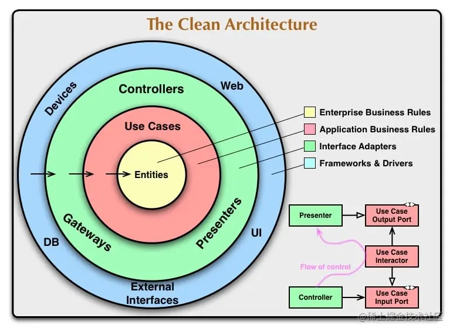
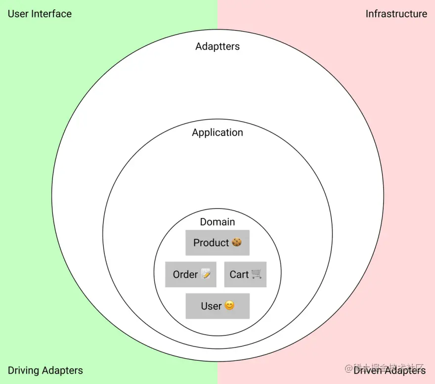

## 前端领域的干净架构

> 设计本质上是以一种可以将它们重新组合在一起的方式将事物拆开......将事物拆分成可以重新组合的事物，这就是设计。--Rich Hickey《设计、重构和性能》

系统设计就是系统的拆分，最重要的时我们可以在不耗费太多时间的情况下重新把它们组合起来。

### 什么是干净的架构

干净架构是一种根据应用程序的领域（domain）的相似程度来拆分职责和功能的方法。

领域（domain）是由真实世界抽象而来的程序模型。可以反映现实世界和程序中数据的映射。比如，如果我们更新了一个产品的名称，用新名称来替代旧名称就是领域转换。

#### 领域层

在最中心的是领域层，这里会描述应用程序主题区域的实体和数据，以及转换该数据的代码。领域是区分不同程序的核心。

可以把领域理解为当我们从react迁移到angular，或者改变某些用例的时候不会变的那一部分。在商店应用中，领域就是产品、订单、用户购物车以及更新这些数据的方案。（数据状态的管理和数据状态的流转策略）

数据结构和他们之间的转化是与外部世界相互隔离的。外部的事件调用会触发领域的转换，但并不会决定他们如何运行。

#### 应用层

围在领域外面的是应用层。例如，“添加到购物车”这个场景就是一个用例。它描述了用户单击按钮后执行的具体操作，像是一种“协调者”。
  - 向服务器发送一个请求；
  - 执行领域转换；
  - 使用响应的数据更新UI；

此外，在应用层还有端口--它描述了应用如何和外部通信。通常一个端口就是一个接口（interface），一个行为契约。

端口也可以被认为是一个与现实世界和应用程序之间的“缓冲区”。输入端口会告诉我们应用要如何接受外部的输入，同样输出端口会说明如何与外部通信做好准备。

#### 适配器层

最外层包含了外部服务的适配器，我们通过适配器层来转换外部服务的不兼容API。

一般用户最常和驱动型适配器进行交互，例如，处理UI框架发送的点击事件就是一个驱动型适配器。它与浏览器API一起将事件转换为我们的应用程序可以理解的信号。

驱动型会和我们的基础设施交互。在前端，大部分的基础设施就是后端服务器，但有时我们可能会直接与其他的一些服务交互，如搜索引擎。

注意，离中心越远，代码的功能就越“面向服务”，离应用的领域就越远，这在后面我们要决定一个模块是哪一层的时候是非常重要的。

### 依赖规则

三层架构有一个依赖规则：只有外层可以依赖内层。这意味着：
  - 领域必须独立；
  - 应用层可以依赖领域；
  - 最外层可以依赖任何东西；

不控制依赖方向的代码可能会变得非常复杂和难以维护。比如：
  - 循环依赖，模块A依赖于B，B依赖于C，C依赖于A；
  - 可测试性差，即使测试一小块功能也不得不模拟整个系统；
  - 耦合度太高，因为模块之间的交互会很脆弱；

### 干净架构的优势

#### 独立领域

所有应用的核心功能被拆分并统一维护在一个地方-领域。领域中的功能是独立的，这意味着它更容易测试。模块的依赖越少，测试所需的基础设施就越少。

独立的域的代码每次的变更很明确，出任何问题也容易排查。

#### 独立用例

应用的使用场景和用例都是独立描述的。它决定了我们所需要的那些第三方服务，这让我们有更多的空间选择合适的第三方服务。比如，支付系统涨价了，可以很快的换掉它。

用例的代码是扁平的，并且容易测试，扩展性强。

#### 可替换的第三方服务

适配器使得第三方服务发生变更也能保证api的稳定性，适配器可以减少应用运行时错误的传播。

### 实现干净架构的成本

#### 需要更多时间

设计、实现都需要更多的时间，因为直接调用第三方服务比写适配器更简单。

我们很难在一开始就把模块的所有交互和需求都想的很明白，我们设计的时候需要留意那些地方可能发生变化，所以要考虑更多的可扩展性。

#### 有时会显得多余

干净架构并不适用于所有场景，甚至有的时候是有害的。如果本身就是一个很小的项目，还要按照干净架构进行设计。这会大大增加上手门槛。

#### 上手更困难

完全按照干净架构进行设计和实现会让新手上手更困难，他需要先了解清楚应用是怎么运行起来的。

#### 代码量增加

这是前端会持有的一个问题，干净架构会增加最终打包的产物体积。产物越大，浏览器下载和解释的时间越长，所以代码量一定要把控好，适当删减代码：
  - 将用例描述的更简单一些；
  - 直接从适配器和领域交互，绕过用例；
  - 进行嗲吗拆分；

#### 如何降低这些成本

你可以适当的偷工减料和牺牲架构的“干净度”来减少一些实现时间和代码量。如果舍弃一些东西可以获得更大的收益，我会毫不犹豫的去做。

不必在所有方面都遵守干净架构的设计准则，把核心准则遵守好即可。

#### 抽象领域

对领域的抽象可以帮助我们理解整体的设计，以及它们是怎么工作的，同时也会让其他开发人员更容易理解程序、实体以及它们之间的关系。

抽象的领域也更容易重构，因为它们的代码集中封装在一个地方的，其他层需要的时候可以方便添加。

#### 遵守依赖规则

依赖方向是需要遵守的，外部的服务需要适配内部，而不是反方向的。

如果你尝试直接去调用一个外部API，这就是有问题的，最好在没出问题之前写个适配器，增加一层，保持内层的独立干净。

### 商店应用的设计

#### 设计领域

程序设计中最重要的就是领域设计，它们表示了实体到数据的转换。

商店的领域可能包括：
  - 每个实体的数据类型：用户、饼干、购物车和订单；
  - 如果你是用OOP（面向对象思想）实现的，那么也要设计生成实体的工厂和类；
  - 数据转换的函数；

领域中的转换方案只依赖于领域的规则，而不依赖于其他任何东西。比如方法应该是这样的：
 - 计算总价的方法；
 - 检测用户口味的方法；
 - 检测商品是否在购物车的方法；

#### 设计应用层

应用层包含用例，一个用例包含一个参与者、一个动作和一个结果。

在商店应用里，我们可以这样区分：
  - 一个产品购买场景；
  - 支付、调用第三方支付系统；
  - 与产品和订单的交互：更新、查询；
  - 根据角色访问不同页面；

#### 设计适配器层

在适配器层，我们为外部服务声明适配器。适配器可以为我们的系统兼容各种不兼容的外部服务。

在前端，适配器一般是UI框架和对后端的API请求模块。比如我们的商店应用程序中会用到：
  - 用户界面；
  - API请求模块；
  - 本地存储的适配器；
  - API返回到应用层的适配器；

##### 对比MVC架构

  - Model一般都是领域实体；
  - Controller一般是与转换或者应用层；
  - View是驱动适配器；

#### 相互依赖的用例

如果两个用例是相关的，通过一个用例的事件触发另一个用例。一个比较好的处理方式是将用例分解为更小的原子用例。它们将更容易的组合在一起。

通常，出现这个问题是编程中另外一个大问题的结果。这就是实体组合。

