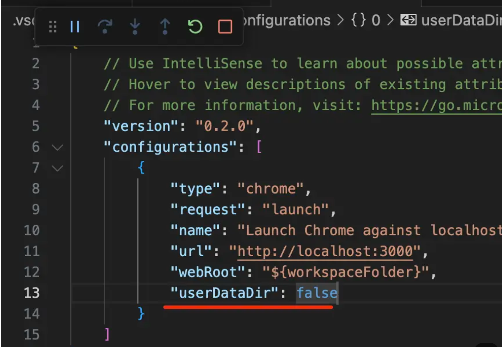

## React出现的历史背景及介绍

1. react的出现是为了解决哪些问题?
   * 传统的UI操作关注太多细节
   * 应用程序分散在各处,难以追踪和维护

2. react始终整体刷新页面,无需关注细节
3. 把你从繁琐的ui操作中解放出来,你无需关心ui的更新,只需要关注状态的管理和更新.

4. React很简单
        * 组件化开发：让你用组件的方式去开发项目
        * 单向数据流
        * 完善的错误提示

5. 创建一个组件需要考虑的因素
        * 创建静态ui
        * 考虑组件的状态组成
        * 考虑组件的交互方式

6. 受控组件与非受控组件

        * 受控组件，表单元素状态由使用者维护

        ```js
        <input type="text"
            value={this.state.value}
            onChange={evt => 
                this.setState({ value: evt.target.value});
            }
        />
        ```
        * 非受控组件,表单状态由自身维护

        ```js
        <input 
                type="text"
                ref={node => this.input = node}
        />
        ```

7. 创建组件的时候需要遵循的原则

* 单一职责原则
确定一个组件只做一件事,如果一个组件变得复杂,则应该考虑拆分成小组件.
* DRY原则
能计算得到的状态就不要单独存储,组件尽量无状态,所需数据通过props获取.

8. JSX

jsx,就是让你可以在JavaScript代码中直接写HTML标记,它不是一种模板,而是动态创建组件的语法糖,你可以使用jsx语法来创建组件,也可以使用react.createElement来创建组件.

jsx优点:

* 声明式创建界面的直观
* 代码动态创建界面的灵活
* 无需学习新的模板语言

9. React的生命周期和使用场景

        * render阶段

        纯净且没有副作用,可能会被react暂停,终止或重新启动

        * pre-commit阶段

        可以读取DOM

        * Commit阶段

        可以使用DOM,运行副作用,安排更新

10. constructor

        * 用于初始化内部状态
        * 唯一可以直接修改state的地方

11. getDerivedStateFromProps

        * 当state需要从props初始化时使用(我的理解state依赖props的值更新)
        * 尽量不要使用,维护两者状态一致性会增加复杂度
        * 每次render都会调用
        * 典型场景,表单组件获取默认值

12. componentDidMount

        * ui渲染完成后调用
        * 只执行一次
        * 典型场景: 获取外部资源,订阅事件

13. componentWillUnmount

        * 组件移除时被调用
        * 典型场景: 资源释放,定时器清除

14. getSnapshotBeforeUpdate

        * 在页面render之前会调用
        * 典型场景: 获取render之前的dom状态,做一些副作用操作

15. componentDidUpdate

        * 每次UI更新时被调用
        * 典型场景: 页面需要根据props变化重新获取数据

16. shouldComponentUpdate

        * 决定Virtual DOM是否需要重绘
        * 一般可以由pureComponent自动实现
        * 典型场景: 性能优化

17. Virtual DOM原理

react的virtual dom采用广度优先的深层比较,当节点跨层移动的时候其实react是分辨不出来的,它只是粗暴的把原有的节点删除,然后在移动后的地方创建新的节点,这样其实性能上是有一定的损耗的.

虚拟DOM的两个假设:

* 组件的DOM结构是相对稳定的,假定没有节点的跨层级移动;
* 类型相同的兄弟节点可以被唯一标识.

为节点制定key属性,可以使得react能够高性能的更新你的应用.

**优点**

  - 保证性能下限：虚拟DOM可以经过diff找出最小差异，然后批量进行patch，这种操作虽然比不上手动优化，但是比起粗暴的DOM操作性能要好很多，因此虚拟DOM可以保证性能下限；
  - 无需手动操作DOM：React会处理虚拟DOM的diff和patch，开发者无需手动操作DOM，只需专注于状态管理，极大提升开发效率；
  - 跨平台：虚拟DOM本质上是js对象，而DOM与平台强相关，相比之下虚拟DOM可以进行更方便的跨平台操作，例如服务端渲染、移动端开发等；

**缺点**

  - 无法进行机制优化：在一些性能要求极高的应用中虚拟DOM无法进行针对性的极致优化；


18. 高阶组件

高阶组件的概念就是给当前组件扩展一些别的应用逻辑

19. React调试

用户数据是保存在useDataDir里的，一个useDataDir对应一个浏览器实例，各种chrome插件、浏览记录、cookies等，所有用户数据都保存在useDataDir里。一个useDataDir只能跑一个实例，我们调试的时候，如果没有指定useDataDir，默认是临时创建一个新的useDataDir。这是会没有安装的chrome插件。如果希望调试的时候有已安装的插件，可以把useDataDir设置为false，这样就使用默认的useDataDir来跑：


20. React的数据不可变
    - 普通的class组件，setState会重新渲染；
    - 继承的PureComponent的class组件，setState时会比props和state引用是否改变，还会对state的每个key的值做比较，变了才会重新渲染；
    - function组件在用useState的setXxx时，会比较state的引用是否变化，变了就会重新渲染；

21. React的渲染流程

整体分为两大阶段：
        - render阶段：把React Element树（也可以叫vdom）转成fiber链表的reconcile过程，reconcile过程并不只是创建新的fiber节点，当更新的时候，还会和之前的fiber节点做diff，判断是新增、修改、还是删除。由Scheduler负责调度，通过时间分片来把计算任务分到多个任务里去。
        - commit阶段：reconcile结束就有了完整的fiber链表，再次遍历这个fiber链表，执行其中的effect、增删改dom等。
        commit也分成了三个小阶段：
            - before mutation：操作dom之前，effect函数会在before mutation前异步调度执行；
            - mutation： 操作dom；
            - layout： 操作dom之后，useLayoutEffect会在layout阶段同步执行。在mutation阶段更新了dom，在layout阶段就可以拿到ref了。

22. React的并发模式

React的并发模式简单来说就是基于优先级的可打断的渲染流程。fiber结构的设计，一方面可以极大的降低查询节点的时间复杂度，把整个vdom树变成线性的链表结构，使得查询的时间复杂度为O(1)。另一方面链表的数据结构设计存储正在处理的fiber节点，使得耗时的渲染任务可以被打断、恢复。

        - 双缓冲
        Fiber结构使用了双缓冲技术，即维护两个虚拟DOM树：当前树（Current Tree）和工作树（Work-in-Progress Tree）。当前树表示当前渲染的UI状态，而工作树表示正在进行的更新。
        更新过程中，React会在工作树上进行计算和修改，完成后将工作树切换为当前树，从而实现了UI的更新。这种方式避免了直接修改当前树，减少了不必要的计算和渲染。
        - 递归变迭代
        传统的React渲染过程是递归的，即在更新阶段，react会递归地遍历整个组件树，这种方式在处理大型组件树时，可能会导致栈溢出或性能问题。
        fiber架构将递归遍历改为迭代遍历，每个fiber节点都包含了指向父节点、子节点和兄弟节点的指针。React可以通过这些指针在fiber树上进行迭代遍历，从而避免了递归带来的栈溢出和性能问题。

23. React的Hook为什么不能写在判断和循环里？

React Hooks不能写在条件语句、循环或其他嵌套函数中。这是因为React依赖于Hooks的调用顺序来正确的管理组件状态和副作用。如果Hooks的调用顺序在不同的渲染周期发生变化，React将无法正确跟踪和管理组件状态，从而导致难以调试的错误。

24. React中使用Hooks的好处

  1. 状态管理更简洁
  Class Component的状态管理主要通过类组件的`this.state`和`this.setState`来实现。Hooks引入了`useState`，使得函数组件可以拥有状态，并且状态管理的代码更加简洁和直观。
  2. 副作用管理方便
  Hooks提供了`useEffect`，使得在函数组件中处理副作用（如数据获取、订阅、手动DOM操作等）变得更加方便。`useEffect`允许你在组件渲染后执行副作用操作，并且可以控制副作用的执行时机。
  3. 逻辑复用更灵活
  Hooks允许你将组件逻辑提取到自定义Hooks中，从而实现逻辑的复用。自定义Hooks可以封装复杂的状态逻辑或副作用逻辑，并在多个组件中共享。
  4. 组件结构更清晰
  Hooks使得函数组件的结构更加清晰和简洁。函数组件没有类组件中的生命周期方法，所有逻辑集中在函数体内，使得代码更易于理解和维护。
  5. 更好的性能优化
  Hooks提供了`useMemo`和`useCallback`，使得在函数组件中进行性能优化更加容易。`useMemo`可以缓存计算结果，`useCallback`可以缓存函数引用，从而避免不必要的渲染。
  6. 更好的TypeScript支持
  Hooks与TypeScript结合更加自然，因为函数组件的类型推断更加直观。你可以直接使用TypeScript的类型注解来定义Hooks的参数和返回值。

25. JSX的解析流程

  1. 编译JSX：Babel解析JSX转换成render function，本质上调用React.createElement。
  2. React.createElement调用，生成虚拟DOM；
  3. 遍历虚拟DOM树，将其转换为fiber结构（这个过程叫reconcile）；
  reconcile过程并不只是创建fiber节点，当更新的时候，还会和之前fiber节点做diff，判断是新增、修改还是删除，然后打上对应的标记。
  4. 根据增删改的标记，更新真实DOM中发生变化的部分；
  5. 调用组件的生命周期方法，执行副作用操作；

25. React Router

  1. history.scrollRestoration可以设置保留滚动位置
  它的值有auto、manual，默认是auto，也就是会自动定位到上次滚动位置，设置为manual就不会了。
  2. 当你在history中导航时，popstate就会触发，比如history.forward，history.back，history.go。但是history.pushState、history.replaceState并不会触发popState。
  添加、修改history不会触发popstate，只有history之间导航才会触发。
  3. react的路由跳转是封装了pushState和replaceState的，当pushState或者replaceState触发的时候，会触发matchRoutes，match完会pushState修改history，然后更新state，触发了setState，组件树会重新渲染。

  渲染时会用到Outlet渲染子路由，用到useXxx来取一些匹配信息，这些都是通过context传递的。

  4. 为什么需要路由?
    * 单页应用需要进行页面切换
    * 通过url可以定位到页面
    * 更有语义的组织资源的显示与隐藏
    memoryRouter内存路由,一般服务端渲染的时候会用到.

  5. 基于路由组织资源的优点:
    * 1.实现业务逻辑的松耦合
    * 2.易于扩展,重构和维护
    * 3.路由层面实现lazy load,统一的地方做懒加载的处理
    navLink带有选中状态的link.prompt,页面要切换时的确认操作.
    redirect,登陆校验时会用到,route路由匹配显示对应组件
    exact是否精确匹配,route默认会显示所有匹配的组件,采用switch只显示第一个匹配的组件.页面状态可以通过url参数控制.

26. React Context

context的实现：

首先是调用createContext方法，这个方法返回一个对象，有3个属性：

  - _currentValue：保存context的值的地方，私有属性；
  - Provider：ContextProvider类型的jsx；
  - Consumer：ContextConsumer类型的jsx；

具体实现逻辑：

  - provider的处理就是修改了 context._currentValue的值，也可以自己修改；
  - useContext和consumer的原理类似，都是读取context._currentValue，然后传入组件渲染；

Consumer如何保证消费最近的一个Provider提供的value：当一个Consumer组件需要消费数据时，React会在组件树中向上查找最近的Provider组件。React会记录每个Provider的value，并在查找过程中使用这些记录来确定最近的Provider组件，消费对应Provider组件的value。

context导致的重渲染如何解决？

  - 拆分context，每一类状态放在一个context里，这会导致context嵌套过多，维护成本增加。
  - 用zustand等状态管理库，通过selector逻辑只订阅组件依赖的状态的变更；
  - 用memo包裹子组件，它会对比新旧props（浅比较），没变化就不会重新渲染；

27. useEffect的effect函数在操作dom之后异步执行。

异步执行就是用setTimeout，Promise等api包裹执行的逻辑；

这些逻辑会以单独的宏任务或微任务的形式存在，然后进入Event Loop调度执行。

异步执行的effect逻辑有两种可能，在下次渲染之前执行完这个effect或者分片时间不够了，在渲染之后执行了。这样就导致页面出现闪动，第二次渲染值更新了，如果不想闪动一下，就用useLayoutEffect。

useLayoutEffect和useEffect的区别是useLayoutEffect的执行是同步的，浏览器会等effect逻辑执行完再渲染。
而如果这段同步执行的逻辑耗时太久，会导致页面卡顿，所以开发者需要根据实际情况考虑选择使用useEffect还是useLayoutEffect。

28. useRef可以视为React的一个组件内的全局变量，它的值的修改不会触发重渲染。useRef一般用来存一些不用于渲染的内容。

29. 在React里，只要涉及到state的修改，就必须返回新的对象，不管是useState还是useReducer。
这也是react的特性之一：数据不可变性。
如果要修改复杂的深层嵌套的对象，可以用immer来优化。

30. forwardRef + useImperativeHandle

forwardRef + useImperativeHandle组合使用使得子组件可以自定义暴露给父组件的内容，是父组件访问和修改子组件状态的一种方式。

31. 可以使用memo包裹组件来避免非必要的重渲染。

如果子组件用了memo，给它传递的对象，函数类的props就需要用useMemo、useCallback包裹，否则，每次props都会变，memo就没用了。

反之，如果props使用useMemo，useCallback，但是子组件没有被memo包裹，那也没意义，因为不管props变没变父组件重渲染都会导致子组件重渲染，只是做了无用功。

32. React的生命周期

  - useEffect不添加依赖类似于componentWillMount，不添加依赖的返回值类似于componentWillUnmount；
  - useEffect添加prop为依赖，类似于getDerivedStateFromProps；
  - useEffect添加state为依赖，类似于componentDidUpdate；

33. React引入Fiber架构的原因和必要性

React引入Fiber架构的主要原因是为了解决处理大型应用时，虚拟DOM的更新和渲染过程出现的性能瓶颈和用户体验问题。虽然之前的虚拟DOM树也可以正常的进行迭代和比较，但在某些情况下，它可能无法满足React对高性能和流畅用户体验的需求。以下是引入Fiber架构的主要原因：

  1. 调度：
    - 问题：在旧版本的架构中，React的渲染过程是同步的，这意味着React开始渲染一个组件树时，它会一直执行到渲染完成，期间不会中断。这在处理大型组件树时会导致长时间的阻塞，影响用户体验，尤其是在低端设备上。
    - 解决方案：fiber结构引入了任务调度的概念，允许React将渲染工作分解为多个小任务，并在浏览器的主线成空闲时执行这些任务。这使得React可以在渲染过程中暂停、恢复和中断任务，从而避免长时间的阻塞，提高应用的响应性。
  2. 优先级
    - 问题：在旧版本的架构中，所有任务的优先级都是相同的，React无法区分哪些任务更重要，哪些任务可以稍后处理。这可能导致一些高优先级的任务（如用户交互）被低优先级的任务（如渲染）阻塞。
    - 解决方案：Fiber架构引入了优先级机制，允许react根据任务的优先级来调度任务。如果进来的任务的优先级比当前在执行的任务的优先级高，则React暂停当前任务，优先处理用户交互事件，然后再处理数据更新。

  3. 并发

    - 问题：在旧版本的架构中，React的渲染过程是单线程的，无法并发处理多个任务，这限制了React处理复杂应用时的性能。
    - 解决方案：Fiber架构引入了并发模式，允许React看起来在同一时间处理多个任务，提高应用的性能和响应性。

  4. 增量渲染

    - 问题：在旧版本的架构中，React的渲染性能是全局的，即每次更新都会重新渲染整个组件树。这在处理大型组件树时会导致性能问题。
    - Fiber架构引入了增量渲染的概念，允许React将渲染工作分解为多个小的单元（Fiber），并在多个帧中逐步完成渲染。这使得React可以在不阻塞主线程的情况下，更新组件树，提高渲染性能。

  5. 错误边界

    - 问题：在旧版本的架构中，如果一个组件在渲染过程中抛出错误，整个应用可能会被崩溃；
    - 解决方案：Fiber架构引入了错误边界的概念，允许开发者定义错误边界组件，当子组件抛出错误时，错误边界组件可以捕获错误并显示备用UI，从而提高应用的健壮性；

  6. 更好的调和
    
    - 问题：在旧版本的架构中，React的reconciler是基于递归的，这会导致在处理大型组件树时，调用栈过深，影响性能，且容易发生栈溢出；
    - 解决方案：Fiber架构将reconciler过程从递归改为基于链表的迭代，这使得React可以在不消耗过多调用栈空间的情况下，处理大型组件树。此外，Fiber架构还允许React在调和过程中暂停和恢复，从而更好地控制渲染过程。


### React Ref

1. createRef 创建的是一个seal对象，不能增删属性，其实创建普通的对象，也能实现dom实例的绑定。

```js
function createRef() {
    var refObject = {
        current: null
    }
    {
        Object.seal(refObject)
    }
    return refObject;
}
```
2. useRef

```js
function mountRef(initialValue) {
    let hook = mountWorkInProgressHook();
    var ref = {
        current: initialValue
    }
    {
        Object.seal(ref)
    }
    hook.memoizedState = ref;
    return ref;
}
function updateRef(initialValue) {
    var hook = updateWorkInProgressHook();
    return hook.memoizedState;
}
```

3. forwardRef

forwardRef函数创建了专门的React Element类型

```js
function forwardRef(render) {
    // ...
    var elementType = {
        $$typeof: REACT_FORWARD_REF_TYPE,
        render: render
    }
    // ...
    return elementType;
}
```
然后beginWork处理这类型的节点会做专门的处理，也就是将它的的ref的值传递给函数组件，所以渲染函数组件的时候留了第二个参数来传递ref，从而完成了ref从父组件到子组件的传递。

4. render阶段处理到原生标签也就是HostComponent类型的时候，如果有ref属性会在fiber.flags里加一个标记。

5. commit阶段会在layout操作完dom后遍历fiber链表更新HostComponent的ref，也就是将fiber.stateNode赋值给ref.current。

6. forwardRef创建了单独的react element类型，在beginWork处理到它的时候做了特殊处理，就是把ref作为第二个参数传递给了函数组件。

7. useImperativeHandle的底层实现就是useEffect，只不过执行的函数和需要的对象是指定传入的，这样在layout阶段调用hook的effect函数的时候就可以更新ref了。


## redux

Redux让组件通信更容易

1. Redux特性

* 单一数据来源
传统的mvc框架中一个view可能会有多个model,一个model也可能对应多个view,这就会让应用的结构错综复杂,不容易管理和维护.
* 可预测性
state + action = new state, 不可变特性,每次状态更新会产生一个新的state

* 纯函数更新Store
新的状态依赖于旧的状态(输入参数)

2. Store

`const store = createStore(reducer)`

store有三个方法:

* 1.getState(); // 获取当前的状态
* 2.dispatch(action); // 触发action,更新state
* 3.subscribe(listener); // 监听store的变化,调用回调函数

定义reducer,创建store,createAction,subscribe订阅状态,bindActionCreators帮我们给函数包裹一层dispatch操作,免去了手动调用dispatch的操作.高阶函数,combineReducer用于组合多个renducer.

3. connect

把一个组件connect到一个store上,连接成功后,组件里就可以访问store以及action了.connect其实是一个高阶组件,可以实现让组件可以访问和操作Store的状态.

4. Redux中间件

Redux中间件主要做两个事情: 
* 截获action,判断是否是一个函数,是的话去执行
* 发出action,将异步的执行结果传入,触发action.
Redux 中间件通过在dispatcher中截获action做特殊处理.

5. 异步action不是特殊的action,而是多个同步的action的组合使用

6. 单个action和reducer放在同一个文件
7. Redux的运行基础,不可变数据,为何需要不可变数据?

  * 性能优化
  * 易于调试和追踪
  * 易于推测,可预测性
有一个轻量级的不可变数据的实现方案immer

## React 的事件机制

React的事件机制是其核心特性之一，它提供了一种统一的方式来处理DOM事件，使得开发者可以在React组件中以声明式的方式来处理事件。React的事件机制并不是直接使用原生DOM事件，而是通过合成事件（SyntheticEvent）来实现的。

1. 合成事件（SyntheticEvent）

React的事件系统基于合成事件（SyntheticEvent），这是一种跨浏览器的事件包装器。合成事件与原生DOM事件类似，但它提供了跨浏览器的兼容性和一致性。React通过合成事件来屏蔽不同浏览器之间的差异，使得开发者可以编写跨浏览器的代码。

2. 事件委托（Event Delegation）

React的事件系统采用了事件委托（Event Delegation）的机制。事件委托是一种优化技术，它将事件处理程序附加到DOM树的顶层元素（通常是document或reactDom.render的根元素），而不是每个子元素上。当事件触发时，React会在顶层元素上捕获事件并分发给对应的组件。

事件委托的优势：
  - 性能优化：减少事件处理程序的数量，用特别是在处理大量子元素时；
  - 动态元素：对于动态添加或删除的元素，事件委托可以自动处理，无需手动绑定或解绑事件；

3. 事件池（Event Pool）

React会创建一个合成事件对象，并将其传递给事件处理函数。同时使用事件池来重用合成事件对象，以提高性能。事件处理程序执行完毕后，合成事件对象会被重置并放回事件池中。

4. 注意事项

异步事件处理：由于合成事件对象会被重用，因此在异步操作中访问事件对象时，可能会遇到事件对象已被重置的情况。如果需要在异步操作中访问事件对象，可以通过event.persist() 方法来保留事件对象。

```js
function handleClick(event) {
  event.persist();
  setTimeout(() => {
    console.log(event.target); // 输出当前点击的元素
  }, 0);
}
```

## React和Vue的区别

React和Vue是两个非常流行的前端框架库，他们都用于构建用户界面，但在设计理念、使用方式和生态系统方面有一些显著的区别。

1. 核心思想

  - React：React是一个用于构建用户界面的js库，它遵循组件化的思想，将ui拆分为独立、可重用的组件。React使用JSX语法，允许你在js代码中编写类似HTML的结构；
  - Vue：VUe是一个渐进式js框架，它也遵循组件化的思想，但更注重灵活性和易用性。Vue使用模版语法（类似HTML）和单文件组件（SFC），将模版、逻辑和样式封装在一个文件中。

2. 模版与JSX

  - React：使用JSX来描述组件的结构，JSX是一种在js中编写类似于HTML代码的语法扩展。JSX最终会被编译成js代码。
  - Vue：使用模版语法，模版式纯HTML的扩展，跟之前的ejs有些相像，更容易上手。Vue的模版语法支持指令（v-if、v-for）和插值，使得数据绑定和条件渲染更加直观；

3. 数据绑定

  - React：使用单向数据流，数据从父组件流向子组件。React中的状态（state）是不可变的，每次修改都要返回新的state；
  - Vue：使用双向数据绑定，数据可以在试图和模型之间自动同步。VU饿的状态是响应式的，当数据变化时，视图会自动更新。

4. 性能

  - React：使用虚拟DOM来优化性能，React的diff算法能够最小化DOM操作，提高渲染效率。但是更细粒度的避免重渲染需要开发者管理好状态依赖，以及给组件增加memo等逻辑来实现；
  - Vue：vue也使用虚拟DOM，但vue的响应式系统能够更细粒度的追踪依赖关系，减少不必要的重渲染；


## Ref的实现原理

render阶段处理到原生标签也就是HostComponent类型的时候，如果有ref属性会在fiber.flags里加一个标记。

commit阶段会在layout操作完dom后遍历fiber链表更新HostComponent的ref，也就是把fiber.stateNode赋值给ref.current。

react并不关心ref是哪里创建的，用createRef、useRef创建的，或者forwardRef传过来的都行，甚至普通对象也可以。createRef、useRef只是把普通对象 Object.seal了一下。

useImperativeHandle的底层实现就是useEffect，只不过执行的函数是它指定的，bind了传入的ref和create函数，这样layoutr阶段调用hook的effect函数就可以更新ref。


