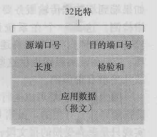
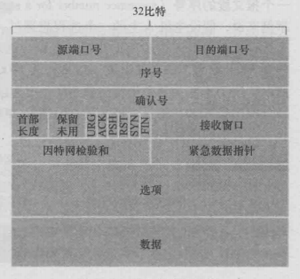

# 计算机网路
## DNS协议
### 概况

DNS协议提供的是一种主机名到IP地址的转换服务，就是我们常说的域名系统。它是一个由分层的DNS服务器组成的分布式数据库，是定义了主机如何查询这个分布式数据库的应用层协议。DNS协议运行在UDP协议之上，使用53端口。

### 域名的层级结构

```bash
主机名.次级域名.顶级域名.根域名
# 即
host.sld.tld.root
```
根据域名的层级结构，管理不同层级域名的服务器，可以分为根域名服务器、顶级域名服务器和权威域名服务器。

### 查询过程

DNS查询过程一般为，我们首先将DNS请求发送到本地DNS服务器，由本地DNS服务器代为请求。
1. 从“根域名服务器”查到“顶级域名服务器”的NS记录和A记录（IP地址）；
2. 从“顶级域名服务器”查到“次级域名服务器”的NS记录和A记录（IP地址）；
3. 从“次级域名服务器”查出“主机名”的IP地址；

比如我们如果想要查询 www.baidu.com 的 IP 地址，我们首先会将请求发送到本地的 DNS 服务器中，本地 DNS 服务 器会判断是否存在该域名的缓存，如果不存在，则向根域名服务器发送一个请求，根域名服务器返回负责 .com 的顶级域名 服务器的 IP 地址的列表。然后本地 DNS 服务器再向其中一个负责 .com 的顶级域名服务器发送一个请求，负责 .com 的顶级域名服务器返回负责 .baidu 的权威域名服务器的 IP 地址列表。然后本地 DNS 服务器再向其中一个权威域名服务器发送一个请求，最后权威域名服务器返回一个对应的主机名的 IP 地址列表。

### 递归查询和迭代查询

递归查询指的是查询请求发出后，域名服务器代为向下一级域名服务器发出请求，最后向用户返回查询的最终结果。使用递归查询，用户只需要发出一次查询请求。

迭代查询指的是查询请求后，域名服务器返回单次查询的结果。下一级的查询由用户自己请求。使用迭代查询，用户需要发出 多次的查询请求。

一般我们向本地 DNS 服务器发送请求的方式就是递归查询，因为我们只需要发出一次请求，然后本地 DNS 服务器返回给我 们最终的请求结果。而本地 DNS 服务器向其他域名服务器请求的过程是迭代查询的过程，因为每一次域名服务器只返回单次 查询的结果，下一级的查询由本地 DNS 服务器自己进行。

### DNS 缓存
DNS 缓存的原理非常简单，在一个请求链中，当某个 DNS 服务器接收到一个 DNS 回答后，它能够将回答中的信息缓存在本地存储器中。返回的资源记录中的 TTL 代表了该条记录的缓存的时间。

### DNS 实现负载平衡

DNS 可以用于在冗余的服务器上实现负载平衡。因为现在一般的大型网站使用多台服务器提供服务，因此一个域名可能会对应 多个服务器地址。当用户发起网站域名的 DNS 请求的时候，DNS 服务器返回这个域名所对应的服务器 IP 地址的集合，但在每个回答中，会循环这些 IP 地址的顺序，用户一般会选择排在前面的地址发送请求。以此将用户的请求均衡的分配到各个不同的服务器上，这样来实现负载均衡。

## 传输层
传输层协议主要为不同主机上的不同进程间提供了逻辑通信的功能。传输层只工作在端系统中。

### 多路复用与多路分解
将传输层报文段中的数据交付到正确的套接字的工作被称为多路分解。

在源主机上从不同的套接字中收集数据，封装头信息生成报文段后，将报文段传递到网络层，这个过程被称为多路复用。

无连接的多路复用和多路分解指的是 UDP 套接字的分配过程，一个 UDP 套接字由一个二元组来标识，这个二元组包含了一个目的地址和一个目的端口号。因此不同源地址和端口号的 UDP 报文段到达主机后，如果它们拥有相同的目的地址和目的端口号，那么不同的报文段将会转交到同一个 UDP 套接字中。

面向连接的多路复用和多路分解指的是 TCP 套接字的分配过程，一个 TCP 套接字由一个四元组来标识，这个四元组包含了源 IP 地址、源端口号、目的地址和目的端口号。因此，一个 TCP 报文段从网络中到达一台主机上时，该主机使用全部 4 个值来将报文段定向到相应的套接字。

### UDP协议

UDP协议是一种无连接的，不可靠的传输层协议。它只提供了传输层需要实现的最低限度的功能，除了多路复用/多路分解功能和少量的差错检测外，它几乎没有对IP增加其他的东西。UDP协议适用于对实时性要求高的应用场景。

#### UDP协议的特点

1. 使用UDP时，在发送报文段之前，通信双方没有握手的过程，因此UDP被称为无连接的传输层协议。因为没有握手过程，相对于tcp来说，没有建立连接的时延。因为没有连接，所以不需要在端系统中保持连接的状态。
2. UDP提供尽力而为的交付服务，也就是说UDP协议不保证数据的可靠交付。
3. UDP没有拥塞控制和流量控制的机制，所以UDP报文段的发送频率没有限制。
4. 因为一个UDP套接字之使用目的地址和目的端口来标识，所以UDP可以支持一对一，一对多，多对一，和多对多的交互通信。
5. UDP首部小，只有8个字节。

#### UDP报文段结构
UDP报文段由首部和应用数据组成。报文段首部包含四个字段，分别是源端口号、目的端口号、长度和校验和。每个字段的长度为两个字节，长度字段指的是整个报文段的长度，包含了首部和应用数据的大小。校验和是UDP提供的差错校验机制。虽然提供了差错校验的机制，但是UDP对于差错的恢复无能为力。



### TCP协议
TCP协议面向连接的，提供可靠数据传输服务的传输层协议。

#### TCP协议的特点
1. TCP是面向连接的，在通信双方进行通信前，需要经过三次握手建立连接。它需要在端系统维护双方连接的状态信息。
2. TCP协议通过序号、确认号、定时重传、校验和等机制，来保证可靠的数据传输服务。
3. TCP协议提供的是点对点的服务，即它是在单个发送方和单个接收方之间的连接；
4. TCP协议提供的是全双工的服务，也就是说连接的双方能够向对方发送和接收数据。
5. TCP提供了拥塞控制机制，在网络拥塞的时候会控制发送数据的速率，有助于减少数据包的流失，减轻网络的拥塞程度。
6. TCP提供了流量控制机制，保证了通信双方的发送和接收相同。如果接收方的缓存很小时，发送方会降低发送速率，避免因为缓存填满而造成的数据包丢失。

#### TCP报文段结构

TCP报文段由首部和数据组成，它的首部一般为20个字节。

源端口和目的端口号用于报文段的多路复用和分解。

32比特的序号和32比特的确认号，用于实现可靠数据的运输服务。

16比特的接收窗口字段用于实现流量控制，该字段表示接收方愿意接收的字节数量。

4比特的首部字段长度，该字段指示了以32比特的字为单位的TCP首部的长度。

6 比特的标志字段，ACK 字段用于指示确认序号的值是有效的，RST、SYN 和 FIN 比特用于连接建立和拆除。设置 PSH 字 段指示接收方应该立即将数据交给上层，URG 字段用来指示报文段里存在紧急的数据。

校验和提供了对数据的差错检测。



#### TCP三次握手的过程

第一次握手，客户端向服务器发送一个SYN连接请求报文段，报文段的首部中SYN标志位置为1，序号字段是一个任选的随机数。它代表的是客户端数据的初始序号。

第二次握手，服务端接收到客户端发送的SYN连接请求报文段后，服务器首先会为该连接分配TCP缓存和变量，然后向客户端发送SYN、ACK报文段，报文段的首部中SYN和ACK标识位都被置为1，代表这是一个对SYN连接请求的确认，同时序号字段是服务端产生的一个任选的随机数，它代表的是服务端数据的初始序号。确认号字段为客户端发送的序号+1。

第三次握手，客户端接收到服务器的肯定应答后，它也为这次TCP连接分配缓存和变量，同时向服务器发送一个对服务器端报文段的确认。第三次握手可以在报文段中携带数据。

TCP三次握手的建立连接的过程就是互相确认初始序号的过程，告诉对方，什么样的报文段能够被正确接收。第三次握手的作用是客户端对服务端初始序号的确认。如果只使用两次握手，那么服务端就没有办法知道自己的序号会否已被确认。同时这样也是为了防止失效的请求报文段被服务端接收，而出现错误的情况。

#### TCP四次挥手的过程

因为TCP连接是全双工的，也就是说通信的双方都可以向对方发送和接收消息，所以断开连接需要双方的确认。

第一次挥手，客户端认为没有数据发送给服务端，会向服务端发送一个FIN报文段，申请断开连接。发送后客户端进入FIN_WAIT_1状态。

第二次挥手，服务端接收到客户端释放连接的请求后，向客户端发送一个确认报文段，表示已经接收到了客户端释放连接的请求，以后不再接收客户端发送过来的数据。发送完后服务端进入CLOSE_WAIT状态。客户端收到确认后，进入FIN_WAIT_2状态。

第三次挥手，服务端发送完所有数据后，向客户端放FIN报文段，申请断开连接。发送后进入LAST_ACK状态；

第四次挥手，客户端接收到FIN请求后，向服务端发送一个确认应答，并进入TIME_WAIT阶段。该阶段会持续一段时间，这个时间为报文段在网络中的最大生存时间，如果该时间内服务端没有重发请求的话，客户端会进入CLOSED的状态。如果收到服务端的重发请求就重新发送确认报文段。服务端收到客户端的确认报文段后就进入CLOSED状态，连接就被释放了。

TCP使用四次挥手的原因是因为TCP的连接是全双工的，所以需要双方分别释放对方的连接，单独一方的连接释放，只代表不再向对方发送数据，连接处理半释放的状态。
最后一次挥手中，客户端会等待一段时间再关闭，是为了防止发送给服务器的报文丢失或出错，从而导致服务端不能正常关闭连接。

### ARQ协议

ARQ协议指的是自动重传请求，它通过超时和重传来保证数据的可靠传输，它是TCP实现可靠传输的一个重要机制。
它分为停止等待 ARQ 协议和连续 ARQ 协议。

### 停止等待 ARQ 协议

停止等待 ARQ 协议的基本原理是，对于发送方来说发送方每发送一个分组，就为这个分组设置一个定时器。当发送分组的确认 回答返回了，则清除定时器，发送下一个分组。如果在规定的时间内没有收到已发送分组的肯定回答，则重新发送上一个分组。

对于接受方来说，每次接受到一个分组，就返回对这个分组的肯定应答，当收到冗余的分组时，就直接丢弃，并返回一个对冗余 分组的确认。当收到分组损坏的情况的时候，直接丢弃。

使用停止等待 ARQ 协议的缺点是每次发送分组必须等到分组确认后才能发送下一个分组，这样会造成信道的利用率过低。

### 连续 ARQ 协议

连续 ARQ 协议是为了解决停止等待 ARQ 协议对于信道的利用率过低的问题。它通过连续发送一组分组，然后再等待对分组的 确认回答，对于如何处理分组中可能出现的差错恢复情况，一般可以使用滑动窗口协议和选择重传协议来实现。

连续 ARQ 协议是为了解决停止等待 ARQ 协议对于信道的利用率过低的问题。它通过连续发送一组分组，然后再等待对分组的 确认回答，对于如何处理分组中可能出现的差错恢复情况，一般可以使用滑动窗口协议和选择重传协议来实现。

1. 滑动窗口协议

使用滑动窗口协议，在发送方维持了一个发送窗口，发送窗口以前的分组是已经发送并确认了的分组，发送窗口中包含了已经发 送但未确认的分组和允许发送但还未发送的分组，发送窗口以后的分组是缓存中还不允许发送的分组。当发送方向接收方发送分 组时，会依次发送窗口内的所有分组，并且设置一个定时器，这个定时器可以理解为是最早发送但未收到确认的分组。如果在定 时器的时间内收到某一个分组的确认回答，则滑动窗口，将窗口的首部移动到确认分组的后一个位置，此时如果还有已发送但没 有确认的分组，则重新设置定时器，如果没有了则关闭定时器。如果定时器超时，则重新发送所有已经发送但还未收到确认的分 组。

接收方使用的是累计确认的机制，对于所有按序到达的分组，接收方返回一个分组的肯定回答。如果收到了一个乱序的分组，那 么接方会直接丢弃，并返回一个最近的按序到达的分组的肯定回答。使用累计确认保证了确认号以前的分组都已经按序到达了， 所以发送窗口可以移动到已确认分组的后面。

滑动窗口协议的缺点是因为使用了累计确认的机制，如果出现了只是窗口中的第一个分组丢失，而后面的分组都按序到达的情况 的话，那么滑动窗口协议会重新发送所有的分组，这样就造成了大量不必要分组的丢弃和重传。

2. 选择重传协议

因为滑动窗口使用累计确认的方式，所以会造成很多不必要分组的重传。使用选择重传协议可以解决这个问题。

选择重传协议在发送方维护了一个发送窗口。发送窗口的以前是已经发送并确认的分组，窗口内包含了已发送但未被确认的分组， 已确认的乱序分组，和允许发送但还未发送的分组，发送窗口以后的是缓存中还不允许发送的分组。选择重传协议与滑动窗口协 议最大的不同是，发送方发送分组时，为一个分组都创建了一个定时器。当发送方接受到一个分组的确认应答后，取消该分组的 定时器，并判断接受该分组后，是否存在由窗口首部为首的连续的确认分组，如果有则向后移动窗口的位置，如果没有则将该分 组标识为已接收的乱序分组。当某一个分组定时器到时后，则重新传递这个分组。

在接收方，它会确认每一个正确接收的分组，不管这个分组是按序的还是乱序的，乱序的分组将被缓存下来，直到所有的乱序分 组都到达形成一个有序序列后，再将这一段分组交付给上层。对于不能被正确接收的分组，接收方直接忽略该分组。

### TCP的拥塞控制机制

TCP 的拥塞控制主要是根据网络中的拥塞情况来控制发送方数据的发送速率，如果网络处于拥塞的状态，发送方就减小发送的 速率，这样一方面是为了避免继续增加网络中的拥塞程度，另一方面也是为了避免网络拥塞可能造成的报文段丢失。

TCP的拥塞控制主要使用了四个机制，分别是慢启动、拥塞避免、快速重传和快速回复。

- 慢启动：基本思想是，因为在发送方刚开始发送数据的时候，并不知道网络中的拥塞程度，所以先以较低的速率发送，进行试探 ，每次收到一个确认报文，就将发动窗口的长度加一，这样每个 RTT 时间后，发送窗口的长度就会加倍。当发送窗口的大小达 到一个阈值的时候就进入拥塞避免算法。

- 拥塞避免算法： 是为了避免可能发生的拥塞，将发送窗口的大小由每过一个 RTT 增长一倍，变为每过一个 RTT ，长度只加一。 这样将窗口的增长速率由指数增长，变为加法线性增长。

- 快速重传：指的是，当发送方收到三个冗余的确认应答时，因为 TCP 使用的是累计确认的机制，所以很有可能是发生了报文段的 丢失，因此采用立即重传的机制，在定时器结束前发送所有已发送但还未接收到确认应答的报文段。

- 快速恢复：是对快速重传的后续处理，因为网络中可能已经出现了拥塞情况，所以会将慢启动的阀值减小为原来的一半，然后将拥 塞窗口的值置为减半后的阀值，然后开始执行拥塞避免算法，使得拥塞窗口缓慢地加性增大。简单来理解就是，乘性减，加性增。

TCP认为网络拥塞的主要依据是报文段的重传次数，它会根据网络中的拥塞程度，通过调整慢启动的阈值，然后交替使用四种机制来打到拥塞控制的目的。

**注意**
- 超时重传对性能的影响最大，因为在RTO期间不能穿书任何数据，而且拥塞控制窗口会急剧减小。所以应该尽量避免超时重传；
- 丢包对极小文件的影响比大文件严重，因为小文件可能不能触发三次重复的ACK，导致无法快速重传。
- 在采用快恢复算法时，慢开始算法只是在TCP连接建立时和网络出现时才使用；

BRR：拥塞控制算法，通过检测带宽和RTT两个指标来进行拥塞控制。


## 网络层

网络层协议主要实现了不同主机间的逻辑通信功能。网络层协议一般包含两个主要的组件，一个IP网际协议，一个路由选择协议。

IP网际地址规定了网络层的编址和转发方式，比如我们接入网络的主机都会分配一个IP地址，常用的比如IPV4使用32位来分配地址，还有IPV6使用128位来分配地址。

路由选择协议决定了数据报从源到目的所流经的路径，常见的比如距离向量路由选择算法等。

## 数据链路层

数据链路层提供的服务是如何将数据报通过单一通信链路从一个节点移动到相邻节点。每一台主机都有一个唯一的mac地址，这是由网络适配器决定的，在全世界都是独一无二的。

## 物理层

物理层提供的服务是尽可能屏蔽掉组成网络的物理设备和传输介质间的差异，使数据链路层不需要考虑网络层的具体传输介质是什么。


## 网络安全

### XSS攻击

1. 什么是XSS攻击？
Cross-Site Scripting（跨站脚本攻击）简称XSS，是一种代码注入攻击。攻击者通过在目标网站上注入恶意脚本，使之在用户的浏览器上运行。利用这些恶意脚本，攻击者可以获得用户的敏感信息如Cookie、SessionID等，进而危害数据安全（冒充用户身份向网站发起攻击者定义的请求）。

2. xss有哪些注入的方法？
  - 在HTML中内嵌的文本中，恶意内容以script标签形成注入；
  - 在内联的js中，拼接的数据突破了原本的限制（字符串、变量、方法名等）；
  - 在标签属性中，恶意内容包含引导，从而突破属性值得限制，注入其他属性或者标签；
  - 在标签的href、src等属性中，包含javascript:等可执行代码；
  - 在onload、onerror、onclick等事件中，注入不受控制的代码；
  - 在style属性和标签中，包含类似background-image:url("javascript:...");的代码（新版本浏览器已经可以防范）。
  - 在style属性和标签中，包含类似expression(...)的CSS表达式代码（新版本浏览器已经可以防范）；

3. 在处理输入时，以下内容都不可信：
  - 来自用户的UGC信息；
  - 来自第三方的连接；
  - URL参数；
  - POST参数；
  - Referer（可能来自不可信的来源）
  - Cookie（可能来自其他子域注入）

4. XSS的分类

|类型|存储区|插入点|
|---|---|---|
|存储型 XSS|后端数据库|HTML|
|反射型 XSS|URL|HTML|
|DOM 型 XSS|后端数据库/前端存储/URL|前端 JavaScript|

**存储型XSS**

存储型XSS的攻击步骤：
  1. 攻击者将恶意代码提交到目标网站的数据库中；
  2. 用户打开目标网站时，网站服务端将恶意代码从数据库取出，拼接在 HTML 中返回给浏览器。
  3. 用户浏览器接收到响应后解析执行，混在其中的恶意代码也被执行。
  4. 恶意代码窃取用户数据并发送到攻击者的网站，或者冒充用户的行为，调用目标网站接口执行攻击者指定的操作。

这种攻击常见于带有用户保存数据的网站功能，如论坛发帖、商品评论、用户私信等。

**反射型XSS**

反射型XSS的攻击步骤：
  1. 攻击者构造出特殊的URL，其中包含恶意代码；
  2. 用户打开带有恶意代码的URL时，网站服务端将恶意代码从URL中取出，拼接在HTML中返回给浏览器。
  3. 用户浏览器接收到响应后解析执行，混在其中的恶意代码也被执行。
  4. 恶意代码窃取用户数据并发送到攻击者的网站，或者冒充用户的行为，调用目标网站接口执行攻击者指定的操作。

反射型XSS跟存储型XSS的区别是：存储型XSS的恶意代码存在数据库里，反射型XSS的恶意代码存在URL里。反射型XSS漏洞常见于通过URL传递参数的场景，如：网站搜索、跳转等。

由于需要用户主动打开恶意的URL才能生效，攻击者往往会结合多种手段诱导用户点击。POST的内容也可以触发反射型XSS，只不过其触发条件比较苛刻（需要构造表单提交页面，并引导用户点击），所以非常少见。

**DOM型XSS**

DOM型XSS的攻击步骤：
  1. 攻击者构造出特殊的URL，其中包含恶意代码；
  2. 用户打开带有恶意代码的URL；
  3. 用户浏览器接收到响应后解析执行，前端 JavaScript 取出 URL 中的恶意代码并执行。
  4. 恶意代码窃取用户数据并发送到攻击者的网站，或则冒充用户行为，调用目标网站接口执行攻击者指定的操作；

DOM型XSS跟前两种的区别：DOM型XSS攻击中，取出和执行恶意代码由浏览器完成，属于前端js自身的安全漏洞，而其他两种xss都属于服务端安全漏洞（经由服务端完成的安全攻击）。

5. XSS攻击的预防

**预防存储型和反射型XSS攻击**
  - 纯前端渲染，把代码和数据分隔开，不做HTML拼接，将内容当作纯文本渲染（设置innerText、设置setAttribute）；
  - 需要做HTML拼接的场景，对HTML做充分转义（使用三方完善的HTML转义库）；

**预防DOM型XSS攻击**
  - 尽量使用textContent、setAttribute，而不是innerHTML，outerHTML，document.write()等，render层面避免渲染代码；
  - 避免将不可信的数据拼接到字符串中传递给一些API，如location、onclick、onerror、onload、onmouseover等，a标签的href属性，js的eval、setTimeout、setInterval等，这些api会将字符串作为代码执行。
  - 后端存入数据库前，对输入内容做过滤；（html转义）


**CSP（Content Security Policy）**

严格的CSP在XSS规范中可以起到以下的作用：
  - 禁止加载外域代码，防止复杂的攻击逻辑；
  - 禁止外域提交，网站被攻击后，用户的数据不会泄漏到外域；
  - 禁止内联脚本执行（规则较严格）；
  - 禁止未授权的脚本执行（新特性，google map移动版在使用）；
  - 合理使用上报可以及时发现XSS，利于尽快修复问题；

开启白名单，防止白名单以外的资源加载和运行。

**其他策略**
  - 输入长度控制；
  - HTTP-only cookie：禁止js读取某些敏感cookie，攻击者完成xss注入后也无法窃取此cookie；
  - 验证码：防止脚本冒充用户提交危险操作；

**XSS攻击的检测**
  - 白盒法：通过扫描源代码，查找是否存在拼接输入的代码；
  - 黑盒法：通过扫描用户提交的信息，查找是否存在拼接脚本的代码；
  - 使用扫描工具自动检测XSS漏洞；

### CSRF攻击

1. 什么是CSRF？

CSRF（cross-site request forgery）跨站请求伪造：攻击者诱导受害者进入第三方网站，在第三方网站中，向被攻击网站发送跨站请求。利用受害者在被攻击网站已经获取的注册凭证，绕过后台的用户验证，达到冒充用户对攻击的网站执行执行某项操作的目的。

2. 一个典型的csrf攻击有如下流程：

  - 受害者登陆a.com，并保留了登录凭证；
  - 攻击者诱导受害者访问了b.com；
  - b.com向a.com 发送了一个请求：a.com/act=xx；
  - a.com接收到请求后，对请求进行验证，并确认是受害者的凭证，误以为是受害者自己发送的请求；
  - a.com以受害者的名义执行了act=xx；
  - 攻击完成，攻击者在受害者不知情的情况下，冒充受害者，让a.com执行了自己定义的操作；

csrf发起攻击的形式：
  - 通过get请求，即通过访问img的页面后，浏览器自动访问目标地址，发送请求；
  - 设置一个自动提交的表单发送post请求；
  - 使用a标签，用户点击连接后触发一个自动提交的表单，模拟用户完成了一次POST操作；

3. 几种常见的攻击类型

 - GET类型的CSRF；

 GET类型的CSRF利用非常简单，只需要一个HTTP请求，一般会这样利用：
 ```js
   
 ```
 在受害者访问含有这个img的页面后，浏览器会自动向http://bank.example/withdraw?account=xiaoming&amount=10000&for=hacker发出一次HTTP请求。bank.example就会收到包含受害者登录信息的一次跨域请求。

 - POST类型的CSRF
 这种类型的CSRF利用起来通常使用的是一个自动提交的表单，如：
 ```js
  <form action="http://bank.example/withdraw" method="POST">
    <input type="hidden" name="account" value="xiaoming" />
    <input type="hidden" name="amount" value="10000" />
    <input type="hidden" name="for" value="hacker" />
  </form>
  <script> document.forms[0].submit(); </script> 

 ```
 访问该页面后，表单会自动提交，相当于模拟用户完成了一次POST操作。
 POST类型的攻击通常比GET要求更加严格一点，但仍并不复杂。任何个人网站、博客，被黑客上传页面的网站都有可能是发起攻击的来源，后端接口不能将安全寄托在仅允许POST上面。
 
 - 链接类型的CSRF

 链接类型的CSRF并不常见，比起其他两种用户打开页面就中招的情况，这种需要用户点击链接才会触发。这种类型通常在论坛中发布的图片中嵌入恶意链接，或者以广告的形式诱导用户中招，攻击者通常会以比较夸张的词语诱骗用户点击。
 ```js
   <a href="http://test.com/csrf/withdraw.php?amount=1000&for=hacker" target="_blank">
  重磅消息！！
  <a/>
 ```
 由于之前用户登录了信任的网站A，并且保存登录状态，只要用户主动访问上面的这个PHP页面，则表示攻击成功。

4. CSRF的特点

  - 攻击一般发起在第三方网站，而不是被攻击的网站。被攻击的网站无法防止攻击发生。
  - 攻击利用受害者在被攻击网站的登录凭证，冒充受害者提交操作；而不是直接窃取数据。
  - 整个过程攻击者并不能获得受害者的登录凭证，仅仅是“冒用”；
  - 跨站请求可以用各种方式：图片URL、超链接、Form提交等等。部分请求方式可以直接嵌入在第三方论坛、文章中，难以进行追踪；

CSRF通常是跨域的，因为外域通常更容易被攻击者掌控。但是如果本域下有容易被利用的功能，比如可以发图和链接的论坛和评论区，攻击可以直接在本域下进行，而且这种攻击更加危险。

5. 防护策略

csrf的两个特点：

  - csrf（通常）发生在第三方域名；
  - csrf攻击者不能获取到cookie等信息，只是使用；

针对上述两点，我们可以专门制定防护策略：

  - 阻止不明外域的访问
  阻止跨域请求携带cookie，或者设置允许携带cookie的域名白名单。
    - 同源检测；
    - SameSite Cookie；
  - 提交时要求附加本域才能获取到的信息；
    - CSRF Token；
    要求所有的用户请求都携带一个CSRF攻击者无法获取的token，服务器通过校验请求是否携带正确的token，来把正常的请求和攻击的请求分开，从而防范CSRF攻击。
    - 双重Cookie验证；
  
也可以通过设置referrer来防护，但是referrer可以被篡改，这种防护策略不够安全。设置Referrer Policy的方法有三种：

  - 在CSP设置
  - 页面头部增加meta标签
  - a标签增加referrer policy属性

### SQL注入

SQl注入攻击，是通过恶意的sql查询或添加语句插入应用的输入参数中，再在后台sql服务器上解析执行进行的攻击。

预防策略：
  - 严格检查输入的变量的类型和格式；
  - 过滤和转义特殊字符；
  - 对访问数据库的web应用程序采用web应用防火墙；

6. 分布式校验

在大型网站中，使用Session存储CSRF Token会带来很大的压力。访问单台服务器session是同一个。但是现在的大型网站中，我们的服务器通常不止一台，可能是几十台甚至几百台之多，甚至多个机房都可能在不同的省份，用户发起的HTTP请求通常要经过像Nginx之类的负载均衡器之后，再路由到具体的服务器上，由于Session默认存储在单机服务器内存中，因此在分布式环境下同一个用户发送的多次HTTP请求可能会先后落到不同的服务器上，导致后面发起的HTTP请求无法拿到之前的HTTP请求存储在服务器中的Session数据，从而使得Session机制在分布式环境下失效，因此在分布式集群中CSRF Token需要存储在Redis之类的公共存储空间。

由于使用Session存储，读取和验证CSRF Token会引起比较大的复杂度和性能问题，目前很多网站采用Encrypted Token Pattern方式。这种方法的Token是一个计算出来的结果，而非随机生成的字符串。这样在校验时无需再去读取存储的Token，只用再次计算一次即可。

这种Token的值通常是使用UserID、时间戳和随机数，通过加密的方法生成。这样既可以保证分布式服务的Token一致，又能保证Token不容易被破解。

在token解密成功之后，服务器可以访问解析值，Token中包含的UserID和时间戳将会被拿来被验证有效性，将UserID与当前登录的UserID进行比较，并将时间戳与当前时间进行比较。

7. 双重cookie验证

在会话中存储CSRF Token比较繁琐，而且不能在通用的拦截上统一处理所有的接口。

双重Cookie采用以下流程：

在用户访问网站页面时，向请求域名注入一个Cookie，内容为随机字符串（例如csrfcookie=v8g9e4ksfhw）。
在前端向后端发起请求时，取出Cookie，并添加到URL的参数中（接上例POST https://www.a.com/comment?csrfcookie=v8g9e4ksfhw）。
后端接口验证Cookie中的字段与URL参数中的字段是否一致，不一致则拒绝。

用双层cookie防御CSRF的优点：

- 无需使用Session，适用面更广，易于实施；
- Token存储于客户端中，不会给服务器带来压力；
- 相对于Token，实施成本更低，可以在前后端统一拦截校验，而不需要一个个接口和页面添加；

缺点：

- cookie中增加了额外的字段；
- 如果有其他漏洞（如xss），攻击者可以注入Cookie，那么该防御方式失效；
- 难以做到子域名的隔离；
- 为了确保Cookie的传输安全，采用这种防御方式的最好确保整站HTTPS的方式，没有切HTTPS的使用这种方式有风险；

8. Samesite Cookie属性

  - Samesite=Strict
  严格模式，表明这个cookie在任何情况下都不可能作为第三方cookie。
  - Samesite=Lax
  宽松模式：比Strict放宽了点限制，假如这个请求时是这种请求（改变了当前页面或者打开了新页面）且同时是个GET请求，则这个Cookie可以作为第三方Cookie。
  - Samesite=None


9. CSRF的预防

可以使用三方专业网站对网站进行CSRF测试，和对网站进行CSRF监控，以便感知存在的漏洞，及时修复。

